# `python`高级编程

[TOC]

## 第一章 `python`中一切皆对象

### 1.1 `python`中一切皆是对象

- 讲解动态语言和静态语言的区别：`Python`的面向对象更彻底
- 函数和类也是对象，属于`python`的一等公民

	- 1. 赋值给一个变量
	-  2. 可以添加到集合对象中 
	- 3. 可以作为参数传递给函数
	- 4. 可以当做函数的返回值

### 1.2 `type`、`object`和`class`的关系

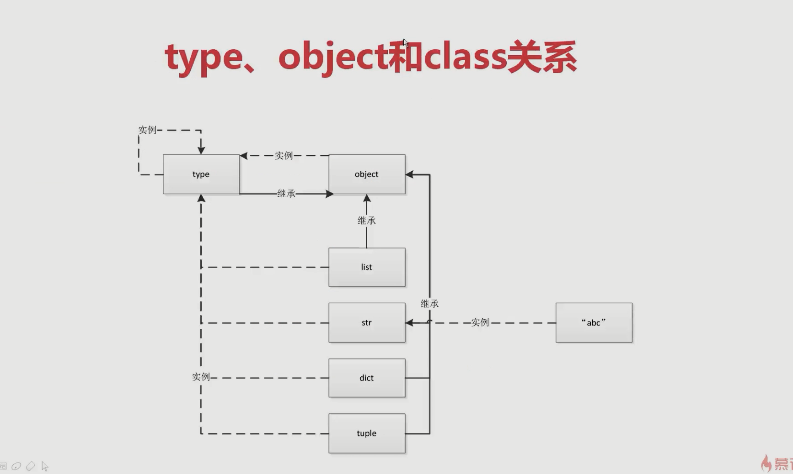

* type->class->obj
* type也是一个类，同时type也是一个对象

```python
>>> a = 1
>>> b = "abc"
>>> type(a)
<class 'int'>
>>> type(int)
<class 'type'>
>>> type(b)
<class 'str'>
>>> type(str)
<class 'type'>
>>> type(type)
<class 'type'>
>>> class Student:
...     pass
...
>>> stu = Student()
>>> type(stu)
<class '`__`main`__`.Student'>
>>> type(Student)
<class 'type'>

>>> Student.`__`bases`__`
(<class 'object'>,)
>>> object.`__`bases`__`
()
>>> type.`__`bases`__`
(<class 'object'>,)
```


### 1.3 python中的常见内置类型

- 对象的三个特征：身份（对象在内存中的地址）、类型（str,dict,int等）、值
- `set/dict`性能非常高，尽量使用它们进行数据处理
- `None`(全局只有一个): `python`在解释器启动时会None类型生成一个`None`对象，

```python
In [1]: a = None
In [2]: b = None
In [3]: id(a)
Out[3]: 140722730457216
In [4]: id(b)
Out[4]: 140722730457216
```

- 数值: int、float、complex（复数）、bool

- 迭代类型：

- 序列类型

	- list
	- bytes、bytearray、memoryview（二进制序列）
	- range
	- tuple
	- str
	- array

- 映射(dict)

- 集合

	- set
	- frozenset(不可修改的set)

- 上下文管理类型（with）

- 其他

	- 模块类型
	- class和实例
	- 函数类型
	- 方法类型
	- 代码类型
	- object对象
	- type类型
	- ellipsis类型（省略号类型）
	- notimplemented类型（类对象，面向对象高级设计时使用）

## 第二章 魔法函数

### 2.1 什么是魔法函数

* `python`中以双下划线开头，双下划线结尾，魔法函数是为了增加类的一些特性，不能自己定义魔法函数

```python
class Company(object):
    def `__`init`__`(self, employee_list):
        self.employee = employee_list
	
    def __getitem__(self, item):
        # iterable(可迭代类型)，也是subsriptable(序列类型),包含了__len__方法
        return self.employee[item]

    def __len__(self):
        return len(self.employee)

if __name__ == "__main__":
    employee_list = ["tom", "bob", "jane"]
    company = Company(employee_list)
    for em in company:
        print(em)
```

### 2.2 python的数据模型以及数据模型对python的影响

python隐式调用魔法函数，增强类的类型，使得类具有某些特征。

### 2.3 魔法函数一览

- 2.3.1 非数学运算
  - 字符串表示

  	- `__`repr`__`
  	- `__`str`__`

  - 集合、序列相关

  	- `__`len`__`
  	- `__`getitem`__`
  	- `__`setitem`__`
  	- `__`delitem`__`
  	- `__`contains`__`

  - 迭代相关

  	- `__`iter`__`
  	- `__`next`__`

  - 可调用

  	- `__`call`__`

  - with上下文管理器

  	- `__`enter`__`
  	- `__`exit`__`

  - 数值转换

  	- `__`abs`__`
  	- `__`bool`__`
  	- `__`int`__`
  	- `__`float`__`
  	- `__`hash`__`
  	- `__`index`__`

  - 元类相关

  	- `__`new`__`
  	- `__`init`__`

  - 属性相关

  	- `__`getattr`__`、 `__`setattr`__`
  	- `__`getattribute`__`、setattribute`__`
  	- `__`dir`__`

  - 属性描述符

  	- `__`get`__`、`__`set`__`、 `__`delete`__`

  - 协程

  	- `__`await`__`、`__`aiter`__`、`__`anext`__`、`__`aenter`__`、`__`aexit`__`
- 2.3.2 数学运算
  - 一元运算符

  	- `__`neg`__`（-）、`__`pos`__`（+）、`__`abs`__`

  - 二元运算符

  	- `__`lt`__`(<)、 `__`le`__` <= 、 `__`eq`__` == 、 `__`ne`__` != 、 `__`gt`__` > 、 `__`ge`__` >=

  - 算术运算符

  	- `__`add`__` + 、 `__`sub`__` - 、 `__`mul`__` * 、 `__`truediv`__` 、 `__`floordiv`__` 、 `__`
  mod`__` % 、 `__`divmod`__` divmod() 、 `__`pow`__` ** 或 pow() 、 `__`round`__` round()

  - 反向算术运算符

  	- `__`radd`__` 、 `__`rsub`__` 、 `__`rmul`__` 、 `__`rtruediv`__` 、 `__`rfloordiv`__` 、 `__`rmod`__` 、
  `__`rdivmod`__` 、 `__`rpow`__`

  - 增量赋值算术运算符

  	- `__`iadd`__` 、 `__`isub`__` 、 `__`imul`__` 、 `__`itruediv`__` 、 `__`ifloordiv`__` 、 `__`imod`__` 、
  `__`ipow`__`

  - 位运算符

  	- `__`invert`__` ~ 、 `__`lshift`__` << 、 `__`rshift`__` >> 、 `__`and`__` & 、 `__`or`__` | 、 `__`
  xor`__` ^

  - 反向位运算符

  	- `__`rlshift`__` 、 `__`rrshift`__` 、 `__`rand`__` 、 `__`rxor`__` 、 `__`ror`__`

  - 增量赋值位运算符

  	- `__`ilshift`__` 、 `__`irshift`__` 、 `__`iand`__` 、 `__`ixor`__` 、 `__`ior`__`


### 2.4 随便举个例子说明魔法函数的重要性(len函数)

len直接读取c语言内部的一个数据长度，性能高。

## 第三章 深入类和对象

### 3.1 鸭子类型和多态

当看到一只鸟走起来像鸭子，游起来像鸭子，叫起来也像鸭子，那么这只鸟就可以称为鸭子。

```python
class Cat(object):
    def say(self):
        print("i am a cat")

class Dog(object):
    def say(self):
        print("i am dog")
    def __getitem__(self, item):
        return "bobby"

class Duck(object):
    def say(self):
        print("i am duck")

if __name__ == "__main__":
    animal_list = [Cat, Dog, Duck]
    for animal in animal_list:
        animal().say()

    # 只用知道数据的类型，不必知道是set还是list
    a = [1, 2]
    b = [8, 9]
    name_set = set()
    name_set.add(3)
    name_set.add("2")
    a.extend(name_set) # iterable就可以
```


### 3.2 抽象基类(abc模块)

抽象基类不能实例化。

```python
from collections.abc import Sized
__all__ = ["Awaitable", "Coroutine",
           "AsyncIterable", "AsyncIterator", "AsyncGenerator",
           "Hashable", "Iterable", "Iterator", "Generator", "Reversible",
           "Sized", "Container", "Callable", "Collection",
           "Set", "MutableSet",
           "Mapping", "MutableMapping",
           "MappingView", "KeysView", "ItemsView", "ValuesView",
           "Sequence", "MutableSequence",
           "ByteString",
           ]
           
# 抽象基类
# 1. 在某些情况需要判定某个对象的类型
# 2. 强制某个子类必须实现某些方法

class Sized(metaclass=ABCMeta):

    __slots__ = ()

    @abstractmethod
    def __len__(self):
        return 0

    @classmethod
    def __subclasshook__(cls, C):
        if cls is Sized:
            return _check_methods(C, "__len__")
        return NotImplemented
```

* 加个装饰器，强制子类必须重写抽象基类的get方法。

```python
import abc
class CacheBae(metaclass=abc.ABCMeta):
    @abc.abstractmethod
    def get(self, key):
        raise NotImplementedError
```

### 3.3 使用`isintance`而不是`type`

`isintance`会检查一个继承链。

### 3.4 类变量和对象变量

```python
class A:
    aa = 1 # 类变量
    def __init__(self, x, y): # self 是实例
        self.x = x # x是实例属性
        self.y = y

if __name__ == "__main__":
    a = A(2, 3)
    A.aa = 2
    print(a.aa,a.x, a.y)
```

### 3.5 类属性和实例属性以及查找顺序

```python
# C3 算法 属性查找算法
# python3 新式类 object

class D:
    pass

class C(D):
    pass

class B(D):
    pass

class A(B, C):
    name = "A"
    def __init__(self):
        self.name = "obj"

if __name__ == "__main__":
    # a = A()
    # print(a.name)
    print(A.__mro__) 
    
# (<class '__main__.A'>, <class '__main__.B'>, <class '__main__.C'>, <class '__main__.D'>, <class 'object'>)
```

### 3.6 静态方法、类方法以及对象方法

```python
class Date:
    def __init__(self, year, month, day):
        self.year = year
        self.month = month
        self.day = day

    def tomorrow(self):
        """
        实例方法
        :return:
        """
        self.day += 1

    # 静态方法，不需要实例化直接使用
    # 硬编码不太好使
    @staticmethod
    def parse_from_strings(date_str):
        year,month, day = tuple(date_str.split("-"))
        return Date(int(year), int(month), int(day))
	
    # 类方法，推荐使用类方法
    # cls改为self也可以，写成cls是为了规范
    @classmethod
    def from_string(cls, data_str): 
        year,month, day = tuple(data_str.split("-"))
        return cls(int(year), int(month), int(day))
	
    def __str__(self):
        return "{}/{}/{}".format(self.year, self.month, self.day)

if __name__ == "__main__":
    day = Date(2018, 21, 31)
    print(day)
    new_day = Date.from_string("2019-10-21")
    #new_day = Date.parse_from_strings("2019-10-21")
    print(new_day)
    print(type(day))
```

### 3.7 数据封装和私有属性

```python
class User:
    def __init__(self, birthday:Date):
        # 私有属性,双下划线,只能在类方法中进行访问
        self.__birthday = birthday

    def get_age(self):
        return 2020-self.__birthday.year

if __name__ == "__main__":
    user = User(Date(1990,2,1))
    print(user.get_age())
    # 也可以通过这种方式访问，所以python没有绝对的安全
    print(user._User__birthday)
```

### 3.8 python对象的自省机制

自省就是通过一定的机制可以查询到对象的内部结构

```python
class Person:
    """人"""
    name = "user"

class Student(Person):
    def __init__(self, shool_name):
        self.school_name = shool_name

if __name__ == "__main__":
    user = Student("慕课网")
    print(user.__dict__)
    print(user.name)
    print(Person.__dict__)
    print(dir(user))

# {'school_name': '慕课网'}
# user
# {'__module__': '__main__', '__doc__': '人', 'name': 'user', '__dict__': <attribute '__dict__' of 'Person' objects>, '__weakref__': <attribute '__weakref__' of 'Person' objects>}
# ['__class__', '__delattr__', '__dict__', '__dir__', '__doc__', '__eq__', '__format__', '__ge__', '__getattribute__', '__gt__', '__hash__', '__init__', '__init_subclass__', '__le__', '__lt__', '__module__', '__ne__', '__new__', '__reduce__', '__reduce_ex__', '__repr__', '__setattr__', '__sizeof__', '__str__', '__subclasshook__', '__weakref__', 'name', 'school_name']
```

### 3.9 `super`函数

```python
from threading import Thread

class A:
    def __init__(self):
        print("A")

class B(A):
    def __init__(self):
        print("B")
        super().__init__()  # 这里可以直接用 super(),而不需要加类名

class MyThread(Thread):
    def __init__(self, name, user):
        self.user = user
        super(MyThread, self).__init__(name=name)

if __name__ == "__main__":
    b = B()

# mixin模式单一, 类似于接口
# minxin功能单一
# 不和基类关联, 基类可以不和minx关联就可以完成初始化
# 不要使用super这种方法
```

### 3.10 django rest framework中对多继承使用的经验

实际开发中不要使用多继承进行开发，如果使用多继承，可以用mixin模式进行开发（混合模式）

* minin类功能单一
* minin不和基类关联，可以和任意基类组合
* minin不要使用super这种方法

### 3.11 python中的with语句

上下文管理器协议（`__enter__`和`__exit__`）

```python
# 上下文管理器 __enter__ 和 __exit__

# 上下文管理器协议

# def test():
#     try:
#         print("code started")
#         raise KeyError
#
#     except KeyError as e:
#         # 有异常
#         print("key error")
#     else:
#         # 没有异常
#         print("other error")
#     finally:
#         # 不管有没有异常
#         print("finally")

class Sample():
    def __enter__(self):
        print("enter")
        # 获取资源
        return self

    def __exit__(self, exc_type, exc_val, exc_tb):
        # 释放资源
        print("exit")

    def do_something(self):
        print("do something")

if __name__ == "__main__":
    with Sample() as sample:
        sample.do_something()
```

### 3.12 `contextlib`实现上下文管理器

```python
import contextlib

# 上下文管理器
@contextlib.contextmanager
def file_open(file_name):
    print("file open")
    yield # 返回的数据
    print("file end")

if __name__ == "__main__":
    with file_open("bobby.txt") as f_open:
        print("file processing")
```

## 第四章 自定义序列类

### 4.1 序列类型的分类

- 容器序列

	- list、tuple、deque

- 扁平序列

	- str、bytes、bytearray、array.array

- 可变序列

	- list， deque，bytearray、array

- 不可变

	- str、tuple、bytes

### 4.2 序列的abc继承关系

```python
from collections import abc
__all__ = ["Awaitable", "Coroutine",
           "AsyncIterable", "AsyncIterator", "AsyncGenerator",
           "Hashable", "Iterable", "Iterator", "Generator", "Reversible",
           "Sized", "Container", "Callable", "Collection",
           "Set", "MutableSet",
           "Mapping", "MutableMapping",
           "MappingView", "KeysView", "ItemsView", "ValuesView",
           "Sequence", "MutableSequence",
           "ByteString",
           ]
```

`Sequence`和`MutableSequence`

### 4.3 序列的+、+=和extend的区别

```python
'''
+= 就地加
extend
+
apeend
"Sequence", "MutableSequence",
'''

if __name__ == "__main__":
    a = [1, 2]
    c = a + [3, 4]
    print(c)
    a += [3,4]
    print(a)
    a += (3,4) # 任意序列类型
    a.extend(range(3))
    print(a)

# += 的实现
# def __iadd__(self, values):
#     self.extend(values)
#     return self
```

### 4.4 实现可切片的对象

```python
'''
实现序列基类的魔法函数
[start:end:step]
当step为负整数时,表示反向切片,这是start比end大
'''
import numbers
from collections import abc

class Group:
    # 支持切片操作
    def __init__(self, group_name, company_name, staffs):
        self.group_name = group_name
        self.company_name = company_name
        self.staffs = staffs

    def __reversed__(self):
        return self.staffs.reverse()

    def __getitem__(self, item):
        # 传进来的是int or slice
        cls = type(self)
        # 切片
        if isinstance(item, slice):
            return cls(group_name=self.group_name, company_name=self.company_name, staffs=self.staffs[item])
        # 整数
        elif isinstance(item, numbers.Integral):
            return cls(group_name=self.group_name, company_name=self.company_name, staffs=[self.staffs])

    def __len__(self):
        return len(self.staffs)

    def __iter__(self):
        return iter(self.staffs)

    def __contains__(self, item):
        if item in self.staffs:
            return True
        else:
            return False


if __name__ == "__main__":
    staffs = ["bobby1", "bobby3", "bobby2", "bobby4"]
    group = Group(group_name="user",company_name="imooc", staffs=staffs)
    sub_group = group[:2]

    print(len(group))
    if "bobby" in group:
        print("ok")
```

### 4.5 bisect管理可排序序列

```python
# 使用二分法处理已排序序列, 用来维持已排序的序列,升序

import bisect
inter_list = []
bisect.insort(inter_list,3)
bisect.insort(inter_list,8)
bisect.insort(inter_list,9)
bisect.insort(inter_list,6)

if __name__ == "__main__":
    print(inter_list)
    # bisect = bisect_righth
    print(bisect.bisect(inter_list, 7))
    print(inter_list)
```

### 4.6 什么时候我们不该用列表

```python
# array就是c语言的数组, array的性能更高
# array只能存储指定类型的数据: 
# https://docs.python.org/zh-cn/3/library/array.html
import array

if __name__ == "__main__":
    my_array = array.array("i")
    # my_array.append("abc")
    my_array.append(1)
    print(my_array)
```

### 4.7 列表推导式、生成器表达式、字典推导式

```python
def handle_item(item):
    return item * item

if __name__ == "__main__":
    # odd_list = []
    # for i in range(21):
    #     if i %2 == 1:
    #         odd_list.append(i)
    # print(odd_list)

    # 列表生成式
    odd_list = [handle_item(i) for i in range(21) if i % 2 == 1]
    print(odd_list)

    # 生成器表达式
    odd_list = (handle_item(i) for i in range(21) if i % 2 == 1)
    print(odd_list) # generator 可迭代

    # 字典推导式
    my_dict = {"bobby":22, "bobby1": 23, "imooc.com": 5}
    reversed_dict = {value:key for key, value in my_dict.items()}
    print(reversed_dict)

    # 集合推导式 set
    my_set = {key for key, value in my_dict.items()}
    print(my_set)
```

## 第五章 深入python的set和dict

### 5.1 先来看看collections中的abc

```python
from collections.abc import Mapping, MutableMapping

if __name__ == "__main__":
    a = {}
    print(isinstance(a, MutableMapping))
```

### 5.2 dict的常见用法

- `setdefault`
- `defaultdict`
- `__`missing`__`方法

```python
import copy

if __name__ == "__main__":
    a = {"ss":1}
    # a.clear()
    print(a)
    # 浅拷贝
    new_dict = a.copy()
    deep_new_dict = copy.deepcopy(a)
    a.get("ssw", "") # 如果有值则返回否则返回""
    # `setdefault`除了取值之外，还会设置a["ssw"] = ""
    # update可以合并新字典，可迭代对象
```

### 5.3 dict的子类

- `defaultdict`（c语言写的）
- `Counter`
- 不要去继承内置类型， 有可能会失败比如update方法

### 5.4 set和frozenset

`set`集合 `frozenset`(不可变集合) 无序，不重复

### 5.5 dict和set实现原理

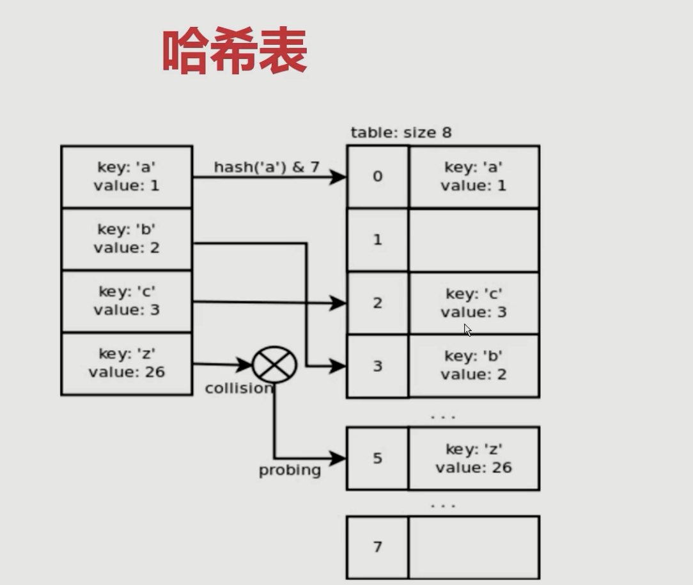

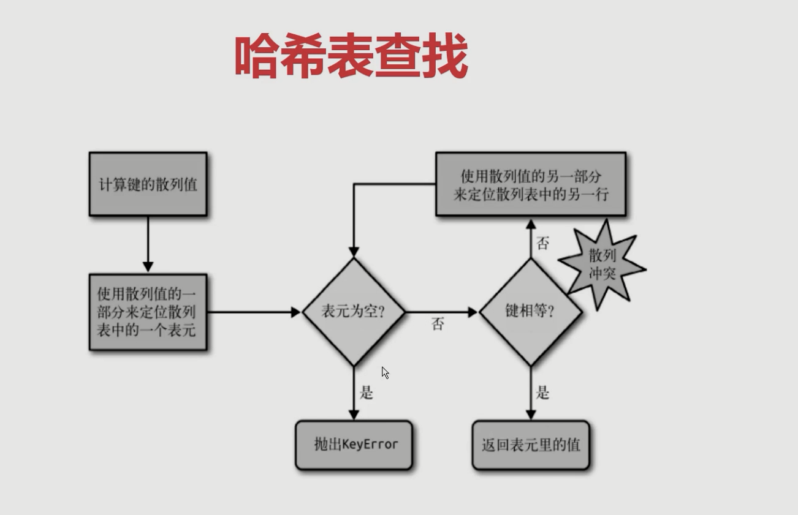

* dict查找的性能远远大于list
* list中查找元素会随着元素数量增加而增大
* dict中查找元素时间不会随着元素数量增加而增大

* `dict`背后实现是哈希表，所以`key`必须是可哈希的，哈希之后做与运算计算出偏移量
* 不可变对象都是可哈希的str, fronzenset, tuple, 自己实现的类`__hash__`
* dict的内存花销大，但是查询速度快，自定义的对象或者python内部得对象都是dict包装的
* dict的存储顺序与元素添加的顺序有关
* 添加数据有可能改变已有数据顺序，当表元小于已有三分一空余时，需要重新分配内存，在进行数据搬迁算法时会改变映射位置。

## 第六章 对象引用、可变性和垃圾回收

### 6.1 python变量到底是什么

`python`的变量是一个指针，指针本身的大小是固定的。`a =  1` , `1`申请一个`int`对象， `a`指向`1`

### 6.2 ==和is的区别

```python
a = [1,2,3,4]
b = [1,2,3,4]
# 对于小整数和短字符串，a is b 为 true
a is b # false

a = [1,2,3,4]
b = a
a is b # true
```

### 6.3 del语句和垃圾回收

python中的垃圾回收算法是采用引用计数。当

```python
a = 1 #  计数器加一
b = a # 计数器加一
del a # 计数器减一
# 当计数器减到零时，才会对对象进行垃圾回收
```

### 6.4 一个经典的错误

传递了一个列表，列表是可变的，如果都使用默认的列表，那么，实例化的对象的列表属性都会使用同一个默认列表对象。所以尽量不要传递`list`参数。

```python
def add(a, b):
    a += b
    return a
if __name__ == "__main__":
    a = [1, 2]
    b = [3, 4]
    c = add(a, b)
    print(c) # [1, 2, 3, 4]
    print(a, b) # [1, 2, 3, 4] [3, 4]
```

## 第七章 元类编程

### 7.1 property动态属性

```python
from datetime import date, datetime
class User:
    def __init__(self, name, birthday):
        self.name = name
        self.birthday = birthday
        self._age = 0

    def get_age(self):
        return datetime.now().year - self.birthday.year

    @property
    def age(self):
        return datetime.now().year - self.birthday.year

    @age.setter
    def age(self, value):
        self._age = value

if __name__ == "__main__":
    user = User("bobby", date(year=1987, month=1, day=1))
    print(user.age) # 33
    user.age=30 # set赋值
    print(user._age) # 30
```

### 7.2 `__`getattr`__`、`__`getattribute`__`魔法函数

```python
# __getattr__ 在查找不到属性的时候进行调用
# __getattribute__ 无条件进入

from datetime import date, datetime
class User:
    def __init__(self, name, birthday, info):
        self.name = name
        self.birthday = birthday
        self.info = info

    def __getattr__(self, item):
        return self.info[item]

    # def __getattribute__(self, item):
    #     return self.info[item]

if __name__ == "__main__":
    user = User("bobby", date(year=1987, month=1, day=1), info={"company_name": "sss"})
    print(user.company_name)
```

### 7.3 属性描述符和属性查找过程

* `__get__`、`__set__`、`__delete__`这几个魔法方法都是属性描述符

```python
import numbers

class IntField:
    #数据描述符
    def __get__(self, instance, owner):
        return self.value
    def __set__(self, instance, value):
        if not isinstance(value, numbers.Integral):
            raise ValueError("int value need")
        if value < 0:
            raise ValueError("positive value need")
        self.value = value
    def __delete__(self, instance):
        pass


class NonDataIntField:
    #非数据属性描述符
    def __get__(self, instance, owner):
        return self.value

class User:
    age = IntField()
    # age = NonDataIntField()

'''
如果user是某个类的实例，那么user.age（以及等价的getattr(user,’age’)）
首先调用__getattribute__。如果类定义了__getattr__方法，
那么在__getattribute__抛出 AttributeError 的时候就会调用到__getattr__，
而对于描述符(__get__）的调用，则是发生在__getattribute__内部的。
user = User(), 那么user.age 顺序如下：

（1）如果“age”是出现在User或其基类的__dict__中， 且age是data descriptor， 那么调用其__get__方法, 否则

（2）如果“age”出现在user的__dict__中， 那么直接返回 obj.__dict__[‘age’]， 否则

（3）如果“age”出现在User或其基类的__dict__中

（3.1）如果age是non-data descriptor，那么调用其__get__方法， 否则

（3.2）返回 __dict__[‘age’]

（4）如果User有__getattr__方法，调用__getattr__方法，否则

（5）抛出AttributeError

'''
if __name__ == "__main__":
    user = User()
    user.__dict__["age"] = "abc"
    print (user.__dict__)
    print (user.age)
```

### 7.4 `__`new`__`和`__`init`__`的区别

```python
# 如果new不返回对象，则不会调用init

class User:
    def __new__(cls, *args, **kwargs):
        """在对象生成之前，控制对象生成过程
        如果new方法不返回对象，则不会调用init函数
        """
        print("new")
        # return super().__new__(cls)

    def __init__(self, name):
        """完善对象生成"""
        print("init")
        self.name = name

if __name__ == "__main__":
    name = User("bobby")
```

### 7.5 自定义元类

元类是创建类的类，对象<-`class`(对象)<-`type`

```python
# type 动态创建类
class BaseClass:
    def answer(self):
        print("answer")

def say(self):
    print("i am user")
    return self.name
    
User = type("User", (BaseClass, ), {"name":"bobby", "say":say}) # 类名，基类， 属性
```

* `metaclass`控制实例化过程，python中类的实例化过程，会首先寻找`metaclass`，通过`metaclass`去创建`user`类。

```python
class MetaClass(type):
    # 控制User的生成过程，可以检查User方法或者参数，不通过直接抛异常
    # 而不需要在User生成之后进行检查
    def __new__(cls, *args, **kwargs):
        return super().__new__(cls, *args, **kwargs)
class User(metaclass=MetaClass):
    def __init__(self, name):
        self.name = name
    def __str__(self):
        return "user"
```

### 7.6 元类实现简单的`orm`

```python
import numbers

class Field:
    pass

class IntField(Field):
    # 数据描述符
    def __init__(self, db_column, min_value=None, max_value=None):
        self._value = None
        self.min_value = min_value
        self.max_value = max_value
        self.db_column = db_column
        if min_value is not None:
            if not isinstance(min_value, numbers.Integral):
                raise ValueError("min_value must be int")
            elif min_value < 0:
                raise ValueError("min_value must be positive int")
        if max_value is not None:
            if not isinstance(max_value, numbers.Integral):
                raise ValueError("max_value must be int")
            elif max_value < 0:
                raise ValueError("max_value must be positive int")
        if min_value is not None and max_value is not None:
            if min_value > max_value:
                raise ValueError("min_value must be smaller than max_value")

    def __get__(self, instance, owner):
        return self._value

    def __set__(self, instance, value):
        if not isinstance(value, numbers.Integral):
            raise ValueError("int value need")
        if value < self.min_value or value > self.max_value:
            raise ValueError("value must between min_value and max_value")
        self._value = value


class CharField(Field):
    def __init__(self, db_column, max_length=None):
        self._value = None
        self.db_column = db_column
        if max_length is None:
            raise ValueError("you must spcify max_lenth for charfiled")
        self.max_length = max_length

    def __get__(self, instance, owner):
        return self._value

    def __set__(self, instance, value):
        if not isinstance(value, str):
            raise ValueError("string value need")
        if len(value) > self.max_length:
            raise ValueError("value len excess len of max_length")
        self._value = value


# 这里在对象生成之前对参数进行检查
class ModelMetaClass(type):
    def __new__(cls, name, bases, attrs, **kwargs):
        if name == "BaseModel":
            return super().__new__(cls, name, bases, attrs, **kwargs)
        fields = {}
        for key, value in attrs.items():
            if isinstance(value, Field):
                fields[key] = value
        attrs_meta = attrs.get("Meta", None)
        _meta = {}
        db_table = name.lower()
        if attrs_meta is not None:
            table = getattr(attrs_meta, "db_table", None)
            if table is not None:
                db_table = table
        _meta["db_table"] = db_table
        attrs["_meta"] = _meta
        attrs["fields"] = fields
        del attrs["Meta"]
        return super().__new__(cls, name, bases, attrs, **kwargs)


class BaseModel(metaclass=ModelMetaClass):
    def __init__(self, *args, **kwargs):
        for key, value in kwargs.items():
            setattr(self, key, value)
        return super().__init__()

    def save(self):
        fields = []
        values = []
        for key, value in self.fields.items():
            db_column = value.db_column
            if db_column is None:
                db_column = key.lower()
            fields.append(db_column)
            value = getattr(self, key)
            values.append(str(value))

        sql = "insert {db_table}({fields}) value({values})".format(
            db_table=self._meta["db_table"],                                       
            fields=",".join(fields), 
            values=",".join(values))
        pass

class User(BaseModel):
    name = CharField(db_column="name", max_length=10)
    age = IntField(db_column="age", min_value=1, max_value=100)

    class Meta:
        db_table = "user"

if __name__ == "__main__":
    user = User(name="bobby", age=28)
    # user.name = "bobby"
    # user.age = 2
```

## 第八章 迭代器和生成器

### 8.1 python的迭代协议

```python
# 迭代协议
# 迭代器时访问集合内元素的一种方式，一般用来遍历数据
# 迭代器不能返回，迭代器提供惰性访问数据

# Iterable 可迭代
# Iterator 迭代器

from collections.abc import Iterable, Iterator

a = [1, 2]
iter_rator = iter(a)

if __name__ == '__main__':
    print(isinstance(a, Iterable)) # True
    print(isinstance(a, Iterator)) # False
```

### 8.2 什么是迭代器和可迭代对象

```python
from collections.abc import Iterator, Iterable

class Company(object):
    def __init__(self, employee_list):
        self.employee = employee_list

    def __iter__(self):
        return MyIterator(self.employee)

    # def __getitem__(self, item):
    #     return self.employee[item]

    # def __len__(self):
    #     return len(self.employee)

# __next__放在下面处理，不要放在上面的类实现中
class MyIterator(Iterator):
    def __init__(self, employee_list):
        self.employee_list = employee_list
        self.index = 0

    def __next__(self):
        # 真正返回迭代值的逻辑
        try:
            word = self.employee_list[self.index]
        except IndexError:
            raise StopIteration
        self.index += 1
        return word

if __name__ == "__main__":
    employee_list = ["tom", "bob", "jane"]
    company = Company(employee_list)

    for em in company:
        print(em)
```

### 8.3 生成器函数使用

```python
# 生成器，函数里有 yield
# 生成器对象，python编译字节的时候就产生了
# 惰性求值，延迟求值

def fib(index):
    if index <= 2:
        return 1
    else:
        return fib(index-1) + fib(index-2)

def fib2(index):
    re_list = []
    n,a,b = 0,0,1
    while n < index:
        re_list.append(b)
        a,b = b, a+b
        n += 1
    return re_list

def fib3(index):
    n,a,b = 0,0,1
    while n < index:
        yield b
        a,b = b, a+b
        n += 1

import time
if __name__ == '__main__':
    for data in fib3(100000):
        print(data)
        time.sleep(1)
```

### 8.4 生成器的原理

可以控制函数的暂停停止和运行


```python
# 函数工作原理
# python.exe Py_Eval_EvalFramEx(c函数)去执行foo函数
# 首先会创建一个栈帧（stack frame）
# python 一切皆对象，栈帧对象， 字节码对象

# 所有的栈帧都是分配在堆内存上，这就决定了栈帧可以独立于独立于调用者存在
import inspect
from collections import UserList

frame = None

def foo():
    bar()

def bar():
    global frame
    frame = inspect.currentframe()

if __name__ == '__main__':
    foo()
    print(frame.f_code.co_name)
    caller_frame = frame.f_back
    print(caller_frame.f_code.co_name)
    # import dis
    # print(dis.dis(foo))
```

### 8.5 通过`UserList`来看生成器的应用

```python
class Sequence(Reversible, Collection):

    """All the operations on a read-only sequence.

    Concrete subclasses must override __new__ or __init__,
    __getitem__, and __len__.
    """

    __slots__ = ()

    @abstractmethod
    def __getitem__(self, index):
        raise IndexError

    def __iter__(self):
        i = 0
        try:
            while True:
                v = self[i]
                yield v
                i += 1
        except IndexError:
            return
    # ...
```

### 8.6 生成器实现大文件读取

```python
# 大文件读取，一行500G

def myreadlines(f, newline):
    buf = ""
    while True:
        while newline in buf:
            pos = buf.index(newline)
            yield buf[:pos]
            buf = buf[pos + len(newline)]
        chunk = f.read(4096)
        if not chunk:
            # 读到结尾
            yield buf
            break
        buf += chunk

if __name__ == '__main__':
    with open("open.txt") as f:
        for line in myreadlines(f, "{|}"):
            print(line)
```

## 第九章 `python socket`编程

### 9.1 弄懂`HTTP`、`Socket`、`TCP`这几个概念

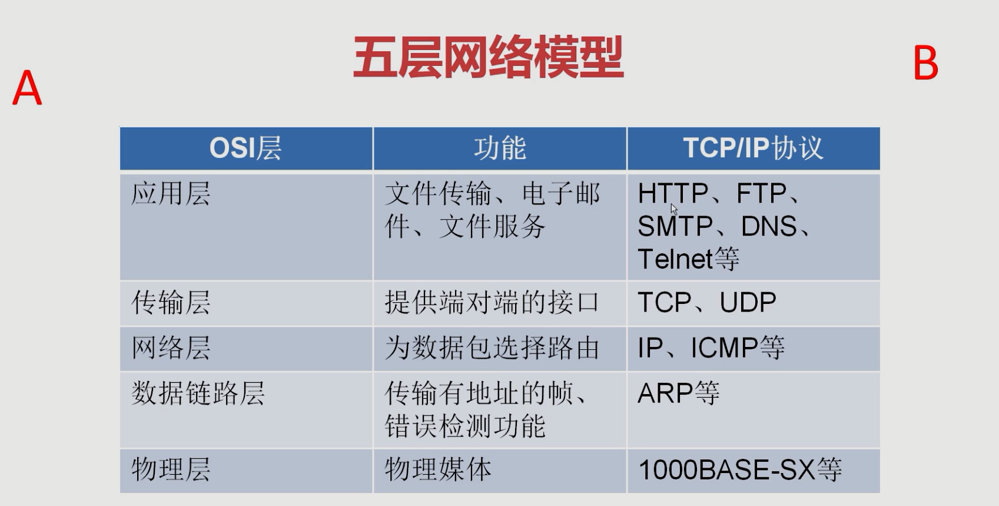

### 9.2 client和server实现通信

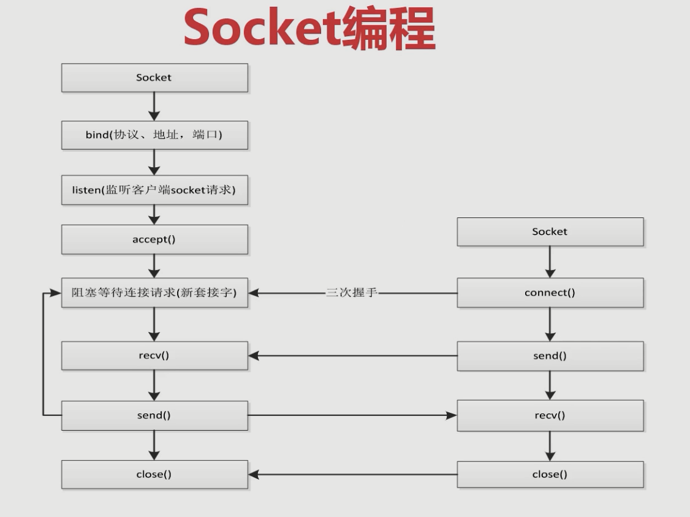

- 服务端
- 客户端
- socket发送http请求

	- 写类模拟urllib类

- urllib和socket区别

	- urllib支持client，但是socket支持server、client等等
	- urllib支持http、ftp等协议属于应用层是包装过socket的
	- 学习`socket`的目的不是为了让大家在任何时候都用socket去编程，而是要知道底层后期理解协程容易、以及具体问题在解决的时候首先能想到还有socket底层可以用

### 9.3 socket模拟http请求

```python
#requests -> urlib -> socket
import socket
from urllib.parse import urlparse

def get_url(url):
    #通过socket请求html
    url = urlparse(url)
    host = url.netloc
    path = url.path
    if path == "":
        path = "/"
    #建立socket连接
    client = socket.socket(socket.AF_INET, socket.SOCK_STREAM)
    # client.setblocking(False)
    client.connect((host, 80)) #阻塞不会消耗cpu

    #不停的询问连接是否建立好， 需要while循环不停的去检查状态
    #做计算任务或者再次发起其他的连接请求

    client.send("GET {} HTTP/1.1\r\nHost:{}\r\nConnection:close\r\n\r\n".format(path, host).encode("utf8"))

    data = b""
    while True:
        d = client.recv(1024)
        if d:
            data += d
        else:
            break

    data = data.decode("utf8")
    html_data = data.split("\r\n\r\n")[1]
    print(html_data)
    client.close()

if __name__ == "__main__":
    import time
    start_time = time.time()
    for url in range(20):
        url = "http://shop.projectsedu.com/goods/{}/".format(url)
        get_url(url)
    print(time.time()-start_time)
```

## 第十章 多线程、多进程和线程池编程

### 10.1 python中的GIL

```python
# gil global interpreter lock
# python中一个线程对应c语言的一个线程
# gil使得同一时刻只有一个线程运行在一个cpu上执行字节码, 线程安全
# 无法将多个线程映射到多个cpu上,无法利用多核优势

# gil会根据执行的字节码行数以及时间片进行释放，gil在遇到io操作主动释放，交给其他线程
# gil会影响性能，锁也会引起死锁
# RLock 可重入的锁

import dis

def add(a):
    a = a+1
    return a

if __name__ == '__main__':
    print(dis.dis(add))

#  17           0 LOAD_FAST                0 (a)
#               2 LOAD_CONST               1 (1)
#               4 BINARY_ADD
#               6 STORE_FAST               0 (a)
#
#  18           8 LOAD_FAST                0 (a)
#              10 RETURN_VALUE
# None
```

### 10.2 python多线程编程

```python
# 对于io操作，多线程和多进程性能差别不大

import time
import threading

def get_detail_html(url):
    print("get detail html started")
    time.sleep(2)
    print("get detail html end")

def get_detail_url(url):
    print("get detail url started")
    time.sleep(4)
    print("get detail url end")


# 通过继承Thread来实现多线程
class GetDetalHTML(threading.Thread):
    def run(self):
        print("get detail html started")
        time.sleep(2)
        print("get detail html end")

class GetDetalURL(threading.Thread):
    def run(self):
        print("get detail url started")
        time.sleep(2)
        print("get detail url end")

if __name__ == '__main__':
    # thread1 = threading.Thread(target=get_detail_html, args=("",))
    # thread2 = threading.Thread(target=get_detail_url, args=("",))
    #
    # # 当主线程退出时，子线程kill掉, 守护线程
    # # thread1.setDaemon(True)
    # # thread2.setDaemon(True)
    #
    # start_time = time.time()
    # thread1.start()
    # thread2.start()
    # #阻塞
    # thread1.join()
    # thread2.join()
    #
    # print("last time: {}".format(start_time-time.time()))

    thread1 = GetDetalHTML()
    thread2 = GetDetalURL()
```

### 10.3 线程间通信-Queue

```python
# 线程通信
# 1. 共享变量,gil会释放导致线程不安全，不会按照预期执行
# 2. 一般我们用 queue 进行线程间步，线程安全，queue本身就是线程安全操作
# deque 双端队列，字节码本身就是线程安全的

import time
import threading
# 先进先出
from queue import Queue
# 优先级队列
from queue import PriorityQueue

def get_detail_html(queue):
    while True:
        print("get detail html started")
        time.sleep(2)
        # 阻塞方法,如果队列为空，会一直停在这儿
        url = queue.get()
        print("get detail html end")

def get_detail_url(queue):
    # global detail_url_list
    print("get detail url started")
    time.sleep(4)
    for i in range(3):
        queue.put("http://projectsedu.com/{}".format(i))
    print("get detail url end")


if __name__ == '__main__':
    detail_url_queue = Queue(maxsize=1000)
    thread1 = threading.Thread(target=get_detail_html, args=(detail_url_queue,))
    thread2 = threading.Thread(target=get_detail_url, args=(detail_url_queue,))
    thread1.start()
    thread2.start()
    
    # 这两个成对出现，join会一直block,直到接收到task_done信号
    # detail_url_queue.task_done()
    # detail_url_queue.join()
```

### 10.4 线程同步（Lock、RLock、Semaphores、Condition）

使用锁会影响性能，锁容易引起死锁，可重入的锁RLock就可以多个acquire

```python
import dis
import threading
from threading import Lock, RLock
a = 0
lock = RLock()

def add():
    global a
    global lock
    for i in range(1000000):
        lock.acquire()
        lock.acquire()
        lock.acquire()
        a = a + 1
        lock.release()
        lock.release()
        lock.release()

def desc():
    global a
    global lock
    for i in range(1000000):
        lock.acquire()
        a = a - 1
        lock.release()

if __name__ == '__main__':
    thread1 = threading.Thread(target=add)
    thread2 = threading.Thread(target=desc)

    thread1.start()
    thread2.start()

    thread1.join()
    thread2.join()

    print(a)
```

* 条件变量Condition，用于复杂的线程间同步，内部实现了lock和Rlock，Condition有`__enter__`和`__exit__`，可以使用上下文管理器方式实现锁的的线程安全。
* Condition有两层锁，一把底层锁会在线程调用wait方法时释放，每次调用wait会分配一把并放入到cond的等待队列中，等待notify方法唤醒。

```python

import threading
from threading import RLock
# 条件变量，用于复杂的线程间同步
from threading import Condition


# class XiaoAi(threading.Thread):
#     def __init__(self, lock):
#         super().__init__(name="小爱")
#         self.lock = lock
#
#     def run(self):
#         self.lock.acquire()
#         print("{}: 在 ".format(self.name))
#         self.lock.release()
#
#         self.lock.acquire()
#         print("{}: 好啊 ".format(self.name))
#         self.lock.release()
#
# class TianMao(threading.Thread):
#     def __init__(self, lock):
#         super().__init__(name="天猫精灵")
#         self.lock = lock
#
#     def run(self):
#         self.lock.acquire()
#         print("{}: 小爱同学 ".format(self.name))
#         self.lock.release()
#
#         self.lock.acquire()
#         print("{}: 我们来对古诗吧 ".format(self.name))
#         self.lock.release()


class XiaoAi(threading.Thread):
    def __init__(self, cond:Condition):
        super().__init__(name="小爱")
        self.cond = cond

    def run(self):
        with self.cond:
            self.cond.wait()
            print("{}: 在 ".format(self.name))
            self.cond.notify()

            self.cond.wait()
            print("{}: 好啊 ".format(self.name))
            self.cond.notify()


class TianMao(threading.Thread):
    def __init__(self, cond:Condition):
        super().__init__(name="天猫精灵")
        self.cond = cond

    def run(self):
        with self.cond:
            print("{}: 小爱同学 ".format(self.name))
            self.cond.notify()
            self.cond.wait()

            print("{}: 我们来对古诗吧 ".format(self.name))
            self.cond.notify()
            self.cond.wait()

if __name__ == '__main__':
    conf = Condition()
    xiaoai = XiaoAi(conf)
    tianmao = TianMao(conf)

    xiaoai.start()
    tianmao.start()
```

### 10.5 Semaphore  用于控制进入数量的锁

文件的读写，写一般是一个线程写，读可以允许多个线程，`Semaphore`内部也是用`Condition`实现, `Queue`内部也使用了`Condition`.

```python
import threading
import time
from threading import Semaphore

class HtmlSpider(threading.Thread):
    def __init__(self, url, sem:Semaphore):
        super().__init__()
        self.url = url
        self.sem = sem

    def run(self):
        time.sleep(2)
        print("got html text success")
        self.sem.release()

class UrlProducer(threading.Thread):
    def __init__(self, sem:Semaphore):
        super().__init__()
        self.sem = sem
    def run(self):
        for i in range(20):
            self.sem.acquire()
            # 子线程
            html_thread = HtmlSpider("https://www.baidu.com/{}".format(i), self.sem)
            html_thread.start()

if __name__ == '__main__':
    # 控制数量 acquire 和 release也要成对
    sem = Semaphore(3)
    url_producer = UrlProducer(sem)
    url_producer.start()
```

### 10.6 concurrent线程池编码

* 希望有个最高并发线程，可以控制数量
* 主线程可以获取某一个线程或者某一个任务的状态以及返回值
* `futures`可以让多线程和多进程编码接口一致

```python
from concurrent.futures import ThreadPoolExecutor, as_completed, wait
from concurrent.futures import Future
import time

def get_html(times):
    time.sleep(times)
    print("get page {} success".format(times))
    return times

if __name__ == '__main__':
    executor = ThreadPoolExecutor(max_workers=3)

    # 通过submit函数提交执行的函数到线程池
    # task1 = executor.submit(get_html, (3))
    # task2 = executor.submit(get_html, (2))

    # print(task1.done())
    # print(task2.cancel())
    # time.sleep(4)
    # print(task1.done())

    # 获取已经成功的task
    url_list = [2,3,4,1]
    all_task = [executor.submit(get_html, (url)) for url in url_list]
    # wait(all_task, return_when='ALL_COMPLETED')
    # 谁先执行完，谁就先返回
    for future in as_completed(all_task):
        data = future.result()
        print("get {} page sucess".format(data))
    
    # map方法可以一步完成，按顺序返回结果
    # for data in executor.map(get_html, url_list):
    #     print("get {} page sucess".format(data))
```

* `from concurrent.futures import Future`: Future，未来对象，task的返回容器，future可以得到task的执行状态和执行结果。

### 10.7 多进程编程-`multiprocessing`

* `GIL`锁，耗`cpu`的操作(计算)，多线程不能很好利用多核优势，无法达到并行操作，所以要使用**多进程**编程，充分利用多个cpu并发的特性。
* 对于IO操作(sleep)，操作系统的进程切换代价高于线程，使用多线程操作。

```python
import time
from concurrent.futures import ThreadPoolExecutor, as_completed # 线程
from concurrent.futures import ProcessPoolExecutor # 进程

# 耗cpu操作，可以用多进程 ProcessPoolExecutor
def fib(n):
    if n <= 2:
        return 1
    return fib(n-1)+fib(n-2)

# 对于io操作，使用多线程编程 ThreadPoolExecutor
def random_sleep(n):
    time.sleep(n)
    return n

if __name__ == '__main__':
    with ProcessPoolExecutor(3) as executor:
        all_task = [executor.submit(random_sleep, (num)) for num in [1]*10]
        start_time = time.time()
        for future in as_completed(all_task):
            data = future.result()
            print("exe result: {}".format(data))
        print("last time is: {}".format(time.time()-start_time))
```

* 进程的数据是隔离，`ProcessPoolExecutor`底层也是用`multiprocessing`实现
* 使用进程池

```python
# import os
# import time
#
# pid = os.fork()
# print("bobby")
#
# if __name__ == '__main__':
#     if pid == 0:
#         print('子进程 {}, 父进程 {}'.format(os.getpid(), os.getppid()))
#     else:
#         print('我是父进程 {}'.format(pid))
# pipe的性能高于queue

from multiprocessing import Pool, Manager, Pipe
import multiprocessing
import time

def get_html(times):
    time.sleep(times)
    print("get page {} success".format(times))
    return times

if __name__ == '__main__':
    # 如果没有指定数量，内部会自动获取cpu数量
    pool = Pool()
    # 异步提交任务
    result = pool.apply_async(get_html, args=(2,))
    pool.close()
    # 等待所有任务完成，join之前必须关闭pool接收新的task
    pool.join()
    print(result.get())

    # 直接使用多线程
    # progress = multiprocessing.Process(target=get_html, args=(2, ))
    # progress.start()
    # progress.join()
    # print("main progress success")

    # # 按顺序返回结果
    # for result in pool.imap(get_html, [1, 5, 3]):
    #     print("{} sleep success".format(result))
    #
    # # 谁先执行完，返回谁
    # for result in pool.imap_unordered(get_html, [1, 5, 3]):
    #     print("{} sleep success".format(result))
```

### 10.8 进程间通信

使用multiprocessing里的Queue，不能用于进程池中，进程池中使用Manage里的Queue

```python
from multiprocessing import Queue
from multiprocessing import Manager

queue = Manage().Queue()
```

* pipe只能用于两个进程间通信，性能高于queue，queue做进程间同步加了很多锁，降低了性能。

```python
from multiprocessing import Pipe, Process

def producer(pipe):
    pipe.send("bobbby")

def consumer(pipe):
    print(pipe.recv())

if __name__ == '__main__':
    # 只能用于两个进程间通信
    recive_pipe, send_pipe = Pipe()
    my_producer = Process(target=producer, args=(send_pipe,))
    my_consumer = Process(target=consumer, args=(recive_pipe, ))

    my_producer.start()
    my_consumer.start()
    my_producer.join()
    my_consumer.join()
```

* 进行间共享内存，及共享变量，使用manager内部的数据结构

```python
from multiprocessing import Manager

if __name__ == '__main__':
    progress_dict = Manager().dict()
    progress_list = Manager().list()
```

## 第十一章 协程和异步io

### 11.1 并发、并行、同步、异步、阻塞、非阻塞

1. 并发和并行
并发：宏观上并发，多个程序一个时间段内在一个cpu运行，但是一个时间点只有一个程序运行
并行：任意时间点，有多个程序同时运行在多个cpu
2.  同步和异步(消息通信机制)
同步：代码调用IO操作时，必须等待IO操作完成才返回的调用方式
异步：代码调用IO操作时，不必等待IO操作完成就返回的调用方式
3. 阻塞和非阻塞(函数调用机制)
阻塞：指函数调用时，当前线程被挂起
非阻塞：指函数调用时，当前线程被不会挂起

### 11.2 C10K问题和io多路复用(select、poll、epoll)

`C10K`问题: 1999年提出来的，如何在一颗1GHz CPU，2G内存，1gbps网络环境下，让单台服务器同时为1w个客户端提供`ftp`服务。

Unix五种IO模型:

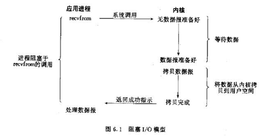

阻塞I/O：在等待的过程中，cpu是空闲的，占用资源。对于一个套接字上的输入操作，第一步通常涉及等待数据从网络中到达。当所有等待分组到达时，它被复制到内核中的某个缓冲区。第二步就是把数据从内核缓冲区复制到应用程序缓冲区。 

---

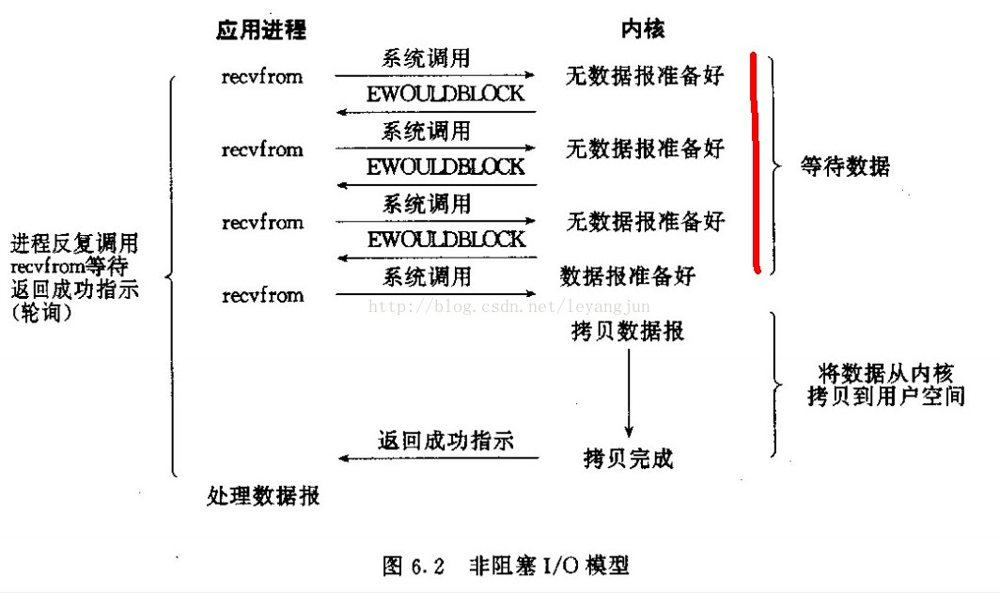

非阻塞I/O：进程把一个套接字设置成非阻塞是在通知内核，当所请求的I/O操作非得把本进程投入睡眠才能完成时，不要把进程投入睡眠，而是返回一个错误。

---

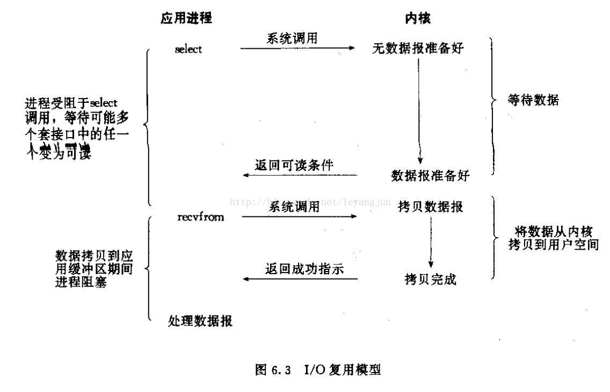

I/O复用：I/O多路复用是阻塞在select，epoll这样的系统调用之上。现在大部分框架所使用的也是I/O多路复用模型。

---


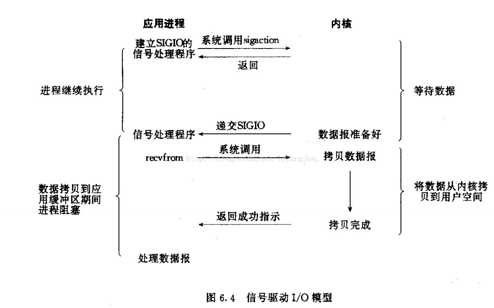

信号驱动I/O：建立信号处理程序，程序主动发送信号告诉数据准备好了。

---


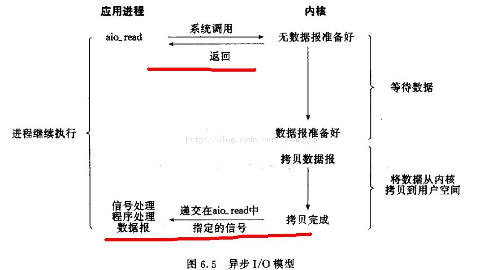

异步I/O(POSIX的aio系列函数)：告知内核启动某个操作，并让内核在整个操作（包括将数据从内核拷贝到用户空间）完成后通知我们。相对于I/O多路复用少了一个数据拷贝的过程。


I/O多路复用模式：**select、poll、epoll**都是同步I/O，读写过程是阻塞的。epoll是红黑树实现的，效率高。

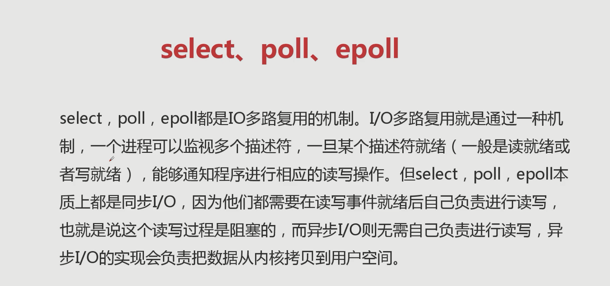


* epoll并不代表一定比select好
* 并发高，连接活跃并不高，用epoll（web，网站）
* 并发性不高， 同时连接很活跃，select比epoll好（游戏里）

### 11.3 epoll+回调+事件循环方式url

```python
# select模式实现http请求，省去线程切换开销，协程的核心点

from selectors import DefaultSelector, EVENT_WRITE, EVENT_READ
import socket
from urllib.parse import urlparse

urls = ["https://www.baidu.com"]
stop = False

selector = DefaultSelector()
class Fetcher:
    def connected(self, key):
        selector.unregister(key.fd)
        self.client.send("GET {} HTTP/1.1\r\nHost:{}\r\nConnection:close\r\n\r\n".format(self.path, self.host).encode("utf8"))
        selector.register(self.client.fileno(), EVENT_READ, self.readable)

    def readable(self, key):
        d = self.client.recv(1024)
        if d:
            self.data += d
        else:
            selector.unregister(key.fd)
            data = self.data.decode("utf8")
            html_data = data.split("\r\n\r\n")[1]
            print(html_data)
            self.client.close()
            urls.remove(self.spider_url)
            if not urls:
                global stop
                stop = True

    def get_url(self, url):
        self.spider_url = url
        url = urlparse(url)
        self.host = url.netloc
        self.path = url.path
        self.data = b""
        if self.path == "":
            self.path = "/"

        # 建立socket连接
        self.client = socket.socket(socket.AF_INET, socket.SOCK_STREAM)
        # 非阻塞
        self.client.setblocking(False)

        try:
            self.client.connect((self.host, 80))  # 阻塞不会消耗cpu
        except BlockingIOError:
            pass
        # 注册
        selector.register(self.client.fileno(), EVENT_WRITE, self.connected)


def loop():
    # 事件循环，不停的请求socket的状态并调用对应的回调函数
    # 1. select本身是不支持register模式
    # 2. socket状态变化以后的回调是由程序员完成的
    while not stop:
        ready = selector.select()
        for key, mask in ready:
            call_back = key.data
            call_back(key)
    # 回调+事件循环+select(poll\epoll)

if __name__ == "__main__":
    fetcher = Fetcher()
    fetcher.get_url("https://www.baidu.com")
    loop()
    
    # import time
    # start_time = time.time()
    # for url in range(20):
    #     url = "http://shop.projectsedu.com/goods/{}/".format(url)
    #     urls.append(url)
    #     fetcher = Fetcher()
    #     fetcher.get_url(url)
    # loop()
    # print(time.time()-start_time)
```

### 11.4 回调之痛

* 与同步编程模式不同，需要自己实现事件循环，代码的可读性低
* 如果抛异常，我们不清楚异常在哪里
* 回调嵌套，难以维护
* 嵌套了多层，某个环节出现问题，不容易找出问题点
* 变量共享

### 11.5 C10M问题和协程

如何利用8核心CPU，`64G`内存，在`10gbps`的网络上保持`1000w`并发连接.这就是协程要实现的。

* 回调模式编码复杂度高
* 同步编程的并发性不高
* 多线程编程需要线程间同步, lock(降低了并发性能)

解决方式：

* 采用同步的方式去写异步的代码
* 使用单线程去切换任务
  * 线程有操作系统切换，单线程切换意味着我们需要程序员自己去调度任务
  * 不再需要锁，并发性高，如果单线程内切换函数，性能高于线程切换，并发性更高

传统的函数调用过程：A->B->C，函数切换（栈）之后，这个函数就跳出去了。需要一个**可以暂停的函数**，并且可以在适当的时候恢复该函数继续执行。这就促使了协程（有多个入口的函数，可以暂停的函数，可以传入值得函数）的产生。

### 11.6 生成器的send和yield from

```python
def gen_func():
    # 1. 可以产出值
    # 2. 可以接收值给html(调用方法传进来的值)
    html = yield "https://projectsedu.com"
    print(html)
    yield 2
    yield 3
    return "bobby"

if __name__ == '__main__':
    gen = gen_func()
    # 在调用send发送非none值之前，我们必须启动一次生成器，
    # 方式有两种：1.直接send(None)；2. next
    url = next(gen) # url = gen.send(None)
    print(url)
    #download_html
    html = "bobby"
    # send方法可以传递指进入生成器内部，同时还可以重启生成器执行到下一个yield位置
    # gen.send(html)
    print(gen.send(html))
```

* close()导致的异常

```python
def gen_func():
    # 1. 可以产出值
    # 2. 可以接收值给html(调用方法传进来的值)
    try:
        html = yield "https://projectsedu.com"
    except GeneratorExit:
        pass
    yield 2
    yield 3
    return "bobby"

if __name__ == '__main__':
    gen = gen_func()
    print(next(gen))
    gen.close()
    print(next(gen))
```

* 捕获这个异常则没有问题

```python
def gen_func():
    # 1. 可以产出值
    # 2. 可以接收值给html(调用方法传进来的值)
    try:
        yield "https://projectsedu.com" # 这里抛出异常
    except Exception:
        pass
    yield 2
    yield 3
    return "bobby"

if __name__ == '__main__':
    gen = gen_func()
    print(next(gen))

    gen.throw(Exception, "download error")
```

* yield from

```python
from itertools import chain
# chain 将迭代的类型连起来，直接做一个for循环

my_list = [1,2,3]
my_dict = {
    "bobby": "https://www.baidu.com",
    "bobby2": "https://www.google.com"
}

def my_chain(*args, **kwargs):
    for my_iterable in args:
        yield from my_iterable
        # for value in my_iterable:
        #     yield value

def g1(iterable):
    yield iterable
def g2(iterable):
    yield from iterable
for value in g1(range(10)):
    print(value)
for value in g2(range(10)):
    print(value)


if __name__ == '__main__':
    for value in chain(my_dict, my_list, range(5, 10)):
        print(value)

    for value in my_chain(my_dict, my_list, range(5, 10)):
        print(value)
```

另外，`yield from`还能在调用方与子生成器之间建立一个双向通道

```python
def g1(gen):
    yield from gen

def main():
    g = g1()
    g.send(None)
    # 1. main 调用方g1(委托生成器) gen 子生成器
    # 2. yield from 会在调用方与子生成器之间建立一个双向通道
    # yield返回的值直接交给mian
```

* yield from 的一个例子

```python
final_result = {}

def middle(key):
    while True:
        final_result[key] = yield from sales_sum(key)
        print(key+"销量统计完成！！.")

def main():
    data_sets = {
        "bobby牌面膜": [1200, 1500, 3000],
        "bobby牌手机": [28,55,98,108 ],
        "bobby牌大衣": [280,560,778,70],
    }
    for key, data_set in data_sets.items():
        print("start key:", key)
        m = middle(key)
        m.send(None) # 预激middle协程
        for value in data_set:
            m.send(value)   # 给协程传递每一组的值
        m.send(None) # 发送结束
    print("final_result:", final_result)

def sales_sum(pro_name):
    total = 0
    nums = []
    while True:
        x = yield
        print(pro_name+"销量: ", x)
        if not x:
            break
        total += x
        nums.append(x)
    return total, nums

if __name__ == '__main__':
    main()
```

* yiled from 原理

```python

#pep380

#1. RESULT = yield from EXPR可以简化成下面这样
#一些说明
"""
_i：子生成器，同时也是一个迭代器
_y：子生成器生产的值
_r：yield from 表达式最终的值
_s：调用方通过send()发送的值
_e：异常对象

"""

_i = iter(EXPR)      # EXPR是一个可迭代对象，_i其实是子生成器；
try:
    _y = next(_i)   # 预激子生成器，把产出的第一个值存在_y中；
except StopIteration as _e:
    _r = _e.value   # 如果抛出了`StopIteration`异常，那么就将异常对象的`value`属性保存到_r，这是最简单的情况的返回值；
else:
    while 1:    # 尝试执行这个循环，委托生成器会阻塞；
        _s = yield _y   # 生产子生成器的值，等待调用方`send()`值，发送过来的值将保存在_s中；
        try:
            _y = _i.send(_s)    # 转发_s，并且尝试向下执行；
        except StopIteration as _e:
            _r = _e.value       # 如果子生成器抛出异常，那么就获取异常对象的`value`属性存到_r，退出循环，恢复委托生成器的运行；
            break
RESULT = _r     # _r就是整个yield from表达式返回的值。

"""
1. 子生成器可能只是一个迭代器，并不是一个作为协程的生成器，所以它不支持.throw()和.close()方法；
2. 如果子生成器支持.throw()和.close()方法，但是在子生成器内部，这两个方法都会抛出异常；
3. 调用方让子生成器自己抛出异常
4. 当调用方使用next()或者.send(None)时，都要在子生成器上调用next()函数，当调用方使用.send()发送非 None 值时，才调用子生成器的.send()方法；
"""

_i = iter(EXPR)
try:
    _y = next(_i)
except StopIteration as _e:
    _r = _e.value
else:
    while 1:
        try:
            _s = yield _y
        except GeneratorExit as _e:
            try:
                _m = _i.close
            except AttributeError:
                pass
            else:
                _m()
            raise _e
        except BaseException as _e:
            _x = sys.exc_info()
            try:
                _m = _i.throw
            except AttributeError:
                raise _e
            else:
                try:
                    _y = _m(*_x)
                except StopIteration as _e:
                    _r = _e.value
                    break
        else:
            try:
                if _s is None:
                    _y = next(_i)
                else:
                    _y = _i.send(_s)
            except StopIteration as _e:
                _r = _e.value
                break
RESULT = _r

"""
看完代码，我们总结一下关键点：

1. 子生成器生产的值，都是直接传给调用方的；调用方通过.send()发送的值都是直接传递给子生成器的；如果发送的是 None，会调用子生成器的__next__()方法，如果不是 None，会调用子生成器的.send()方法；
2. 子生成器退出的时候，最后的return EXPR，会触发一个StopIteration(EXPR)异常；
3. yield from表达式的值，是子生成器终止时，传递给StopIteration异常的第一个参数；
4. 如果调用的时候出现StopIteration异常，委托生成器会恢复运行，同时其他的异常会向上 "冒泡"；
5. 传入委托生成器的异常里，除了GeneratorExit之外，其他的所有异常全部传递给子生成器的.throw()方法；如果调用.throw()的时候出现了StopIteration异常，那么就恢复委托生成器的运行，其他的异常全部向上 "冒泡"；
6. 如果在委托生成器上调用.close()或传入GeneratorExit异常，会调用子生成器的.close()方法，没有的话就不调用。如果在调用.close()的时候抛出了异常，那么就向上 "冒泡"，否则的话委托生成器会抛出GeneratorExit异常。
"""
```

### 11.7 生成器如何变成协程？

* 生成器是有状态的

```python
# 生成器是可以暂停的
import inspect
def gen_func():
    yield 1
    return "booby"

if __name__ == '__main__':
    gen = gen_func()
    print(inspect.getgeneratorstate(gen)) # GEN_CREATED
    next(gen)
    print(inspect.getgeneratorstate(gen)) # GEN_SUSPENDED
    try:
        next(gen)
    except StopIteration:
        pass
    print(inspect.getgeneratorstate(gen)) # GEN_CREATED
```

消耗io的全部放在生成器里面，主线程不要放`time.sleep()`等IO操作。整个协程调度依然是生成器+事件循环。协程是**单线程模式**。

### 11.8 async和await原生协程

```python
#  python为了将语义更加明确，加了 await 和 async关键词
# async 里面不能存在 yield

async def downloader(url):
    print("444")
    return url

# import types
# @types.coroutine
# def downloader(url):
#     print("444")
#     yield url

async def download_url(url):
    html = await downloader(url)
    return html

if __name__ == '__main__':
    coro = download_url("https://www.baidu.com")
    try:
        coro.send(None)
    except StopIteration:
        pass
```

## 第十二章 asyncio并发编程

* **事件循环+回调(驱动生成器)+epoll(IO多路复用)**

* `asyncio`是`python`用于解决异步`io`编程的一整套解决方案。

* tornado、gevent、twisted(scrapy, django channels)

* tornado(实现web服务器)，django+flask(uwsgi, gunicorn+nginx)

* tornado可以直接部署，nginx+tornado

### 12.1 事件循环

**asyncio**

* 包含各种特定系统实现的模块事件循环
* 传输和协议抽象
* 对TCP、UDP、SSL、子进程、延时调用以及其他的具体支持
* 模仿`futures`模块但适用于事件循环使用的`Future`类
* 基于`yield from`的协议和任务，可以让你用顺序的方式编写并发代码
* 必须使用一个将产生阻塞IO的调用时，有接口可以把这个事情转移到线程池
* 模仿threading的模块中的同步原语，可以用在单线程内的协程之间。

```python
import asyncio
import time
# 偏函数，将函数包装成另一个函数
from functools import partial

async def get_html(url):
    print("start get url")
    await asyncio.sleep(2) #耗时操作需要加await
    # time.sleep(2)
    print("end get url")
    return url

def callback(url, future):
    print(url)
    print("send email to bobby")


if __name__ == '__main__':
    # start_time = time.time()
    # loop = asyncio.get_event_loop()
    # tasks = [get_html("https://www.imooc.com") for i in range(10)]
    # loop.run_until_complete(asyncio.wait(tasks))
    # print(time.time()-start_time)

    # 2. 获取返回结果以及回调
    # start_time = time.time()
    # loop = asyncio.get_event_loop()
    # # future = asyncio.ensure_future(get_html("https://www.imooc.com"))
    # task = loop.create_task(get_html("https://www.imooc.com"))
    # task.add_done_callback(partial(callback, "sss"))
    # loop.run_until_complete(task)
    # print(task.result())
    # print(time.time()-start_time)

    # gather的使用
    # start_time = time.time()
    # loop = asyncio.get_event_loop()
    # tasks = [get_html("https://www.imooc.com") for i in range(10)]
    # loop.run_until_complete(asyncio.gather(*tasks)) # *tasks会将协程解析成参数
    # print(time.time()-start_time)

    #gather和wait的区别，gather更加高级,可以分组
    # 一般情况下用gather,特殊定制情况用wait
    start_time = time.time()
    loop = asyncio.get_event_loop()
    group1 = [get_html("https://www.imooc.com") for i in range(2)]
    group2 = [get_html("https://www.baidu.com") for i in range(2)]

    # group1 = asyncio.gather(*group1)
    # group2 = asyncio.gather(*group2)
    # group2.cancel()
    # loop.run_until_complete(asyncio.gather(group1, group2))

    loop.run_until_complete(asyncio.gather(*group1, *group2))
    print(time.time()-start_time)
```

* 任务的取消run_forever()是一直运行

```python
import asyncio

# loop = asyncio.get_event_loop()
# loop.run_until_complete()
# loop.run_forever()

# 1. loop 会被放在 future 中
# 2. 取消future(task)

async def get_html(sleep_times):
    print("waiting")
    await asyncio.sleep(sleep_times)
    print("done after {}s".format(sleep_times))

if __name__ == '__main__':
    task1 = get_html(1)
    task2 = get_html(2)
    task3 = get_html(3)
    tasks = [task1, task2, task3]

    loop = asyncio.get_event_loop()
    try:
        loop.run_until_complete(asyncio.wait(tasks))
    except KeyboardInterrupt as msg:
        all_tasks = asyncio.Task.all_tasks()
        for task in all_tasks:
            print("cancel task")
            print(task.cancel())
        loop.stop()
        loop.run_forever()
    finally:
        loop.close()
```

### 12.2 协程嵌套

协程嵌套调度时序图。

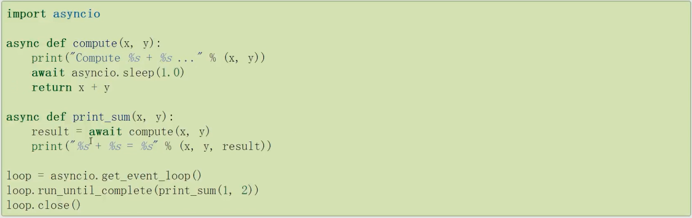

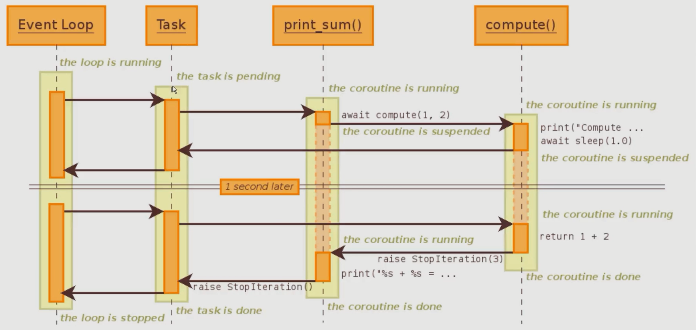

### 12.3 call_soon、call_later、call_at、call_soon_threadsafe

```python
import asyncio

def callback(sleep_times):
    print("sleep {} success".format(sleep_times))

def stoploop(loop):
    loop.stop()

if __name__ == '__main__':
    loop = asyncio.get_event_loop()
    # call_soon即刻执行，等待下一个队列时立即执行
    # call_later 稍后执行
    # call_at 指定时间执行
    # call_soon_threadsafe 线程安全的回调
    loop.call_soon_threadsafe(callback, 2)
    now = loop.time()
    loop.call_at(now+1, callback, 2)
    loop.call_at(now+2, callback, 3)
    loop.call_soon(callback, 4)
    loop.call_later(1, callback, 1)
    loop.call_later(2, callback, 2)
    loop.call_later(3, callback, 3)
    # loop.call_soon(stoploop, loop)
    loop.run_forever()
```

### 12.4 ThreadPoolExecutor+asyncio

* 使用多线程：在协程中集成阻塞io, 把阻塞的代码放在线程池中进行运行

```python
from concurrent.futures import ThreadPoolExecutor
import asyncio
import socket
from urllib.parse import urlparse

def get_url(url):
    #通过socket请求html
    url = urlparse(url)
    host = url.netloc
    path = url.path
    if path == "":
        path = "/"
    #建立socket连接
    client = socket.socket(socket.AF_INET, socket.SOCK_STREAM)
    # client.setblocking(False)
    client.connect((host, 80)) #阻塞不会消耗cpu

    #不停的询问连接是否建立好， 需要while循环不停的去检查状态
    #做计算任务或者再次发起其他的连接请求

    client.send("GET {} HTTP/1.1\r\nHost:{}\r\nConnection:close\r\n\r\n".format(path, host).encode("utf8"))

    data = b""
    while True:
        d = client.recv(1024)
        if d:
            data += d
        else:
            break

    data = data.decode("utf8")
    html_data = data.split("\r\n\r\n")[1]
    print(html_data)
    client.close()

if __name__ == '__main__':
    loop = asyncio.get_event_loop()
    excutor = ThreadPoolExecutor(max_workers=3)
    tasks = []
    for url in range(20):
        url = "http://shop.projectsedu.com/goods/{}/".format(url)
        task = loop.run_in_executor(excutor, get_url, url)
        tasks.append(task)
    loop.run_until_complete(asyncio.wait(tasks))
```

### 12.5 asyncio模拟http请求

```python
# async 没有提供http协议的接口 aiohttp

import asyncio
from urllib.parse import urlparse

async def get_url(url):
    #通过socket请求html
    url = urlparse(url)
    host = url.netloc
    path = url.path
    if path == "":
        path = "/"
    #建立socket连接
    reader, writer = await asyncio.open_connection(host, port=80)
    writer.write("GET {} HTTP/1.1\r\nHost:{}\r\nConnection:close\r\n\r\n".format(path, host).encode("utf8"))
    all_lines = []
    async for raw_line in reader:
        line = raw_line.decode("utf8")
        all_lines.append(line)
    html = "\n".join(all_lines)
    return html

async def main(loop):
    tasks = []
    for url in range(20):
        url = "http://shop.projectsedu.com/goods/{}/".format(url)
        tasks.append(asyncio.ensure_future(get_url(url)))
    for task in asyncio.as_completed(tasks):
        result = await task
        print(result)

if __name__ == '__main__':
    import time
    start_time = time.time()
    loop = asyncio.get_event_loop()

    # # 执行完成之后进行打印
    # tasks = []
    # for url in range(20):
    #     url = "http://shop.projectsedu.com/goods/{}/".format(url)
    #     tasks.append(asyncio.ensure_future(get_url(url)))
    # loop.run_until_complete(asyncio.wait(tasks))
    # for task in tasks:
    #     print(task.result())

    # 执行一个返回一个
    loop.run_until_complete(main(loop))
    print("last time: {}".format(time.time()-start_time))
```

### 12.6 future和task

线程池里的那个future和async的task类似。task是future的子类，对协程进行了封装，使用更人性化。

### 12.7 asyncio同步和通信

不需要锁就可以保证共享变量，没有出现问题。

```python
import asyncio

a = 0

async def add():
    global a
    global lock
    for i in range(1000000):
        a = a + 1

async def desc():
    global a
    for i in range(1000000):
        a = a - 1

if __name__ == '__main__':
    tasks = [add(), desc()]
    loop = asyncio.get_event_loop()
    loop.run_until_complete(asyncio.wait(tasks))
    print(a)
```

* 有时候多个地方需要用到同一个协程，比喻爬虫，下面的例子可能会造成对同一个url请求两次，所以还是要用到锁

```python
import asyncio
from asyncio import Lock, Semaphore, Queue
import aiohttp

cache = {}
lock = Lock()

async def get_stuff(url):
    async with lock:
        if url in cache:
            return cache[url]
        stuff = await aiohttp.request('GET', url)
        cache[url] = stuff
        return stuff

async def parse_stuff():
    stuff = await get_stuff()

async def use_stuff():
    stuff = await get_stuff()
```

* 协程中声明全局变量也可以实现通信

### 12.8 aiohttp实现高并发爬虫

* sanic: https://github.com/huge-success/sanic (高并发web服务器)
* aiohttp: https://github.com/aio-libs/aiohttp

```python3
# asyncio 爬虫、 去重、 入库

import asyncio
import re
import aiohttp
import aiomysql
from pyquery import PyQuery

start_url = "http://www.baidu.com/"
Stopping = False
# 真正爬取的时候需要使用布隆过滤器
waitting_urls = []
seen_urls = set()
# 控制并发请求数量
sem = asyncio.Semaphore(3)

async def fetch(url, session):
    async with sem:
        await asyncio.sleep(1)
        try:
            async with session.get(url) as response:
                print("Status:", response.status)
                if response.status in [200, 201]:
                    html = await response.text()
                    return html
        except Exception as e:
            print(e)

def extract_urls(html):
    urls = []
    pq = PyQuery(html)
    for link in pq.items("a"):
        url = link.attr("href")
        if url and url.startswith("http") and url not in seen_urls:
            urls.append(url)
            waitting_urls.append(url)
    return urls

async def init_urls(url, session):
    html = await fetch(url, session)
    seen_urls.add(url)
    if html:
        extract_urls(html)

async def article_handle(url, session, pool):
    html = await fetch(url, session)
    seen_urls.add(url)
    if html:
        extract_urls(html)
        pq = PyQuery(html)
        title = pq("title").text()
        async with pool.acquire() as conn:
            async with conn.cursor() as cur:
                insert_sql = "insert into article_test(title) values('{}')".format(title)
                await cur.execute(insert_sql)

async def consumer(pool):
    async with aiohttp.ClientSession() as session:
        while not Stopping:
            if (waitting_urls) == 0:
                await asyncio.sleep(0.5)
                continue
            try:
                url = waitting_urls.pop()
            except IndexError:
                continue
            print("start get url: {}".format(url))
            if url not in seen_urls:
                asyncio.ensure_future(init_urls(url, session))
                asyncio.ensure_future(article_handle(url, session, pool))
                # 虽然设置了并发数，但还是要sleep一下
                # await asyncio.sleep(1)

async def main(loop):
    # 等待mysql连接好
    pool = await aiomysql.create_pool(host='127.0.0.1', port=3306,
                                      user='root', password='@GF$67HL*%G7',
                                      db='test', loop=loop,
                                      charset="utf8", autocommit=True)
    async with aiohttp.ClientSession() as session:
        html = await fetch(start_url, session)
        seen_urls.add(start_url)
        extract_urls(html)
    asyncio.ensure_future(consumer(pool))

if __name__ == '__main__':
    loop = asyncio.get_event_loop()
    task = asyncio.ensure_future(main(loop))
    loop.run_until_complete(task)
```

* `mongodb`查询类似于`excel`操作

```python3
import pymongo

client = pymongo.MongoClient('localhost',27017)
walden = client['walden']
sheet_tab = walden['sheet_tab']

if __name__ == "__main__":
#     path = 'walden.txt'
#     with open(path,'r') as f:
#         lines = f.readlines()
#         for index,line in enumerate(lines):
#             data = {
#                 'index':index,
#                 'line' :line,
#                 'words':len(line.split())
#             }
#             sheet_tab.insert_one(data)

    # $lt/$lte/$gt/$gte/$ne，依次等价于</<=/>/>=/!=。（l表示less g表示greater e表示equal n表示not）
    for item in sheet_tab.find({'words':{'$lt':5}}):
        print(item["line"])
```


