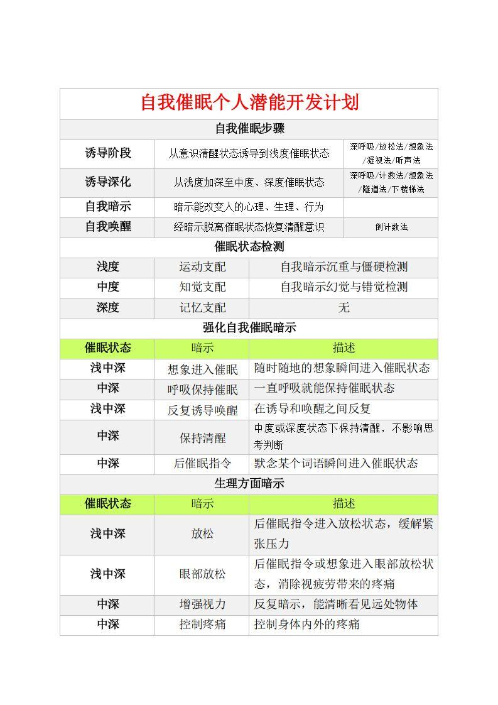
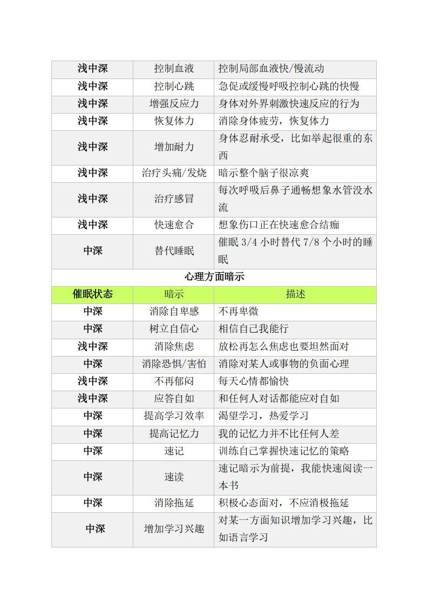
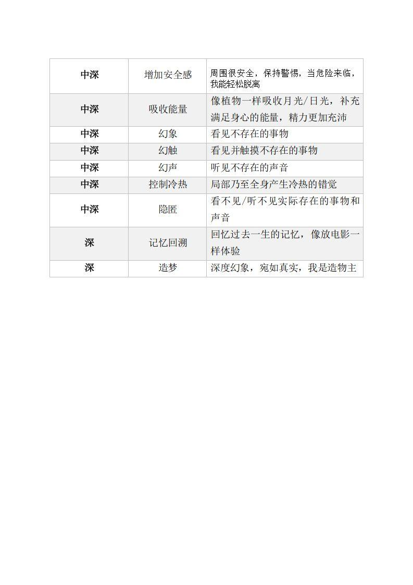

> 来源: https://t.me/xlxbj

## 2019-07-17 00:44:04
现象能够触摸真相，
行为能够反应内心。

## 2019-07-17 00:47:59

笔迹分析，是通过对笔画、结体、字阵、章法等一些特定的笔迹学要素的分析，从而判断、归纳出书写者的性格倾向、气质类型、心理状态等人格特征。
## 2019-07-17 00:57:30
当我住在一间我知道两个星期便会倒塌的房子时，

我的一切重要机能一定会受此观念的影响而遭到破坏。

可是，相反地，

如果我自己觉得已很安全，我便能很正常、很舒适地住在里边。
## 2019-07-17 01:06:16
人在生死大海中“独生独死，独往独来”，

基督教说人本质上是孤独的,

由此产生的孤独感和对孤独的畏惧，深潜于人的意识底层。

当人由某种原因与亲人和社会疏离时，

及考虑独自面对的死亡威胁时，对孤独的畏惧便会凸显。

常单独面对大自然而较多孤独感的游牧者，宗教信仰一般较为 
深切。
## 2019-07-17 01:13:43
佛学认为五通八悉地等神通异能并非“特异”，

是定心本具一种作用，是人心本来具有的一种未被开发的潜能，

任何人都可通过如法修习禅定而获得这些功能。

佛教典籍和中外史传中，记载有大量显现神通的事例。
## 2019-07-17 01:16:44
当前国外的超心理学（parapsychology）将神功异能列为重点研究的对象，一般称“意识研究”，列入“意识转变状态”，被看作当代科学的前沿课题。

经严格检验的大量证据证明：类似于神通的超感知觉（ESP，精神感应）、“视”（remote-viewing）“异地身体效应传递”、“交感魔法” 、 
“异地按摩”治病等现象是真实存在的。
## 2019-07-17 01:25:42
各种心理学体系，从不同的角度、用不同的方法探究本是一体 
的人心，其对人心、人性的理解和诠释，多带有片面性。
## 2019-07-17 12:03:12
言辞透露一个人的品格，
表情反映一个人的内心，
衣着、坐姿、手势会在不知不觉中出卖它的主人，无意识、下意识、潜意识，无不暴露内心的意思，人的一举一动都在“泄漏天机”。
## 2019-07-17 21:46:08
传统上心理学通常被分为以下五个子领域:

神经科学:通过观察大脑反应来研究心理；

发展心理学:研究人类是如何成长，发育以及学习的；

认知心理学:也许是五个子领域里对你们有些人来说最不熟悉的一个领域，它用计算机方法来研究心里，通常将心理比作计算机并探究人类如何行动；如语言理解，物体辨认，游戏等等；

社会心理学:主要研究人类的群体行为，如何与他人沟通交流；

临床心理学:它主要研究心理健康和心理疾病；心理学学科充满了心理如何发展的问题，经济学和游戏理论如今已经成为了理解人类思维和人类行为的重要方法，这些问题涉及哲学、计算机科学、人类学、文学、神学以及许多其他的科学领域；因此这门课程涉及到的方面将相当的广泛。
## 2019-07-17 22:17:30
大脑的损伤将会严重影响我们的日常行为；

多重人格障碍，即一个人有多于一种的人格；

可想而知，脑子跟心理存在一定的关联。
## 2019-07-17 22:19:03
卡普格拉综合征

卡普格拉综合征通常有几百例，不多，目前只有几百例；

它通常是由于受到某种打击而产生的，每个人所表现出来的症状也有很大差异；

卡普格拉综合征经常与非常严重的暴力行为联系在一起，

几年前一名澳大利亚人由于幻想他的父亲变成了机器人而将他父亲的头砍了下来。
## 2019-07-17 22:21:03
科塔尔综合症

认为自己已经死了，
很确定自己已经死了，
四处游走、自己也知道自己在四处游走，
并且还知道身边有其他人，但患病的人就是觉得自己死了。
## 2019-07-17 22:23:55
多重人格迫使我们把问题转向什么是自我;

人究竟在多大程度上是由多种人格组成的，

又在多大程度上是一直由单一人格组成的。
## 2019-07-18 11:52:35
主编是上海华东师范大学的梁建宁。
心理学导论的精品教材，幻影灯PPT，讲课用的，总共908页，有点多，看完不知要用多久。
同时发现另一个简化版的，总共376页。

适合心理学入门学习的资料。
## 2019-07-20 23:35:24
体验和思考的认知

当你看一部电影时，只是简单的看，即使这一过程能感到愉悦，但是看完后又能记住多少内容。

这是被动体验的思维方式，没有清晰的记忆。

当你看一本书，对一章节内某术语感兴趣，比如催眠，但是说的不详细，产生了疑问，于是通过其他方法获取参考信息，这样的做法能引发思考，表明是真的用心去思考，而不是被动的获取体验。

思考能帮助理解和记忆各种细节。
## 2019-07-20 23:43:33
自学参照法

自己联想，阅读时，将新认知的事物、术语、概念与熟悉的经验信息联系在一起。

陌生与熟悉产生关联后，陌生的东西对自己变得更有意义，也很容易记忆，陌生自然变得熟悉。
## 2019-07-20 23:57:14
批判性思维

在看一本书时，在合适的时机停下，这个时机就是产生疑问的时机或兴趣，在停下的某段话加以评价，或对比以前学过的东西，或分析这段话的内容，或批判这段话对错，或整合起来在下文中理解含义。
## 2019-07-21 00:44:02
SR4R阅读法

阅读一本书时，先大概的浏览各章的标题，插图，内容说明，章节总结。

阅读一本书时，看到每个章或节的标题，都要提出几个问题，剩下的在章节内容找到答案。

阅读一本书时，阅读章节的内容，试图找出问题的答案，就是上一步的问题，这要慢慢啃。

阅读一本书时，阅读完一节的内容，要停下回想记住了多少内容，找到问题的答案没有，简单的做笔记，方便回忆联想。

阅读一本书时，看完一章后，要不断的回忆，反复思考提出的问题和找到的答案，批判其中的对错。

阅读一本书时，最后一步就是积极的复习，一章看完后，能记住多少，靠的是复习，拿出学习笔记复习，或者简略的翻看章节内容，哪些记住和没记住，自己都要明白。

从上往下，依次为：
概览，提问，阅读，复述，联想，复习。

总共六个步骤，按照这个方法，找出章节的中心思想，也就明白了这章节说了些什么，其实就是主动思考问题，从阅读中找答案。

在复述阶段没明白，基于节的标题提出的问题，可以重头提问，阅读，然后再复述，直到找到答案。
## 2019-07-21 01:17:14
LISAN课堂学习法

听课学习时的方式，共5个部分。

主动记，一节课要讲什么，可以事先阅读课文内容，甚至可以根据内容自我提问，对某段内容有好奇心时可以主动去思考。

重点记，每节课都有一个重要的核心观点，先提出一个理论或者观点，然后就解释，或者提出一些例子，这时要明白这节课的要点是什么。

抓信号词，听老师讲话时，注意每句话开头的信号词，一般就是提出不同的观点，主要的观点，相反的观点，支持观点的例证，最后下结论。

积极听，用心听老师讲，遇到问题，不懂可以举手提问，使心保持活跃，投入的状态。

选择记，该怎么做笔记，笔记要简洁的做，更重要的还是继续听老师讲，专门记住那些要点，不要过于啰嗦，笔记就是用于复习的。

笔记如果不复习，不整理，不联想，那么只能放着吃灰，学不到新东西。
## 2019-07-21 01:36:13
良好的学习习惯

在一个安静专门用来学习的地方，经常在那里学习。

长时间没有间断的复习，这是集中的复习方式，比不过分散的复习方式效率好，也就是用零碎比较短的时间段来复习。

可以运用记忆术来辅助记忆，提高学习的效率。

不定期的自我检测，看看自己都记住那些，自我反思和批判性思考。

即便初步掌握知识，也还要继续学习，计划学习，强化复习，这就是过度学习，能真正掌握要学习的知识。
## 2019-07-21 02:25:48
拖延

人们往往不喜欢学习，拖延着时间，去看电视，电视剧，小说，漫画，喜欢各种娱乐方式，干着自己喜欢做的事，一天的时间也就过去了，都学不到什么。

拖延成为了学习的阻碍，有什么方法能让学习不再拖拖拉拉。

时间管理，大部分人都不知道管理自己的时间，玩和学习是两件事，学习时不要想玩，玩时不要想学习，制定一张时间表，什么时间段该干什么事，都要按时完成，剩下的时间可以自由支配，想玩想学习都可以。

确定目标，学习要有目标，比如自学英语，从字母，音标，自然拼读，背单词，语法，这是很大的目标，完成它需要很长的时间，这时可以分解为无数小目标，每完成一个小目标而增加动力，没有目标的人会缺乏动力，而失去学习的兴趣，这是治疗拖延症的方法。

学习靠的是自己，它本身需要投入大量时间和精力，这过程很艰苦。

如果学习的方法合理，过程也可以变成一种乐趣，就好像探险，获得各种知识宝藏，满足了各种好奇心。
## 2019-07-21 02:58:01
自律

自律就是能控制自己的行为，做好自己的事。

自律学习，积极的引导自己学习，主动的以目标为方向的学习。

建立目标，想学什么东西的，想要达到什么目标。

学习计划，有多少时间能用来学习，整出一个计划。

自我指导，一个人默默自学时，可以自问自答，比如看完这章节，自问，记住多少，还要不要再看一遍，或者看下一章节。

监控进展，自己要知道学到了哪里，哪里还没学到，还要继续学习，这个可以写笔记把进度记下来，比如看一本书可以记时间和页数。

自我奖赏，完成一个小目标或其中一个小计划，可以奖励自己好吃好玩的，提升自律学习的满足感。

自我评价，看看自己的学习方式和过程哪里不足，需要改进的，或者进展不顺利。

解决问题，自律学习的过程如果出问题，需要及时的解决，不然有可能影响自律学习的进展，例如时间不够达不到短期目标，可以调整下时间。

总结：
一个人学会自律，能够控制自己的学习行为，就等于拿到了终生发展和自我实现的钥匙。
## 2019-07-21 03:08:00
君不见，一缕白发，一生叹，
君不见，时光流转，岁月迁。
## 2019-07-22 10:11:31
由经验引起相对持久的行为变化，叫做学习。

当一个或一只动物在多种刺激和反应之间建立联结，就会产生联想学习。

人类具有认知学习的能力，认知学习的定义是指知道、理解、预测，或通过其他形式利用信息变得丰富的高级心理过程。

一些动物也具有简单的认知学习的能力，马戏团会表演的动物就是最好的例子。
## 2019-07-22 10:29:39
反应，指任何可以被确认的行为，例如眨眼睛这种可以被观察到的行为。

强化，指某种反应重复发生的任何可能性事件。

举个例子，如果一个女孩被狗咬伤了腿，那么会在疼痛与狗之间建立联系，以后再看到狗会害怕被咬，这种恐惧心理情绪会被看到的狗强化。
## 2019-07-22 11:46:47
在反应发生之前的事件为前因，
随着反应而出现的效应称为后果。

例如，听到父母下晚班回家的开门声，一个小孩在自己屋里写作业，这时会打开房门看看是谁，小孩会冲过去求抱抱，这种行为每次都会上演。

听到开门声是前因，打开自己屋子的门是反应，冲过去求抱抱是强化。
## 2019-07-22 11:46:48
操作性条件性反射，学习的产生是建立在反应结果上，一种反应可能伴随着一个奖励，或者惩罚，或者什么也没有，不同的结果决定了这种反应会不会有再出现的可能性。

例如，训练一只狗坐下，吹出一声口哨，喊坐下，狗就会在人面前坐下，每次狗做出反应后，都要摸头或喂食作为奖励，这样的奖励会强化狗做出的行为。

吹口喊指令，这是前因。
坐下的行为，这是反应。
奖励东西吃，这是强化。
听到口哨后喊指令，狗就坐下，这是后果。
## 2019-07-22 12:24:34
操作性条件反射

正强化，伴随一个反应发生并能增加这个反应再次发生的可能性事件。

奖励总是能增强反应，例如孩子喜欢吃巧克力，每次写完作业就奖励巧克力，但不是所有孩子都喜欢吃巧克力。

负强化，一个反应发生后，可以消除一件不愉快的事件。

看到一个频道在播放不喜欢或已看过的电视剧，于是不想看更换了频道，下次再看到，也许会更换频道，更换频道被负强化，结果就是为了消除不愉快。
## 2019-07-22 12:48:20
操作性条件反射

强化

一级强化物，能产生舒适感和消除不适感，或能够满足即时的生理需求。
例如食物，水满足了即时的胜利需求，食物和水自然是一级强化物。

二级强化物，比如金钱，赞扬，注意，赞同，情感，成绩，成功，这些东西都是人心中的需求与期望。

代币，用纸币替代的二级强化物，纸币本身没有太大价值，也不能充饥和解渴，但是人们却用它换取生活必需品。

人类有着一些习得的需要，如希望能够得到它人的注意和赞扬，因此，别人的注意和赞扬就成为社会性强化物，经常会影响我们的行为。
## 2019-07-22 13:10:30
操作性条件反射

反馈

在学习过程获得的反馈，有关行为反应所取得的效果信息。

观看枪战类游戏的视频教学，都会以逼真的击杀声音，画面提示，仿真的任务动作，击杀人数高低，进行回应反馈。

达到预期目标的反馈自身就会起到强化作用。

即使在没有食物和水的情况下，也会产生学习。
## 2019-07-22 13:22:10
操作性条件反射

惩罚

什么是惩罚？打屁股，训斥，罚款，监禁，解雇等相似的方法来控制行为。

惩罚能够降低一个不良的反应再次出行的可能性。

惩罚物，指用于降低目标行为再次发生的可能性的任何事物或事件。

惩罚的两种效应，直接惩罚，惩罚物直接产生不愉快的结果；反应代价，惩罚物是做了某种愉快的事情之后的痛苦代价。

例如开车超速了，违反交通规定了，被交警拦下，这罚单要交钱和扣分，这就是反应代价。
## 2019-07-22 13:47:01
认知学习

超出了基本的条件反射式的学习，
是一种包括记忆，思维，问题解决，语言因素的学习过程。

指经典条件反射和操作性条件反射，这两种联想学习的类型，也就是在认知学习上用这两种解释不了。

潜在学习，在没有经过强化的情况中，保持潜伏状态，直到给予强化，才转化为外显行为。

人在满足好奇心的过程中，就是对学习的强化。
## 2019-07-22 13:54:35
认知学习

发现式学习，认知学习的特点就是思考理解。机械式学习的方式是简单的重复和记忆。

当人们亲自去发现事实和原理的时候，学习将更灵活，记忆更持久。

在发现式学习中，技能是通过顿悟和理解的方式，而不是死记硬背的方式。
## 2019-07-22 14:20:11
认知学习

模仿

人的许多技能都是通过观察学习或模仿学习获得。

观察它人的行为及结果和模拟它人的行为能够导致观察学习。

人和其他哺乳动物都拥有观察学习的能力。

模仿的对象是现实中的榜样，也可能是电视剧，电影，游戏，动漫里的人物，模仿英雄或者犯罪。

看电视确实是观察学习的一种方式，研究表明通过观看大量的暴力影视，儿童会受其影响，甚至成年人也会受到影响，现实模仿出暴力行为。
## 2019-07-22 14:28:25
看《破冰行动》入戏太深，浙江男子报假警17次被拘留

http://www.cditv.cn/mobnews/104/1422142.html
## 2019-07-23 00:39:05
人海茫茫，失去了聯繫，誰也找不到誰。
## 2019-07-23 00:39:22
从现实的角度上看，我们记住什么，忘记什么，决定了我们是谁？
## 2019-07-23 10:09:56
记忆是一个活跃的系统，从事着接收，储存，组织，改变和恢复信息的工作。

记忆系统就像是一台计算机，

从外界获取的信息需要经过编码，把得到信息转换为可操作的数据。

储存，把已成功编码的数据保存在记忆系统中，有三种记忆方式来完成储存。

提取，把需要的记忆，从系统中提取，也就是回忆想起。
## 2019-07-23 11:44:32
信息需要经过感觉记忆，短时记忆和长时记忆这三个步骤，构成记忆模型。

感觉记忆

从外界获取到的信息首先会进入感觉记忆，在几秒钟或短时间之内 你见到和听到的所有内容，都可以精确地保持在感觉记忆中。

通常情况下，人们的意识感觉不到短时记忆的存在。

短时记忆的作用是：把信息保存足够长的时间从而使一些信息能够传送到短时记忆中。

当你看到一张含有文字的图片。
图像视觉记忆一般会持续半秒钟。
当你听到一条语音时，
感觉机会将其作为一种回声记忆储存最多两秒钟。
回声记忆是听觉系统中的一种短暂，却活跃的反应。
## 2019-07-23 12:08:59
短时记忆可以储存一小部分信息，人们能够意识到短时记忆那十几秒的时间。

短时记忆的内容能够以图像形式储存，但更多时候是以声音形式储存的，特别是在储存单词和字母时。

短时记忆的好处，防止我们的头脑永久的储存那些没用的名字，日期，电话号码或其他琐事。

当短时记忆和其它心理过程结合起来时，他会提供一片工作区域，这座区域产生的记忆叫做叫工作记忆。

它能保持在思考和问题解决过程中所需要的信息。
## 2019-07-23 13:21:08
经过短时记忆加工的重要或有意义的信息会被传送到长时记忆中，有意义的信息将得到永久性的储存，长时记忆中保持着你所知道的一切，从事实到幻想。

长时记忆的容量几乎是无限的，记住的东西不会被超载。

事实上，你知道的越多，新的信息就越容易进入长时记忆。

长时记忆主要是依靠理解的意义来储存，长时记忆中出现的错误记忆都是与理解的意义有关。

当进入短时记忆的信息与储存在长时记忆中的知识联系起来时，
短时记忆中的信息便获取了意义并且更便于记忆。
## 2019-07-23 15:53:56
短时记忆就像是电脑的桌面，

长时记忆就像是存放在硬盘的永久性文件，

长时记忆中储存的都是过去的经验和记忆信息，

现在如果想把长期记忆中的信息拿来解决问题，需要把长时记忆中的记忆信息调回到短时记忆中。

就好像在电脑桌面上，打开存放在硬盘内的永久性文件。不需要的时候可以关闭桌面打开文件的窗口。

这就是短时记忆和长时记忆的关系。
## 2019-07-23 16:35:14
记忆模型

人靠感官的去感知获取外界的信息，得到的信息包括图像，声音，气味，温度，等各方面的信息。

这些信息变成感觉记忆，如果没有注意这些感觉，被其他的事物吸引注意，当下所获得的感觉记忆将被很快遗忘。

 当你选择性的注意那些有趣的事物时，而没有赋予明确的意义，只在短时记忆存在十几秒的时间，没有成功编码转变为长时记忆，将被遗忘。

当短时记忆被赋予明确的意义时，被精细加工过，将转化为长时记忆。
## 2019-07-23 17:09:53
短时记忆

心理学家发现，短时记忆容量是有限的，信息单位是比特，而人的短时记忆的容量是7比特。

复述信息，短期记忆内的信息内容，通过无声的复述，信息被多次的复述，不仅仅只出现一次，以延长短期记忆，这一过程被称为保持性复述。

机械复述，复述的次数变得越多，短时记忆变成长时记忆的储存的几率也越大，通过简单的重复进行学习，也就是死记硬背。

精细加工，新的信息与长时记忆中已经有的经验和知识记忆整合起来。对内容进行分析，消化，延伸思考。更加容易的建立永久性记忆。
## 2019-07-23 17:20:50
长时记忆

表现

大脑对过去事件的记忆就像一卷连续的，带有声音信息的电影胶片。

不是所有经验都能保存在记忆中，许多信息在感觉记忆和短时记忆中都被遗忘了。

大部分人都只有相对来说较为长久的记忆，但没有绝对的永久记忆。
## 2019-07-23 18:05:13
长时记忆

虚假记忆

实际上是虚假的，但却被看做真实的记忆。

通过精细加工的方式，新的长时记忆内容形成时，原有记忆经常发生变化，出现记忆修订或记忆改变，还一些记忆丢失了。

记忆中的缺失非常常见，而人们往往通过逻辑，推理，猜想或新的信息去构建这些缺失的部分。

精细加工对永久性记忆虽然有帮助，但是也会带来伪造的记忆，因此，对某件事情的记忆，也许是从未发生过的事。

通过思维，推理，和心理联系都可能歪曲真实的记忆。

在新记忆和原始记忆互相混淆时，精细加工使我们常常分不清信息的来源，造成来源混乱。
## 2019-07-23 22:42:59
记忆的形成和运用过程是一个积极的，创造性的和高度个体化的加工过程。

每个人记忆都会因为个人情感，偏好和人格因素而独具特色，即使有一个朋友与你形影不离，一起经历生活中的每件事，你们的记忆仍然会不尽相同。
## 2019-07-23 23:09:07
长时记忆

记忆索引

人之所以能够从记忆中快速提取想要获取到的信息，是因为我们的记忆中有一个高度组织化的索引系统。

长时记忆的信息储存可能基于多种线索，包括规则，表象，类型，符号，相似性，规范的定义和个性化定义。

记忆网络模型

一个相互连接的点的网络，当点与点之间相隔较远时，就需要通过一条较长的链进行连接，因此，在网络中的两个条目距离很远时，建立连接所需的时间就越长。

记忆恢复

相互关联的记忆构成记忆网络。
通过在记忆网络的分支上不断扩散而实现记忆恢复。
例如现在看到的人和事物，能让你想起过去与之关联的许多往事。

短时记忆编码转换成长时记忆时，精细加工越多，记忆网络的意义也越丰富，记忆恢复时提取线索也更多。
## 2019-07-23 23:38:35
长时记忆的种类

程序性记忆，基本条件反射和各种学习得来的动作，例如打字、拿筷子，这些记忆通过动作来表达，或者说知道怎么做。

陈述性记忆，是对事实信息的记忆，例如姓名、人脸、单词、日期观点等等，该记忆是通过单词和符号来表达，又能分为两种。

语义记忆，关于世界的基本知识记忆。包括人所说的语言，以及记住的单词，春夏秋冬的四季变化，加减乘除的运算规则，各种物体的名称概念。

情景记忆，是个人经历的自传记录，就储存着日复一日，年复一年所发生的事件记忆。
还能以时间为线索来回忆人的心路历程。
## 2019-07-24 12:07:38
记忆测量

你有没有这样的经历？曾经努力的想要记起一件事，却发现自己卡住了，出现了舌尖现象，英文缩写TOT。

在另一项研究中发现，当人们在听喜欢的电视剧主题曲时，如果让他们说出电视剧的片名，在每5次回忆中就会出现一次TOT现象。

与TOT状态紧密相关的一种记忆现象是知道感，即人们经常能够在回忆之前说出他们是否记得某件事情。

当你第一次经历一件事情时，却觉得自己曾经经历过，这种感觉被称为似曾相识，这也是部分记忆的一种。

如果一个新的经历在不涉及任何细节的情况下，触发了你对过去经历的模糊记忆，你可能会出现这种感觉。

在学习中广泛涉猎，尽可能多的学科和知识。

一些人认为学生们把许多时间花在学习代数，历史和外语是一种浪费，因为许多人在毕业后一两年内就会把那些知识忘个一干二净。

然而，在通过学习测验的结果说明，当你一旦再需要这些知识时，将能够在短时间内完成再次学习。
## 2019-07-24 12:18:27
记忆的外显和内隐

外显记忆，可以有意识的回忆出来的过去的经验，这些回忆再认以及你在参加考试时的回忆都依赖外显记忆。

内隐记忆，无意识的记忆，就是我们没有意识到的，但确实存在的过去记忆，就像我们下意识的知道键盘上各个字母的位置，从而实现盲打键盘，对我们当下的行为有着巨大的影响。
## 2019-07-24 12:57:50
遗忘

即便有些精细加工的信息，编码储存在长时记忆中，希望那些信息能一直放在那，然而，大多数信息在记忆后，却立刻被遗忘了。

对记忆是如何进行丢失的理解的更多，你就越能避免记忆的遗忘。

艾宾浩斯曾进行过一系列著名的实验，他在学习后的不同时间对自己的记忆进行检测，为了记忆不受已有知识的影响，艾宾浩斯的记忆材料没有意义的音节，由三个字母构成的无意义的单词。

根据记忆检测的不同间隔时间，艾宾浩斯绘制出了遗忘曲线，这条曲线显示了在不同时间条件下的记忆保持量。

结果表明，在学习没有意义的音节之后，遗忘曲线便开始迅速下降，然后逐渐缓慢下来。

对有意义材料的遗忘也是开始比较快，然后速度减缓，总的来看，遗忘要慢得多。

记住信息需要经过三个步骤：编码，储存和提取。然而，其中一个环节失败，遗忘便会产生。
## 2019-07-24 13:31:33
遗忘的原因

在许多情况下，遗忘发生的原因正是信息编码失败，也就是从一开始信息就没有记忆储存在记忆库里。

积极的对所学的信息进行思考，是一种防止信息编码失败的有效方式。

一些观点认为，遗忘的原因是记忆消退，记忆活动是脑神经细胞或大脑活动发生变化，形成记忆痕迹，这些痕迹会随着时间的流逝而减弱或消退，记忆消退是感觉记忆和短时记忆中信息被遗忘的原因。

有证据表明记忆快，因为不被提取使用和复述而逐渐减弱，会导致遗忘信息中一部分的记忆，但不会遗忘全部。

如果你已经将信息进行编码和储存，那么提取失败可能是引起遗忘的原因。

即使想要获取的信息储存在你的记忆中，仍然需要获取这些信息的相关线索和联系，精细编码的记忆之所以能够更容易记起，是因为与之相连的提取线索更加丰富。

如果将提取线索丢失，记忆就会提取失败，导致想不起来的情况。

干扰导致记忆的遗忘，是指新的记忆对旧的记忆的提取和恢复造成损害影响，在短时记忆和长时记忆中都存在着干扰问题。

倒摄干扰，即新的学习抑制了对先前学习内容的记忆。不学习新的东西能够防止倒摄干扰。

前摄干扰，即先前的学习干扰对后面学习内容的记忆。

通过睡眠一段时间后，再次学习能降低记忆上干扰的发生。
## 2019-07-24 13:47:45
记忆的压抑

许多人发现，他们回忆较多的是快乐和积极的事情，而很少那些令人失望和愤怒的事情。

临床心理学家将这种倾向叫做动机性遗忘或对记忆的压抑。

通过压抑那些痛苦的，具有危险性的，和令人尴尬的记忆被排除在意识之外。

使自己忘掉过去的失败，童年的痛苦，自己所厌恶的人或各种不堪回首的往事。

事实表明，人可以遗忘掉那些不愉快的经历。通过有意的压制，这些记忆就真的被压抑在潜意识中。
## 2019-07-24 17:38:55
逆向性遗忘症是对发生在一个事故或灾难之前的事件的遗忘。

与此相反的是，顺向性遗忘，是发生在一个事故或灾难之后的遗忘。

假设信息从短时记忆转移到长时记忆需要一段时间，这一过程被称为巩固。

防止巩固的方法之一是给于另一次不同强度的电击，这种技术叫电休克ECS，电休克是一种低强度的能够刺激大脑的电击，能够在不伤害动物的情况下破坏其正在形成的记忆。

事实上，大脑的许多区域都与记忆有关，其中，海马的作用特别重要，这个结构深深的埋在大脑里，似乎充当着短时记忆和长时记忆的中转站。

海马体损伤的病人常常不能形成或储存新的记忆。

闪光灯记记是一种似乎冻结在记忆中的特别生动的图像，常因个人公众强烈情绪的事件而产生。

闪光灯记忆一直最初用于描述，那种非同寻常的，生动且持久的记忆。

然而，所谓的闪光灯记忆，并非一定是真实的，随着时间的不断推移，闪光灯记忆越来越明显，尽管有时他们实际上是错误的。

比如说战争或童年时期遭受的虐待，都会激活边缘系统，导致回忆与闪回体验的出现，进而引起人们的情绪障碍。
## 2019-07-24 17:55:48
超凡记忆

遗觉象是一种记忆现象，当这种现象产生时，人好像可以看到自己记忆中的图像，它能非常清晰地保持约30秒钟，你可以扫描观察它。

遗觉象，更像是我们在看一个灯泡或霓虹灯后出现的视觉后像。

遗觉象记忆在儿童身上比较常见，成年人中产生遗觉象的极为少见。

事实上，每一个人都能通过训练记忆策略〔记忆术〕来达到超高的记忆水平，显然超凡的记忆能力是可以通过学习获得。
## 2019-07-24 18:18:22
超凡记忆者有以下特点

使用的记忆策略和技巧
具有一些特殊的兴趣和知识。
能够更容易的对某一类信息进行编码和回忆。
有着天生的超常记忆能力，能够记忆生动的表象。
没有超凡的智力水平或与众不同的大脑结构。

一个人可以天生具有超凡的记忆力。
也可以通过学习和掌握记忆策略来获得超出常人的记忆力。

通常情况下，先天和后天两方面的因素是相辅而成的。
## 2019-07-24 18:55:29
改善记忆之编码、提取策略

基于意义的策略来改善编码和提取。立刻收到提高记忆力的效果。

精细加工，阅读一本书时进行复述，也就是心里回顾的次数越多，记忆效果就越好。只用机械复述并不一定有效。
最好是进行精细复述，即寻找意义和建立新的知识与已有知识间的联系。

选择，好的记忆就像渔网留住大鱼放走小鱼，能够把一篇文章中的每一个段落都凝炼成为一句话或一两个术语，记忆的效率将会非常高。

组织，概括总结可以使信息更好的得到编码进而改善记忆能力。

记忆线索，对新学的知识，进行整合加工更有利于记忆，在记忆编码时，要有目的的记住一些有意义的线索，这些线索将帮助需要时信息被提取。

过度学习，当学习掌握一些基本知识后，并能够准确的回忆后，仍然继续学习。

分散学习，学习一段时间后，休息一段时间，再接着学习，精力充沛不容易感觉枯燥和疲劳。

集中学习，没有休息时间的学习方式，不间断的学习，容易感觉到疲劳。

睡眠以后醒来就进行学习，减少干扰，知识更容易被记住，减少记忆提取失败的几率。

人在饥饿的时候，学习知识的记忆效果是最差的，不要在饥饿状态下学习。
## 2019-07-24 19:05:16
总结

记忆的三步骤，编码，储存，提取。
记忆的三类型，感觉，短时，长时记忆。
测量记忆能记住多少。
记忆是因为哪些原因而造成被遗忘。
超越常人的记忆是如何获得的。
通过什么方法能够得到改善记忆。
## 2019-07-24 19:41:13
意识

意识意味着觉察，意识是对外界所有的感觉和知觉，以及自身的思想，记忆和情感的觉察组成。

通常情况下，人处于清醒的潜意识状态下，是一种清楚，有组织，有警觉的状态，在清醒的意识状态下，把经历的时间，地点，事件知道觉察为真实的，有意义，熟悉的。

当正常觉察的意识状态发生改变后，会改变成疲劳，谵妄，催眠，药物作用，以及欣喜若狂的某一状态等等。

经历的一些能引起意识改变状态的事，比如睡眠，梦，做白日梦。

在意识改变状态下，人的心理活动在性质和模式上都有明显的变化。
人的知觉，情绪，记忆，时间感，思维，自控，和接受暗示等方面都有明显的改变。

大部分人都能察觉到，自己是否处于意识改变状态。
## 2019-07-24 20:11:48
睡眠

睡眠，是每一种生物都不可忽视的先天需求。

人可以长时间的不睡觉，但可持续的时间终究是有限的。

有一种罕见的疾病使患者无法入睡，病情发展的必然结果是患者不省人事，昏迷乃至死亡。

一般人4天以及4天以上不睡觉，都会感觉到很痛苦。

大多数由于睡眠剥夺引发的症状，只需要睡一夜就能恢复。

缺少或失去睡眠的代价是，言语含糊，注意力无法集中，记忆力下降，对常见的物体想不起名字。

典型的身体反应是，双手颤抖，眼睑下垂，注意力涣散，容易愤怒，目光呆滞，疼痛敏感高，全身不舒服。

缺少了几个小时的睡眠，也就是睡不够，就会体验到嗜睡，或者过度的日间睡眠。

1天或2天没有睡觉的人，很难集中注意力，保持警觉，或者重复做一些简单乏味的常见工作。

这种情况人很容易进去微睡眠的状态，在清醒状态下，大脑会短暂的转换到正常睡眠模式的现象。

就是稍微一愣神，昏昏沉沉的状态，能立马醒过来。

人即使一晚上只少睡了1个小时，情绪，记忆，注意力，身体健康都会受到影响。
## 2019-07-24 20:38:00
睡眠，能够调节体温和免疫系统，可以保持能量，有助于身体发育和休整，使大脑和躯体保持健康。

睡眠修复理论，睡眠期间有利于能量的储存，并能延长寿命。

开车时，出现微睡眠现象，可能会发生交通事故。每年全国有将近十万起交通事故，都是因过度疲劳驾驶引起的。

严重的缺少睡眠可能导致，暂时性的睡眠剥夺精神病，主要的行为表现为丧失与现实世界的联系能力，典型反应包括精神错乱，定向障碍，妄想和幻觉，然而这种病并不常见，60小时下睡眠剥夺一般不会出现幻觉和妄想。

从晚上睡到自然醒，如果感觉睡够了，就能计算出自己的自然睡眠需求的时间。
## 2019-07-24 21:26:38
睡眠模式

睡眠和觉醒周期，会产生多种睡眠模式，睡与醒的节奏规律是十分稳定的，即使在不知道时间和看不到昼夜交换的情况下也能持续多日。

睡觉与觉醒，一循环就是一周期，作为正常的节奏规律，是在基于24小时昼夜循环的基础上建立的。

罕见的短时睡眠者，只睡一两个小时却感觉很好。
长时睡眠者，平均每晚睡9个小时或9个小时以上。
大多数人的睡眠时间为7～8小时。

8小时的时间用于睡眠，16小时处于觉醒状态，这一睡眠模式，是大多数人所接受的。

睡眠模式也可能因人为而改变，比如短睡眠周期，3小时睡眠，6小时觉醒做事。

睡眠模式可以被压缩和延伸，但完全屈从人的意志，那几乎是不可能的。
## 2019-07-25 10:14:54
睡眠的四个阶段

当人闭上眼睛，呼吸逐渐变得缓慢而有规律，脉搏艰难，体温下降。

α 阿尔法，大而慢的脑电波，放松和睡眠时出现。
β 贝塔，小而快的脑电波，清醒警觉时出现。
δ 德尔塔，深度睡眠，大幅度而慢速的脑电波。

使用脑电图仪EEG能放大记录下，人脑中产生的微小脑电波，从而观察到睡眠是如何产生的。

浅层睡眠，心跳降低，呼吸不规律，全身肌肉放松，有可能引发入睡抽搐，脑电图仪出现α波。

中二层睡眠，体温下降被自动调节，脑电图仪监控到睡眠纺锤波，它是丘脑产生的脑电波，能使睡眠中的大脑不受外界刺激干扰，是睡与醒的分界线。

中三层睡眠，睡眠进一步加深，意识进一步丧失，脑电图仪监控到δ波的出现。

深层睡眠，最深的睡眠阶段，大脑一片空白，脑电图仪完全出现δ波。
## 2019-07-25 10:51:04
睡眠的两种基本状态

快速眼动REM，眼球快速的运动，与做梦有紧密的关系，在此睡眠期间处于底层睡眠，大脑处于活跃状态，看起来就像醒着。

非快速眼动睡眠NREM，出现在第2、3、4阶段，没有做梦，在此状态下，能镇静大脑。

这两种状态，额外的作用是，消除大脑疲劳并储存记忆。
## 2019-07-25 11:17:42
睡眠紊乱

睡眠紊乱，因为一些原因，导致无法入睡，这些原因可能是白天过度的嗜睡，晚上根本睡不着，随时发作性的睡病，出现灵活的梦魇，梦游到处走，总之原因很多。

药物依赖失眠，因为吃了太多安眠药，已经成瘾，不吃药，导致失眠。

梦游，梦呓都处于深度睡眠，一个是睡着能走能避开障碍物，一个是睡着说梦话。

梦魇是被困在梦境中，无法逃离，夜惊是在梦境中受到惊吓，醒来不能平静
## 2019-07-25 12:00:52
梦

一些心理学家认为，梦具有深刻的隐含意义。
另一些则认为，梦几乎毫无意义。还有一些认为梦反映了人在觉醒时的思维，幻想和情绪。

梦的心理动力学理论，第一观点，弗洛伊德认为梦以伪装了梦的象征，具有深刻象征意义的表象，来表达潜意识的欲望和冲突。

为了理解梦的含义，需要通过分析梦中的显性内容，即明显的一目了然的意义。来揭示其潜在内容，即隐藏的象征性意义。

第二观点。激活合成假说，在快速眼动睡眠时，大脑中的一些低级中枢，被随机激活，但由于从脑细胞发出的信息被阻断，不能到达躯体，所以活动并没有发生，而这些细胞又不断把他们的活动通知给更高级的脑区。为解释这些信息大脑只能搜索储存的记忆，并制造出梦境。

梦是潜意识进行有意识表达的产物，但不排除梦是有意义的。
因为梦产生于个体的记忆和以往经历，梦境中能反应出内心的精神，情感，所关注事件的信息。

第三观点，认知神经梦境理论，梦与清醒时的想法和情感相似，大部分梦都是对日常经历的真实反应。
## 2019-07-25 12:02:32
催眠

催眠术兴起于十七世纪，由奥地利医生始创，施催眠术一词来自这位医生的姓氏，他认为自己可以用磁力来治病，神秘的治疗都和催眠有关系，实际上运用了暗示，并非磁力。

催眠状态不同于睡眠状态，它是一种意识改变状态，其特征是注意范围缩小或受暗示的程度提高。

很多理论家认为，催眠是自我暗示的结果，而催眠师只是一个引导者，通过一系列的暗示，改变被催眠者的感觉，知觉，思维，情绪和行为。

所有的催眠方法都是让人做到以下几点。
集中注意力听催眠师说话，放松并感觉到疲倦，甘愿听从催眠师的指令，催眠师进行情景引导，被催眠者进行生动的想象。

基本暗示效应，被催眠者在执行暗示的同时，认为自己是自然而然这样做的，动作和体验都是自动的，不需要费力。

催眠感受性，指一个人被催眠的容易程度，通过一系列的暗示以及个人对暗示的反应来测量。

催眠的作用，通过一些暗示，使被催眠者认为自己能，拥有很大的力量，增强记忆力，遗忘某些事，某些的身体部位感觉不到疼痛，返老还童觉得自己变回童年时期，感觉出现变化，闻香的变臭，甜的变苦，咸变无味。

舞台催眠，并不需要或几乎不需要真正的催眠，仅仅是对催眠效果的模仿，舞台催眠只是表演。
## 2019-07-25 14:57:40
冥想和感觉剥夺

冥想是用来改变意识状态的一种精神训练。
冥想的过程中，注意力高度集中，日常的思绪和烦恼被短暂隔离，能缓解压力，紧张了焦虑等情绪。

专注冥想，专注于一个焦点，可以是一个物体或一个想法，或者是自己的呼吸。

正念冥想，通过扩散注意力，平和的觉知整个世界。

感觉剥夺，感觉刺激总量和种类的大幅度减少。轻度的感觉剥夺能产生放松的反应，比如洗个热水澡能达到全身放松的效果。
## 2019-07-25 16:06:33
能改变意识状态的药物

用于改变主注意，记忆，判断力，时间感，自我控制，情绪，或知觉的物质。

要想改变一个人的意识状态，可通过服用精神活性药物的方法改变，这些药物能直接作用于大脑来改变意识状态。

药物可以缓解疼痛，诱导睡眠，治疗抑郁，有些强力的药物属于管制物品。

药物成瘾，吃药成瘾，过度依赖药物带来的满足。

这些能控制精神意识的药物，可分为三类，能提高身体和神经系统活跃的兴奋剂，能抑制身体和神经系统的镇静剂，能导致各种幻觉的致幻剂。

精神性药物的作用，无外乎三种，兴奋，抑制，致幻。
## 2019-07-25 16:07:20
兴奋剂

广泛的用于治疗减肥和抗抑郁的安非他命，由人工合成的。

从古柯叶提炼而来的可卡因，服用后使人产生警觉，欣快，安宁，有力量，经历充沛和愉悦的感觉。

摇头丸，和安非他命类相似的药物，能快速产生能量，使人更加兴奋，不断的摇头。

咖啡因，来自咖啡豆，有消除睡意，提高警觉的作用，熬夜提神一杯咖啡就好。

尼古丁，来自烟草，是天然的兴奋剂，之所以烟不离手，是因为尼古丁上瘾。
## 2019-07-25 16:35:36
镇定剂

巴比妥酸盐，抑制脑活动的镇静类药物，在医学上，用于使患者镇静或催眠。

GHB，羟基丁酸，中枢神经系统抑制剂，可使身体肌肉放松和镇静，通常个人通过网络上获取的配方，在家制作所得。

安定药，能缓解焦虑和紧张，街头有种药叫迷奸药，这种药就是比正常的安定药剂十倍量的安定药，作用就是降低自控力，放松，产生睡意。

酒精，一种可点燃的物质，少量的酒精能降低中枢神经系统本身的抑制水平，从而产生放松和欣快感，服用大剂量的酒精能直接令人丧失意识。
## 2019-07-25 17:08:37
致幻剂

LSD和PCP，LSD麦角二乙酰胺最著名的致幻剂，用一点就能出现幻觉，使思维和知觉像精神病一样紊乱。PCP天使之尘，一种麻醉剂，同时具有兴奋和抑制两种作用，使用后会出现暴力，定向丧失，极度兴奋等症状。

大麻，从大麻叶或大麻花中提取，服用后心理作用包括欣快，安宁，放松，时间感改变和知觉扭曲，大剂量使用会产生妄想，幻觉和错觉。
## 2019-07-26 14:09:54
一只豪猪为了寻找避寒的地方，向一窝鼹鼠请求。希望能搬进鼹鼠们住的岩洞里来。

鼹鼠们同意了。但是岩洞很小，鼹鼠不久就发现豪猪一动他身上的刺就会扎到他们。

最后鼹鼠们要求豪猪搬走，但是豪猪不肯，既然你们鼹鼠不同意，那你们就搬走好了。
## 2019-07-27 11:00:00
催眠并不是多么神奇的事情，催眠状态是生物界的本能状态，作为一种生理科学现象，我们生活中处处都会有催眠，只是人们没有意识到而已。

催眠状态在日常生活中并不罕见。当一个人全神贯注于某一活动时，由于精神的高度集中，以致对外周环境的事物一无所知，这种状态也属于催眠的一种形式。

“小动物遇到危险时，会表现为假死，也是一种催眠本能。”

彭旭说，专业上把催眠分成四个境界，催眠秀、催眠操、催眠治疗和催眠道。

这四个境界，就如同舞台表演的太极舞、健身的太极操、用来格斗的太极拳，以及参悟人生的太极道。
## 2019-07-28 15:58:10
人类有一种心理功能，叫动机性遗忘。

所谓动机性遗忘是指为了避免不愉快的情绪，或者强烈的内心冲突，而主动遗忘某些事件或人物的现象。

遗忘通常是人们有意识或无意识，的动机所导致的，同时是一种自我保护心理的特定手段。
## 2019-07-29 09:17:32
人并不是因为独处才感到孤独，是在许多人中感到自己无足轻重或与人的关系疏远，才会感觉到孤独。
## 2019-07-29 11:26:07
学心理学的两类人，一类是研究人，动物，文化的心理学【学术】，

另一类是心理治疗师，医学方面，药物，医疗器械治疗心理疾病，附带催眠术技能【医】。
## 2019-07-30 18:09:05
催眠状态，定义为人的一种精神状态，此状态的特点是，潜意识占据主导地位，并不是清醒状态下，意识占据主导地位。

催眠术能人为的改变精神状态，经催眠师诱导，暗示，唤醒实施整个催眠过程，而被催眠者是被诱导进入催眠状态的对象，由暗示控制思想，由思想控制行为，再由催眠师唤醒或自行唤醒。
## 2019-07-30 18:37:19
被催眠者在催眠状态下，会出现哪些的特点？

注意力高度集中，人在清醒时由于外界的多种刺激，导致注意力过于分散，而在催眠状态下，注意力集中于单一刺激，而对其他刺激毫无知觉。

人在进入催眠状态的过程中，注意力的分布范围会逐渐缩小，直到集中到一个非常狭隘的范围之内。

感官超级敏感，注意力集中的方向上，视觉，听觉，触觉等多方面知觉，会变得比清醒时非常灵敏。

对潜意识主导的神经活动和生理状态进行控制，改变被催眠者的脉搏跳动，肢体僵直，月经周期。

削弱或丧失自主意识的控制，潜意识代替意识进行行为控制，而潜意识受催眠师的暗示控制，若不接受催眠师的暗示内容，强烈抵触暗示内容，有可能会自行从催眠状态中唤醒。

延迟暗示的反应，在催眠状态下，催眠师发出暗示，等脱离催眠状态后再发挥作用，有时候没发挥作用，就关系到暗示内容其实不符合被催眠者的思想和道德倾向。
## 2019-07-30 19:31:41
过去，人们相信催眠师能彻底控制被催眠的对象。
后来，认为催眠的作用完全是被催眠者自己引发的，而催眠师只是引发催眠的辅助工具。
现在，认为只有催眠师和被催眠者彼此配合，才能达到催眠效果。

催眠过程就是意识向潜意识的层次转移的过程，是精神活动的中心从交感过渡到自主神经系统的过程。
## 2019-07-30 19:40:44
清醒催眠和深度催眠

这是两种催眠状态，都需要被催眠者的思想由潜意识主导。

清醒催眠状态下，意识还尚有留存，
深度催眠状态下，潜意识完全取代意识主导行为。
清醒和深度这两种催眠状态没有明确的界限，因为在意识的海洋里，潜意识的浮现是一个连续的过程。

在催眠它人的情况下，需要催眠师和被催眠者双方的配合和信任，才能使被催眠者的意识向潜意识发生转移，潜意识代替意识主导行为。

在自我催眠的过程中，自己诱导自己的意识层次发生转移的过程。
## 2019-07-31 00:40:35
暗示，潜意识把某种想法或念头变为现实的过程。
暗示，是操控被催眠者潜意识的方式。

潜意识，是人一生记忆的储藏室，记忆随时处于活跃状态，随时影响思想，经历决定性格。

潜意识，受情感支配，为意识和意识控制下的行为提供能量，负责调控身体的各项关键生理机能。
整个身体的运行，都受到潜意识主导，没日没夜的工作，不会停息，入睡时意识涣散无注意力，潜意识负责保护身体。
## 2019-07-31 00:41:07
潜意识没有分辨是非黑白的能力，意识和潜意识常处于相互作用中，只要在意识中不断重复某种念头或想法，只要被潜意识接受，会自动转化为行动，称为生活中的一部分，被称之为本能或习惯。

暗示内容只要带有一定程度上的感情色彩，就一定会被潜意识接受，转化为行动，真正对潜意识造成影响的是那些相伴的感情色彩。

前面暗示的内容不能和后面暗示的内容，不能存在情感上的冲突。
## 2019-07-31 00:41:43
睡眠时，潜意识处于高潮期，意识会被彻底淹没。
准备清醒时，潜意识处于落潮期。
清醒时，潜意识处于低潮期，完全隐藏于意识下。
在困倦或者走神时，潜意识处于涨潮期。

当意志力和念头发生冲突时，念头每次都是胜利的一方，意志无法消灭连连不断的念头，反而还会适得其反，屈服于潜意识和想象。
## 2019-07-31 12:27:41
暗示影响力

选择暗示的时机，在催眠状态下，先观察前一次暗示是否在被催眠者身上出现反应，在适当的时机做出下次暗示，暗示的内容包括等下要发生的，或正在发生的，或未来不确定时间发生的。

重复暗示内容，催眠师要不断的重复语言暗示，增强暗示影响力。

说话方式，掌握好说话的节奏，音调，音量，言辞，都会增强暗示的影响力。

彼此关联的暗示内容，前后的暗示内容要产生关联，比如你的手臂在变硬，像钢铁一样，接下来当我拍你的肩膀，你的手臂会变得松弛无力，这会是被催眠者陷入深层次的催眠状态。

训练提高对暗示的反应能力，先从简单的暗示开始训练，之前的暗示成功，被催眠者的反应能力增强，反之削弱。

主动做出反应，直接按照催眠师的暗示内容主动做出反应，内容说明要发生的过程。

深呼吸，引导被催眠者有规律的深呼吸，导致大脑供氧过度，产生轻微的眩晕感。

数数，数数字，催眠师暗示被催眠者，我从1数到10，这时每数一个数字都加个放松，然后深呼吸，暗示全身放松，当我从10倒数到3的时候，你将进入催眠状态。

除了语言之外的暗示，包括身体姿势，呼吸节奏等因素都能起到暗示的作用。
## 2019-07-31 17:58:46
催眠术的效果反应

可让被催眠者变得高兴，愤怒或欣喜等各种情绪，对于暗示的内容表情反应很真实，记忆力也在催眠中得到相当程度的提高，无论催眠是深还是浅，都有可能回忆起以前的事情细节。

能使被催眠者忘记自己的姓名和生活情况，或者忘记一段经历的记忆。

通过暗示让被催眠音产生妄想，错觉，幻觉，比如暗示一个空杯子装有水，让它喝下去，被催眠者就真做出喝水的动作。

幻觉是指感知不存在的东西，例如暗示你面前的桌子上有一个苹果，去把那个苹果拿起来，暗示到这其实没有什么苹果和桌子，都是幻觉。

处于深度催眠状态下，被催眠者经过暗示，产生各种各样的幻觉或错觉，被催眠者却相信那是真实的。

通过暗示能引起各种生理反应，控制身体某部分的温度变冷变热，饥饿，口渴，甚至生病发烧都能通过暗示创造出来。

通过暗示能使被催眠者致盲或致聋，在精神上感官暂时性失去作用，身体上的感官仍然是正常。

在催眠状态下，首先发出指令暗示，要在某一特定的时间做某一件特定的事，如果潜意识接受暗示内容，就会在接近的时间做出行动，这就是暗示的延迟影响。

脱离催眠状态后，清醒状态之下，在接近指定的时间内，不经过意识，由潜意识主导行为，不知不觉中就做出符合暗示内容的行为。

瞬间催眠，在深度催眠状态下，暗示当你从催眠中醒来后，只要我拍下你肩膀，就回到当前被催眠的状态，然后暗示唤醒，完全清醒之后，拍下它肩膀，瞬间回到深度催眠状态。
## 2019-07-31 19:06:48
所有精神正常的人都能受到催眠术的影响，不同人接受催眠的难易程度不相同。

一个人容易催眠它人或被人催眠，都是看个人天赋，从根本上取决于意识进入到潜意识层次的难易程度。

意志力由意识主导，意志力强的人容易被人催眠，反而意志力薄弱的人，不能用严肃的对待自己的想法和念头，所以难以被催眠。

催眠作用主要发生在情感层面，而非个人的主观意志，期待，信仰，信念，想象力，恐惧都能促使人进入催眠状态。

一些情况下，越不愿意被催眠，反而越容易进入催眠状态。

恐惧会使人不知所措，催眠师利用这机会对其暗示，只要影响力强，可以达到瞬间催眠的效果。

催眠不会改变人的道德操守，如果正常状态下觉得某些行为不道德，催眠状态下也会拒绝做出这些行为。

高智商容易被催眠，原因与本身的智力无关，而是本身的好奇心，对未知事物的求知欲。
## 2019-07-31 22:25:31
练习催眠术

催眠它人，此中关系有两者，催眠师和被催眠的对象，练习的次数越多就越熟练。

肌肉放松训练，告诉被催眠者，左手横放在胸前，手心向下，右手伸出食指抵住左手心。

被催眠者需要精神集中和放松，经过催眠师暗示后，当被催眠者相信自己的左手和左臂都已经放松了，经过催眠师暗示后，右手食指移开，左手垂落表示已经接受暗示，没垂落表示暗示没有反应，还没放松下来，需要反复练习。

向后倒训练，提高暗示的反应程度，测试肌肉放松的程度。

人的思想具有这样的特点，当注意力集中在某种想象中的动作或反应时，身体就会下意识的做出这样动作或反应，心理学家威廉詹姆斯，把这样的动作反应成为念动效应。

催眠师暗示被催眠者，双腿要并拢站直，放松自然的向后倒，没有顾虑的，不要故意倒，由催眠者在后面扶住双肩。

在没有说向后倒时，就暗示身体很放松，这时催眠师右手从被催眠者的身体左边放到右肩上，略微往后拉，有反抗表示放松程度不够。

对被催眠者说的话，被称为暗示，暗示的内容影响是的被催眠者的潜意识，而不是意识，说话平静，吐字清晰，声音温和，容易产生信任感，才能达到暗示的效果。

向前倒训练，催眠术和被催眠者面面相对，被催眠者双腿并拢站直，催眠师的双手自然紧贴着被催眠者的太阳穴，被催眠者凝视着催眠师的双眼，催眠师也同时催眠凝视，被催眠者自然的向前倒，催眠师右腿后退一步双手及时的扶住前额和肩膀。

催眠师的催眠凝视，只要盯住被催眠者的双眼中间，这是一种基本的技巧。
## 2019-07-31 22:51:41
向后倒训练的催眠语

催眠师向被催眠者说明过程，现在注意听我说话，现在你感觉到身体很轻松，并感觉不到一丝压力，放松，放松，深呼吸，每一次呼吸会更加放松，有股力量让你的身体很自然的向后倒去，不要抵抗顺应那股力量，身体会更加轻松，我会在你身后扶住你。

暗示内容，其实靠自己编的，要不断的重复说着上面催眠语的某段内容，放松和向后倒本身就是暗示，重复就能增强暗示的影响力。
## 2019-08-01 09:05:11
锁手术

锁手术因法国著名药剂师兼催眠师艾弥尔库艾的应用而为世人所知。

它因最经典的暗示语，每天，在每个方面，我都在不断做得更好而扬名。

清醒催眠，在清醒状态下，通过暗示进行催眠，逐渐由清醒状态过渡到催眠状态。

实施过程，被催眠者面对催眠师而站立，向前伸出双手，双手交叉相锁，保持不动的姿势，这时催眠师可以暗示，你的双手被胶水粘住了，无法分开，不信你试试，或者被催眠者自我暗示，现在我的两只手没法分开，在心里必须深信这一想法。
## 2019-08-01 11:39:14
清醒催眠

催眠状态是一种能够让外来暗示越过意识，直接通过潜意识引发行为的精神状态。

只要条件合适不需要正式的催眠过程，就能让被催眠的对象，在保持清醒的状态下，达到催眠效果。

暗示，产生作用的对象是潜意识，通过特定的念头或想法，让被催眠者的潜意识实现。

当代心理学，不在把人的思想分为意识和潜意识，而是把思想看做一种连贯，时刻处于变化的机制，意识与潜意识随时都能浮现于表层。

处于催眠状态下，最重要的特点是，容易接受暗示。潜意识只能推理，不能进行反溯和归纳。潜意识会直接接受暗示内容，再根据内容得出完全符合逻辑的结论。
## 2019-08-01 11:39:42
清醒催眠下的暗示基本原则

1，被催眠者的注意力必须集中在某个想法或念头上。
2，提出暗示时，催眠师要有自信，让被催眠者不去怀疑，相信暗示的内容的确会发生。
3，语言是催眠师的主要暗示工具，恰当的词语句子能让被催眠者自动做出反应。
4，暗示内容必须是被催眠者所希望的，能被接受的，至少也不抵触的。
## 2019-08-01 23:36:20
深度催眠

深度催眠状态，是人为引发的深度催眠，而一些天生梦游状态是自发的深度催眠状态，梦游等同于深度催眠状态。

如果被催眠者配合催眠师，愿意接受催眠，那么能很好的从清醒催眠过渡到深度催眠。

那些梦游和梦呓的人是最好的催眠对象，却只存在少数，被催眠者和催眠术，都能通过学习，来提高对暗示催眠效果的接受程度。
## 2019-08-02 00:20:14
催眠程度的分类

戴维斯哈斯班三十级分类法

轻度催眠1～4，放松，眼皮颤动，合眼，身体完全放松。

低级深度催眠5～10，眼球、肢体、全身僵直，麻痹。

中级深度催眠11～19，健忘，性格改变，肌肉运动错乱。

高级深度催眠20～30，完全失忆，能睁开眼睛，暗示延迟影响，完全梦游状态，产生幻觉，视觉幻象，听觉幻听，选择性失聪失明，超敏。

六级简化催眠状态分类
浅层睡眠，轻度睡眠，睡眠，深度睡眠，梦游，深度梦游。

前三级，能保留整个催眠过程的记忆。
后三级，能忘记整个催眠过程的记忆。

清醒催眠，前三级和低级深度催眠，只是轻微催眠，意识主导行为，在暗示下潜意识浮现接受暗示内容。

深度催眠，后三级和中、高级深度催眠，人为引导下的梦游状态，身体能自由行走。
## 2019-08-02 01:03:59
在心理学上，催眠与睡眠的精神状态是不一样的。
睡眠状态，意识是涣散的，注意力也是极度分散。
深度催眠状态，注意力高度集中，比平常状态更加清醒。

人在平常生活也有健忘的情况，在深度催眠状态中，唤醒之后大多人都会忘记自己的催眠过程中的行为，可以做出暗示，醒来能回想起这次经历过程。

催眠状态下的健忘程度，因人而产生差别，有的能回忆被暗示做出的行为，醒来后或多或少能回忆一些经历，有的想不起好像失去一段记忆，因催眠的方式导致延迟性的健忘，并没有完全遗忘。

经过心理学验证，催眠和做梦一样，梦醒后能回忆起一些画面，有的完全遗忘梦境的内容，只记得做过一个梦。

健忘暗示：“所有催眠效果都会从你的记忆里逐渐消失，就像一场梦，彻底被你所遗忘”。
## 2019-08-02 08:52:56
唤醒

被催眠者从深度催眠状态中脱离，逐渐恢复清醒，如同刚睡醒。

唤醒的方式，也是利用暗示的机制，唤醒的时间因人而异，并非发出唤醒暗示后，就能立马醒过来，需要等待一些时间。

当被催眠者在催眠状态中，处于长时间没有注意的目标，没有暗示没有反应，过一段时间，会自动清醒。

通过不断的暗示，被催眠者也因暗示的内容不断做出反应，这样能维持催眠状态。
## 2019-08-02 12:38:58
深度催眠的方法

催眠师让被催眠者舒服的坐在椅子上，告诉它，希望你能入睡，让它凝视催眠师的双眼，催眠师同样催眠凝视。

又说，接下来我会慢慢的数数，数一个数字，你就要合上眼睛，再睁开眼睛，一直凝视催眠师的双眼，现在我从1数到100，数数要有节奏。

越往下数，被催眠者的眼睛，睁开的时间就越短，直至眼睛睁不开，停止数数，再重复睡眠暗示，睡吧，睡吧，困了，你已经睡着了，直到进入催眠状态。
## 2019-08-02 19:30:03
瞬间催眠

在一瞬间几秒钟内，进入催眠状态。

延时催眠，被催眠者经过催眠后，发出延时暗示，当催眠师发出某个信号，就会被立刻催眠。

期望催眠，利用被催眠者期望被催眠的心理，来达到瞬间催眠的目的，例如在别人期望时，，猛抓一下对方然后暗示催眠对方。
## 2019-08-02 20:18:34
加深催眠状态

楼梯法，在催眠状态下，暗示被催眠者，站在一个巨大楼梯的楼顶，向下的楼梯没有尽头，你在一步一步的往下走，每走一步都陷得更深，进入更深的催眠状态。

电梯法，暗示被催眠者，在顶楼进入一部电梯，随着电梯缓缓下降，感觉自己的身体在不断往下降，这种感觉将带着你进入更深的催眠状态。

上面两种加深催眠状态的方法，是基于被催眠者的自我想象，通过想象加深催眠状态，而催眠师要做是在旁边观察反应进行言语暗示。
## 2019-08-02 21:09:35
催眠与时间概念

有些人有着很强的时间观念，固定的时间做着固定要做的事，比如经常在早上某个固定的时间醒来，潜意识与时钟产生了关联，形成了所谓的生物钟。

在深度催眠状态下，做出延迟暗示，当你在脱离催眠状态后，1分钟内会再次进入当前这个状态，大约在接近1分钟被催眠者就会出现延迟暗示反应，这里运用了时间概念的暗示。

有一种与催眠和时间概念有关的现象叫时间扭曲，能在深度催眠状态下，用最短的时间去体验需要最长的时间，经历过的所有细节，感觉和正常时间一样。

时间认知上的显著变化，让精神活动加速成为可能。
## 2019-08-02 23:10:16
梅斯迈的生物磁性催眠理论

该理论认为生物都有股能量，这股能量就是磁力，学这理论的催眠师，认为催眠的原理，是通过自身或磁铁的磁力流入目标对象的身体进行催眠，并非通过心理暗示进行催眠。

超自然现象

由于动物磁力说，利用磁力进行催眠，对磁铁敏感，在催眠状态下，通过言语暗示，感知物体散发的能量，那些带磁性的物体都散发磁力光。

在深度催眠状态下，进行一系列的超感知能力实验。

感官超敏，闭着眼睛，轮流把不同的物体给被催眠者感应，并告诉物体的名称，当物体靠近时，能够分辨物体，说出物体的名称。

视觉超敏，中级深度催眠，能睁开眼睛而不打断催眠状态，在相同的东西，放入一样细微差别的东西，混入其中，平常人看起来都一样，被催眠者事先观察这样东西，记住这细微的差别，能在混合打乱后找出。

心灵之眼，能清晰的看到快速运动的物体，通过暗示进行，都是在睁眼的情况下实验。

灵魂飞行，通过暗示告诉被催眠者，你的灵魂可以飞到任何催眠师说的地方，让它飞到催眠师熟悉的一个地方，然后让被催眠者描述看到什么，催眠师负责检验。
## 2019-08-02 23:31:57
动物催眠

催眠动物，与动物的生理机能有关，不涉及心理，只用于舞台表演，看起来像催眠术。

青蛙，翻过来肚皮朝上，动不了看起来定住了，翻回来朝下，恢复正常，假死状态。

龙虾，头朝下，两个钳子支撑体重，会固定住在平面上，肌肉僵硬状态。

母鸡，按压鸡爪突出来的腘窝，摇晃鸡头，地上画出一条线，在线的一端按住，鸡眼盯着线不动，肌肉僵硬眩晕状态。

兔子，肚皮朝上，压住后腿伸直，压住分开两耳，假死状态。
## 2019-08-03 00:31:46
舞台催眠

催眠术被用于在街头或舞台上表演，被催眠者通常是在周围或者台下找的，有时候上来一堆人，都需要测试一些哪些容易催眠或渴望被催眠，难弄的都请下台，搞集体催眠或者单人催眠表演。

催眠师要快速的催眠要被催眠的人，如果催眠过程太过于繁琐，不同于用于心理治疗的催眠，底下都是花钱看催眠术表演的，催眠时间过长，都不乐意看。

清醒催眠状态，在催眠师的暗示下，就能表演一些简单的项目，再暗示加深催眠状态，深度催眠状态，利用被催眠者表演更好看的娱乐项目，例如瞬间催眠表演，幻觉幻象，泪流满面，大哭大笑，变成另一个人。

有可能因为舞台催眠师没学过心理学，不了解人的心理机制，而把人给玩坏了。
## 2019-08-03 16:42:26
催眠术起源

那时候不存在催眠术这个概念，发现者运用它治疗疾病，都不明白其中的原理，认为这样的能力是神所赐予，非人力所能为，大多使用者都是宗教中的僧侣。

公元前千五百年，埃及罗马僧侣，在神的诞生日，于神前进入一种失神的状态，替人占卜。

有一种占卜的方法，只要凝视手中握住的宝石，不久闭上双眼，回答别人问的事情，预言灵验。

公元后一世纪到二世纪后期，耶教有一派，在礼拜那天，教徒们闭合双目，生幻觉，见神之姿。
耶教有很多分派，其中有一派的教徒，只需要凝视自己的肚脐，就能进入睡眠状态引发幻觉，另一派的教徒能运用这原理实现各种不可思议的事。

舍利奴神庙，有一种神秘法，在庙中是浅涸的井底放上一块古镜，有人来求治病，就从井口看下去，出现朦胧的身姿倒映在镜中，僧侣在一旁说一些安慰的话，不上几日病好了。

古埃及医术记载，一个医生只要用手掌停放在患者额头上，便能将疾病治好，这是一种神秘的疗法。
## 2019-08-03 18:50:34
催眠术起源

基于占星术，而提出了一种理论，那就是动物磁气术，随着不同人不断的研究发展构成了不同的分支体系，动物磁气术也就是那时候的催眠术叫法，那时掌握此术的人常用于为人治疗疾病。

占星术，按照星光来占卜未来与命运的法术。

最开始提出动物磁气学的是公元1762年的梅斯迈，以下是不同人在运用研究动物磁气术，猜想得出的不同理论。

星与星之间有发动于其他物体之上的能力，对人类的身体能影响，至于地面上的各种奇异现象，都能这样说明，人类精神上的治疗，也不外乎是星星影响的结果。

整个宇宙内，充满着磁气，人体里的磁气，也是天上的星给予的，人体与星星能相互发生影响，人的生存不仅依赖食物的营养，也要靠磁气的营养，人与人之间能相互影响，因为人体有磁气的关系。

相隔的物体，有牵引和反抗作用，而生出相互的影响，这就叫磁气，含有一种灵气的精神力，可以侵入一切物体中，使之能产生运动。

任何一种物体，都受到星星的影响，磁石也不例外，磁石就是具有磁性的石头，它是受到星星影响的物体，接受了北极星放出的光而得到磁气力。

磁气力是充满宇宙里的一种力，它的作用，是犹如连结神造的一切事物相连的带子一样。

动物磁气术的理论在现代催眠术的理论看来并不可取，完全研究错了方向，但是用动物磁气术确实能把人催眠，并且被那时的用来治病，有个人发现被动物磁气术催眠的人，第二次催眠时只用命令的语调就能让那人，再次入睡也就是被催眠了，梅斯迈的理论站不住脚了。

当时，耗费五六的心力在巴黎一家医学校，重新考察研究动物磁气术，并公开实验报告。

还离不开磁气作用，通过接触或按压就能传导磁气给被催眠者，传导需要1～30分钟的时间，就能诱导进入失神状态。

其实，动物磁气术，还不是现代催眠术，即便在考察报告中，研究在磁气术中的种种反应，对声音，嗅觉，痛觉，催眠的次数，记忆，超常的能力，治病各方面做出实验，不过又是从动物磁气术整出另一个新的结论，还是动物磁气术。
## 2019-08-03 19:36:35
现代催眠术

起源于公元1841年，由一名英国的医生詹姆士始创，本身学过动物磁气术，它的催眠术不再用动物磁气术的名称和原理。

基于催眠术提出的视神经疲劳理论，
长久的专心凝视一东西，导致视神经疲劳，睁不开眼睛，催眠就是一种人为的睡眠状态。

在同一时代，美国有位动物磁气术家，叫格里姆斯，提出新的见解，这一派叫电气生物学。

他只用语言方面的暗示，就能引诱人进入睡眠状态。

最后因为电气生物学这个学术名称，起得不符合学术内容，而催眠术被越来越多的人所接受。

公元1850年，不少医师利用催眠术，在催眠状态下，为患者进行外科手术，而患者察觉不到痛处，但是由于只有少数的人能这么做，大多数对于催眠术的不完全会，怕出事。

南希学派，主张暗示说，催眠现象是被催眠者接受催眠师的暗示而引起一种现象。

催眠术的施展离不开暗示的作用，催眠术简直可以称为暗示术。

耶路学派，认为催眠状态和歇斯里患者发生的状态相同。

最后，南希学派获胜，耶路学派的学说站不住脚。西洋的催眠术起源就是像上面那样，直到现在的21世纪初代。
## 2019-08-04 08:39:32
催眠是一种注意范围被集中缩小的状态，在此状态下，建议性和暗示性被极大的提高。

催眠以人为诱导，如放松，单调刺激，集中注意，想象，而引起的一种特殊心理状态。

被催眠者的自主判断，意愿行动减少或丧失，感觉和知觉发生扭曲或丧失。

被催眠者受到催眠师的暗示或指示，并做出反应。

深度催眠，因被催眠者的催眠感受性，催眠师的威信和技巧各方面的差异而不同。催眠时暗示产生的效应可延续到催眠后的苏醒活动中。

人可以通过很多方法进入催眠状态，但是催眠不能直接改变人，只能让人保持长久稳定的，最有利于进行改变的状态。
## 2019-08-04 10:21:07
催眠术的种类划分

按施展催眠术的人，可分为自我催眠，和它人催眠。

按暗示条件分为，言语暗示，运用语言进行暗示。操作催眠，运用行为，动作，音乐，电流等作为暗示性刺激达到催眠状态。

按意识状态，可分为苏醒时催眠（清醒催眠），和睡眠时催眠（睡眠状态引渡到催眠状态）。

按进入催眠状态的速度，可分为快速催眠（瞬间催眠），和慢速催眠。

按被催眠的人数，可分为个人催眠，和集体催眠。

按距离可分为，近体和远离，催眠师和被催眠者天各一方，依靠电话，书信，远程遥控催眠。

按催眠程度，分为轻度，中度，深度三种催眠状态。

治疗学，运用催眠术是为了帮助催眠师达到治疗的目的，舞台催眠师所提出的催眠建议或指令，只在表演过程发挥作用。

而临床医学催眠师发出的建议或指令，会在催眠结束后保持的长久的效用。
## 2019-08-04 12:44:57
大多数人都存在可能被催眠的潜质，能够在催眠方面变得多么熟练，取决于兴趣和练习程度。

天生梦游的人，拥有最容易被催眠的潜质，也是最容易进入深度催眠状态的人，被称为梦游者，这样的人只存在少数。

梦游者在深度催眠状态下，可以做到轻度催眠状态不可能发生的事。

可以接受不是威胁性的暗示或指令。
可以返回到任何年龄段，想起以前发生的任何事情，可以激活自己的记忆，自动控制身体。
可以接受一些特殊非正常的催眠后指令（延迟暗示影响）
对催眠时周围发生的事情毫无知觉。
## 2019-08-04 14:29:04
心灵状态

脑电图仪器EEG对不同状态下大脑活动进行监控。

β 贝塔 脑电波活动速度14～30周/秒，清醒状态，大脑高度警惕，正常使用推理和逻辑。

α 阿尔法 脑电波活动速度8～13周/秒，处于警惕状态，但较为放松容易接受新信息，发挥想象力，沉迷电影或游戏时，或刚睡着或睡醒时，常出现此状态。

θ 西塔 脑电波活动速度4～8周/秒，高度放松，平和，伴有睡梦，被称为睡梦状态，刚进入深度睡眠时发生。

δ 德尔塔 脑电波活动速度少于每秒4周，完全失去意识，属于深度睡眠状态，催眠无法达到此状态。

催眠性恍惚发生于阿尔法和西塔的脑电波状态，这时对潜意识的暗示才不会受到意识判断的阻碍。
## 2019-08-04 15:13:50
催眠恍惚的六个阶段

催眠的一个重要部分是恍惚状态，潜意识开始接受暗示，而意识的判断能力致盲中，当前处于恍惚状态，无法判断。

六个阶段中被催眠者都有不同的表现，催眠师要学会如何诱导并辨别不同阶段的恍惚状态。

1，第一阶段，伴随着瞌睡，开始放松，被催眠者想睡觉，没法移动沉重的身体，也没法睁开眼睛。

2，第二阶段，轻度恍惚，被催眠者的肌肉组织变得僵直，有沉重感和漂浮感。

3，第三阶段，中度一层恍惚，除了会感觉肌肉变僵直外，味觉和嗅觉能发生改变。

4，第四阶段，中度深层恍惚，催眠师诱导或暗示被催眠者出现健忘，丧失记忆，可以加入后催眠暗示，也就是延迟暗示，以及部分肢体感觉缺乏，丧失痛觉。

5，第五阶段，深度一层恍惚，经过催眠师暗示，被催眠者能产生幻觉，看到不存在的事物，或者听到不存在的声音。

6，第六阶段，最深层次的深度恍惚，被催眠者出现麻醉现象，能开刀做手术，看不到实际存在的事物，听不见实际存在的声音。

前三个阶段，都是记忆留存阶段，能想起催眠过程中，做了什么。

后三个阶段，能使被催眠者丧失记忆，除非给出暗示，不然做过的行为都会记不得。

https://t.me/xlxbj/103
## 2019-08-04 21:28:36
催眠的过程

经过三个步骤，诱导，暗示，唤醒。
诱导被催眠者进入催眠状态，进入后继续诱导能加深催眠状态，从轻度催眠进入深度催眠状态。

在催眠状态下，对被催眠者做出不同的暗示，影响被催眠者的思想，从而看到不同的反应，有些反应看不到比如提高记忆力的暗示，这都是在清醒后通过测试才能看到效果。

当催眠师在催眠状态下，完成各种暗示，达成此次催眠的目的，最后就是要唤醒被催眠者的意识，脱离恍惚状态，恢复正常状态。
## 2019-08-04 22:04:58
经历是一种财富，不管是愉快，成功的经验，还是痛苦，挫折的经验，都能让人成长，经历这些，才会更懂得生命的意义，更加感恩生活，珍惜生命。
## 2019-08-04 22:28:56
人们常说的特异功能，其实是人类潜在能量的一种体现，研究对象主要可以归纳为两类。一类是认识上的超常现象，称为超感官知觉。一类是意念直接作用于外界事物，称为心灵致动。

特异功能的具体内容很庞杂，例如遥视，透视，预知，思维传感，意念移物，意念治疗，灵魂出窍，附体重生，幻影续存等。

特异功能以人的冥想为基础，能量化人的心智，程序化人的生活，物质化人的梦想。
## 2019-08-04 22:56:18
催眠术的作用是唤醒潜意识，催眠是催眠师与被催眠者潜意识沟通的过程，随着被催眠者潜意识的上升，意识就会越来越弱，这就是催眠的深化。

心理学家一般将催眠分为三个阶段，浅催眠，中度催眠与深度催眠。

在浅催眠状态下，人的感觉变化并不是很明显，主要体现在精神愉悦，身体慵懒而不想动，但是其意识仍然是比较清醒，能够清楚知道周围发生的一切事情。

在中度催眠状态下，感觉是比较多的，比如人体温度的变化很明显，痛觉消失以及无法完全知晓周围发生的事情。

在深度催眠状态下，被催眠者只能听见催眠师一人的声音，注意力高度集中的状态，其他感觉几乎全部消失，意识不清醒，不知道周围的状况，沉浸在个人的主观世界中。
## 2019-08-04 23:12:47
只要一个人是正常的，就能够被催眠，只是催眠时间的长短有所不同，有一些很难被催眠的，必须被反复长时间的诱导，有可能需要三到四个小时才能进入催眠状态，那些敏感度高的人，几分钟就可以进入状态，所以时间越长，就越考验催眠师的耐心和技术。

拥有催眠敏感度高的人，一些特点：
容易放松，渴望被催眠，专注力高，好奇心强，想象力丰富，高智商。
## 2019-08-06 09:09:05
人的心灵即意识组成，仿佛一座冰山，露出水面只有一小部分，代表着意识。

而埋藏在水面之下绝大部分是潜意识，人的言行举止，只有少部分的意识掌控，大部分由潜意识主宰。
## 2019-08-06 09:19:31
意识指理性行为的精神活动，包括逻辑，判断，分析，计划，计算等各方面。

潜意识，能控制基本生理功能，比如心跳，呼吸，记忆，情绪反应，习惯性行为，创造梦境，直觉等目前已发现的功能。

潜意识有六大功能，本能，记忆，习惯，情绪，能量，想象力。
## 2019-08-06 13:27:37
在你我出生之前，潜意识这种神奇的力量就存在了，这是一个伟大，永恒真实的力量，是生命运动的法则，运动的法则。

让你牢牢抓住这个，能改变一切的魔法力量，就能治愈你的心灵创伤，愈合你身体的伤痛，摆脱心中的恐惧，摆脱贫穷，失败，痛苦和沮丧，你所要做的。

一切就是将自己的精神，情感与你所期待的美好愿望集合为一体，富有创造力的潜意识会为你做出安排。
## 2019-08-06 13:59:06
意识与潜意识具有相互作用，意识控制着潜意识，潜意识又对意识有重要影响。

潜意识的力量，为许多伟大的科学家，诗人，歌唱家，作家和发明家深刻了解。

心理有两个层次，一个有意识，符合理性。一个是潜意识，不符合理性。

人的意识就是身体，周围环境以及从事一切事务的主人，意识向潜意识发布命令，因为意识能做出判断，接受认为合理的事情。

当理性充满恐惧，担忧，焦急时，潜意识同样以恐惧，绝望影响着意识。

弗洛伊德将意识分为三个部分，即意识，前意识，潜意识。
在他看来，前意识里面的东西，只要借助注意，就可以进入意识，但潜意识的内容，想要进入意识时，就会遭受意识的抗拒。
## 2019-08-06 15:27:55
催眠师，对自己说得话要抱有自信，形象良好，身体健康，积极向上的感觉才能被催眠者所信任，表情温和，具有人情味，往往能让被催眠者放下警惕心，低音质的声音具有浑厚的感觉，对催眠时暗示有利。

催眠师应该考虑时间和场合进行催眠，同时不要给被催眠者脱离常识的暗示，催眠时不要超限度的恶作剧，不选择容易兴奋的被催眠者，感情容易爆发，很容易出现混乱的场面。
## 2019-08-06 23:07:25
诱导

催眠诱导，催眠师诱导被催眠者进入恍惚或催眠状态的过程。

诱导能使被催眠者被动放松，反应降低，注意范围变窄，幻觉增强，逐渐进入催眠状态。

诱导的结果，放松身体和精神，精神力集中，减少外界事物的注意。

固定诱导，让被催眠者的注意力集中在感兴趣的一个点上，自己的呼吸或者蜡烛的火光。

快速诱导，快速的引起催眠状态，该诱导由简短，快速的直接命令组成，对暗示的感受性高的人适用容易成功。

间接诱导，诱导交流通过类比，象征的方式，属于隐喻学的范畴，诱导进入催眠状态。
被催眠者很难抵制拒绝本身没有意识到的暗示。

放松诱导，诱导被催眠者自动放松身体的每块肌肉，从头到脚或者从脚到头，适用于催眠它人或自我催眠。
诱导语：“深呼吸，闭上眼睛，只想着放松身体每一部位，接下来，想象你的额头很放松，接下来…”

从上往下的顺序，额头，双眼，脖子，两个肩膀，胸部，肚子，两条大腿，两条小腿，两只脚。
## 2019-08-07 01:08:31
语言诱导的技巧

同义词，具有相同含义或意义的词汇，能强化要描述的状态，比如放松，平静，舒服，轻柔等等，目的是为了进入催眠状态。

解释暗示，通过重复和解释暗示，加强理解，确保被催眠者的反应能够持续。

连接词，保持语言流畅，防止个人的对白被打断。比如但是，但，接下来，然后，而且，并且，并，等等这些连接词。

明确指定时间，加强语气和强调，提示被催眠者暗示开始或结束的时间。
比如，现在，一分钟后，五分钟后，一小时后，十二点钟，睡觉时，起床时，早上，明天，等等关于时间方面的词语。

例如，现在，你感觉不到身体的重量，身体很轻松，眼睛困得睁不开，只感觉很累很累，只想一觉睡过去，接下来当我从3数到0的时候，你就会睡着，3，快睡吧，2，睡吧，1，睡，0，好，现在你已经睡着了。
## 2019-08-07 14:19:54
诱导前暗示感受性测试

测试被催眠者对暗示的接受和反应能力，暗示感受性越强，就越容易接受催眠。

僵硬手臂，确保身体处于完全舒适放松的状态，现在想象一只手臂，正在慢慢变得僵硬，无法弯曲，当我从5数到1时，手臂完全放松。

提桶，闭上双眼，双手平直的伸出，想象左手提着纸做的桶，很轻很轻，感受不到一点重量，想象右手提着铁桶，桶中一颗一颗石头的放入，桶被石头填满，太重了，右手提不起了。

手部握紧，舞台催眠术称为锁手术，双手手指交叉，想象双手紧贴着，被胶水粘合住，胶水从湿变干，当我从1数到5，会粘得越来越紧，双手融合起来，已经分不开。
## 2019-08-07 20:13:04
诱导方法

凝视法，是刺激被催眠者的感官视觉，从而使注意力集中的催眠诱导方法。

利用生理的集中，造成视觉疲惫，进而神经瘫痪，麻痹大脑中枢神经系统，意识模糊，身心放松的浅度催眠状态。

凝视的对象，可以是任何东西，不同的被催眠者，喜欢凝视的东西不尽相同。

发光的物体，电灯，镜子，水晶球，荧光棒，火苗等。

运动物体，摇晃的钟摆，指尖，手上带的戒指等等。

特殊色彩，催眠师的脸或瞳孔。
## 2019-08-07 21:04:43
诱导方法

深呼吸，能够缓解紧张情绪，释放心理压力。

通过深呼吸能使被催眠者的注意力集中起来，达到一定的专注程度，从而进入催眠状态，要注意，呼吸速度不能时快时慢。
## 2019-08-08 10:47:09
诱导方法

◎压迫法，能提高催眠的效率，通过压迫枕后动脉，颈动脉窦，锁骨下动脉，颞浅动脉，从生理方面诱导进入催眠状态。

◎压迫枕后动脉，位于耳朵中央往后2～5厘米，两边的耳朵都有这条动脉。
催眠师左手扶着被催眠者的额头，右手食指和中指按压这条动脉，掌握好力度，这条动脉不能长时间按压，会出问题的，按的时候注意被催眠者的表情变化。

◎压迫颈动脉窦，位于喉咙两侧的动脉，它是一个压力感受器，能使受到的压力传到大脑，只要按压这条动脉，都会引起血压上升，迷走神经受到刺激，会发挥降血压的作用。

注意，力度是要轻压，这种方法会快速降低血压，用力过猛会导致血压急剧下降，而引发脑缺血，甚至昏迷，进入催眠状态就不要按了。

能成功进入催眠状态的秘诀，在于边按这条动脉，边诱导催眠，诱导的方法可以参考深呼吸和凝视法，诱导语自由发挥。

◎压迫锁骨下动脉，左侧起自主动脉弓，右侧是头臂干的分支。

用力按压颈根部和锁骨的位置，通过压迫锁骨下动脉，减少脑部供血，暂时抑制被催眠者的思考。只有坐着的姿势才能用这个方法，适用于，轻度催眠深化到深度催眠。

◎压迫颞浅动脉，俗称太阳穴的部位，通过慢慢按压，减少脑部供血，从而引发脑贫血状态，更容易催眠诱导，适用于对催眠诱导没反应的人，边按压边诱导，能增加被催眠的成功率。
## 2019-08-08 12:19:45
诱导方法

多重诱导，对于抵抗比较强，或者不愿意配合的被催眠者，通常要求被催眠者，专注几件事，容易产生疲劳，无法胡思乱想。

只要一边凝视，一边数数，一边听催眠师暗示，就能诱导进入催眠状态。

两个催眠师站在被催眠者的左右侧，诱导语可以是相同，甚至可以尝试不同的语气，语音，语调进行诱导，效果明显，迅速给被催眠者带来恍惚，混淆的感觉。

利用意料之外的一些暗示，在被催眠者惊奇或惊讶的一瞬间，造成混乱的感觉。

烛光法，准备一根蜡烛并点亮，让被催眠者自然的凝视烛光，催眠师在一边诱导，只要被催眠者能跟着诱导语进行想象，就能进入恍惚的催眠状态。
## 2019-08-08 13:06:07
催眠深化

当被催眠者进入催眠状态后，继续对其进行催眠，从轻度催眠进入更深的催眠状态。

深化催眠的技巧，在于诱导被催眠者更专注在一件重复操作上，潜意识更容易接受暗示。

催眠深化是催眠诱导的延续，催眠深化的方法是用来加深催眠状态的方法。
## 2019-08-08 13:51:56
催眠深化～反复诱导法

对被催眠者反复诱导，具有加深催眠的作用。

反复诱导是一种清醒状态与催眠状态多次交叉，重复进行的方法。

清醒状态是不完全的清醒，在被唤醒的一瞬间，其实还滞留在催眠状态，再次接着进行催眠，必须要在没有完全苏醒的情况下引导，就能进入更深的催眠状态，这一过程要反复。

即便，没有进入催眠状态，或者进入比较浅的催眠状态，催眠师都要反复暗示，加深催眠的程度。
## 2019-08-08 14:49:13
催眠深化～阶梯意象法

意象，通过描绘想象，使被催眠者成为想象的主角，从而进入深度催眠状态。

描述的想象，可以是任何自然情景，催眠师的想象力越丰富，描述越逼真，被催眠者就能从暗示中想象出更加的具体形象。

阶梯意象，想象自己正在楼顶，面前有个楼梯口，走过去看不到底，只看到数不清的阶梯，走向那个楼梯口，一步一步的往下走，这时催眠师在加些身体很放松，很轻松，很舒服的相关暗示，就能进入深度催眠状态。

当然，除了意象阶梯，还能意象出别的情景，这要看催眠师的引导暗示。

参考
https://t.me/xlxbj/108
## 2019-08-08 14:49:25
催眠深化～数数法

这是一个简单的方法，随着催眠师数着每一个数字，催眠状态就会深化一步。

周围的环境一定要安静，催眠师说话要用平静缓和的语气进行诱导，也要配合被催眠者自然呼吸进行数数。

可以是催眠师数数，也可以是被催眠者自己数，从1数到20，也可从10数到1。
## 2019-08-08 22:36:34
基本诱导的程序

诱导本身就是一种暗示，以下通过暗示完成诱导的过程。

眼睛疲劳，全身没有力气，直到眼睛无法睁开。

感官逐渐变得迟钝，慢慢就没了感觉。

只听见催眠师的声音和要做的事，周围发生的事不知不觉。

想象出来幻觉幻象，犹如真实发生存在面前。

唤醒之后忘记催眠过程中的经历，身心变得轻松且愉快。
## 2019-08-08 23:08:27
暗示

暗示，在生活中无处不在，无论是在意识清醒状态，还是诱导催眠状态，人在接受外界信息或者自身思考产生的想法，都是暗示的来源。

比如别人告诉你裤子后面脏了，你会特意看一下，这就是生活中的暗示。
还有在心里长久的认为别人看不起自己，不想与别人交流，变得越来越自闭，这也是一种自我暗示。

潜意识能对暗示做出反应，潜意识不会思考，容易接受暗示内容。

通过暗示能够实现一些目标，加深催眠，改变情绪，改成行为，产生幻想。

有一种不知不觉的自然催眠状态，平时在人的生活中，经常会处于非常专注，放松的状态。
## 2019-08-09 12:36:42
暗示的分类

○积极与消极的暗示，
消极暗示包括自己乱贴标签，习惯常说的话，侮辱性外号，来自它人的负面评价等，容易形成消极的思维。

积极暗示，遇到挫折，遭遇不幸，来自自我或是它人的鼓励安慰。

○一切暗示都是自我暗示，只有自己接受才能产生作用。
环境暗示，人被周围存在的事物，以及它人的话语暗示，只能被动的注意接受。

○正向和反向暗示，积极的接受暗示就是正向，而反向是与暗示内容相反的暗示，越想让其顺从，反而激起反抗。

○直接和间接暗示，直接暗示，明示，直接明白的说服暗示对象接受，容易会引起其疑惑或反抗。
间接暗示，借助某种方式，采用隐晦，含蓄的方法说服对方。

○清醒，催眠，催眠后的暗示
清醒暗示，人在意识状态很清醒的情况，接受外界或它人的情绪，愿望，观念，判断，态度等多方面影响，暗示被催眠者可以进入催眠状态。

○催眠暗示，在不同程度的催眠催眠状态，被催眠者接受催眠师各种相应的暗示，让被催眠者心理，生理，行为产生变化。

催眠后暗示，在催眠过程中，给被催眠者在唤醒后，意识清醒状态下发生影响的暗示。

○实际指令，意念动作，反应抑制，认知歪曲的暗示

实际指令，按照实际的状况，直接指示被催眠者该怎么做或者做什么。

意念动作，暗示被催眠者集中注意力默想一个动作，由此引发实际的行为反应。

反应抑制，暗示被催眠者不能对后面的一些指令做出反应。

认知歪曲，暗示被催眠者对某些方面的认知发生扭曲，并将这些扭曲理所当然的认为现实。

比如从1数到5，我把3拿走了没有3，现在再数一遍。
## 2019-08-09 21:09:20
暗示的作用

暗示可以有效的帮助我们放松身体，缓解紧张释放压力。

正确积极的暗示可以有效地帮助我们增强自信。提升人格，培养优良的品质与个性，促进身心健康发展。

暗示可以有效地帮助治疗身体疾病，解决心理冲突及治疗心理障碍等。

暗示可以有效的增强记忆力，提高学习效率和工作效率。

暗示可以帮助戒除不良嗜好，纠正不恰当行为习惯，提高生活质量。
## 2019-08-09 21:36:14
曾经有这样的一个心理实验。

心理学家来到一所学校随意进入了一间教室，在表明自己的身份之后，他们随机选择了一些同学，并且宣布这些同学是天才，未来一定会取得好的成就，然后心理学家就离开了。

事后他们进行跟踪调查，发现被宣布是天才的学生。
学习成绩在几个月内都有了不同程度的提高。
于是他们重新来到这所学校，又宣布一些学生是天才。
未来一定会取得非常好的成就，结果和上次一样。
另一些被宣布是天才的学生也出现了学习成绩提高的现象。

这就是心理暗示的巨大作用。
## 2019-08-09 22:18:45
常用的六种暗示

心理暗示，是指人接受外界或他人的愿望，观念，情绪，判断，态度影响的心理特点。
是日常生活中最常见的心理现象。

放松暗示，通过集中注意，调节呼吸，使人的肌肉得到充分放松，从而调节中枢神经系统兴奋的方法。

深入暗示。通过暗示将被催眠者带入更深层的催眠状态。

直接暗示，无需想象和联想就能被暗示者明白暗示内容，直接暗示通常是简单明确的。

想象暗示，通过想象能增强其他暗示，产生幻象，建立有特定目的场景，想象事情的美好结局，潜意识就会帮你实现。

间接暗示，其中一种渴望的情感状态，比如高兴。与被催眠者谈论他的过去，确定曾经激发出渴望情感状态的经历。通过模拟曾经经历的场景暗示，重新体验渴望的情感状态。

在催眠中使用比喻，类推的方式，给予被催眠者意识以外的暗示。

催眠后暗示，催眠师经过催眠以后。给予被催眠者的一些唤醒暗示，方便被催眠者在催眠唤醒后的意思能够逐渐清醒。
## 2019-08-09 22:33:13
暗示的传递途径

催眠师通过语言表情，行动，手势，环境等多方面，传递与强化着暗示的作用。

在各种传递信息的渠道中，语言无疑是最为重要的一种。

除了通过某种单一的途径传递暗示以外。

也经常用到语言与其他手段相结合的方式来传递心理暗示，在其中包括周围的环境以及催眠师适当的表情和肢体动作等。
## 2019-08-09 22:53:56
暗示的使用关键

生活中唯一不变的就是变化，周围的生活环境，在不断地发生着变化，自身也是如此，人们为了适应生活生存的需要，需要有自我改变的能力。

不管是环境的变化，还是自身的变化，通常都要有一个明确的目标，随着环境的变化我们会为自己建立一个明确，具体，现实，对个人有着积极意义的目标，并为之努力。

世界上每一个人都是独一无二的，有着不相同的生活背景，成长经历，知识结构，兴趣，性格，习惯，以及对生活的体验和感悟。
所以只有充分的了解被催眠者才能更恰当的使用暗示进行催眠。

暗示的反复累加作用，反复暗示会使暗示刺激发生作用的速度不断加快，时间越长，影响越深。

利用暗示的双重多重作用，真实的感受加上言语，环境等各方面来加强暗示的效果。
## 2019-08-09 23:35:09
唤醒

催眠就像是睡着的人在梦游，唤醒就是叫醒梦游的人，从催眠状态中醒来。

浅度催眠状态容易被唤醒，而深度催眠状态有时候没法一次唤醒成功，需要多次施展唤醒方法。

三种方式，通过物理方法，通过心理暗示，通过自然清醒。

通过物理唤醒，对着被催眠者额头吹气，或者按摩眼睛，或者轻轻拍打脸，最极端的唤醒方式是泼点冷水到脸上，再配合清醒的暗示指令。

通过心理暗示唤醒，方法有很多，
通过倒计数的暗示，从10 数到1就会醒来，
通过拍手的暗示，当你听到拍手声就会醒来，
通过感觉唤回的暗示，用意象法进行诱导催眠，暗示感受一下身体的感觉，你正在慢慢的醒来。
通过音乐唤醒，在听音乐的过程中唤醒，事先需要苏醒暗示。

通过自然清醒的方式，处于三种催眠状态的被催眠者，因为催眠师有事暂时离开，没有了暗示会自然清醒过来。

处于深度催眠状态，不被催眠师唤醒，会转换为睡眠状态，经过正常睡眠后自然清醒。
## 2019-08-10 00:13:25
唤醒前的收尾工作

用于心理治疗的催眠，在唤醒过程中需要再次强化在治疗过程中的特定暗示，就是重新再提一下暗示。

必须要解除在催眠过程中给的负面暗示，如果不解除暗示，清醒后那些残留的暗示会影响到正常生活。
比如之前暗示过被催眠者手脚不能动，在唤醒之前要解除暗示，再次暗示手脚能动了。

唤醒的过程中，要暗示苏醒后身心都很放松，心情很愉快，作为这次催眠的结尾。

唤醒的过程中，节奏不能急促，要让被催眠者有准备，继续暗示，逐渐直到完全清醒。
## 2019-08-10 10:16:34
高峰体验

由著名人本主义心理学家马斯洛提出，

自我实现的人，在人生历程中曾经体验到的欣喜感，幸福感和完美感，都是在人生领悟，苦尽甘来，至亲至爱相融和宗教悟道等情境下产生。

人们在追求自我实现的过程中，基本需要获得满足后，达到自我实现时所感受到的短暂的、豁达的、极乐的体验，是一种趋于顶峰、超越时空、超越自我的满足与完美体验。

在高峰体验时，人会产生一种存在认知，这与一般的认知不同，这种体验仿佛与宇宙融合了，是人自我肯定的时刻，是超越自我的、忘我的、无我的状态。
## 2019-08-10 13:32:49
自我催眠

许多催眠专家认为催眠的本质实际上是自我催眠。
每一个人并不一定需要别人的诱导才能进入催眠状态。
催眠的基本要素，让自己进入恍惚状态并施加暗示。每个人，都可以通过学习并直接应用。

在自我催眠中，没有其他人在你进入催眠状态之后，对你的潜意识进行暗示。
而在他人催眠中，催眠师为了满足被催眠者的特定需求，和按照提前制定好的计划和方案进行暗示。

研究表明，自我催眠的效果，不比他人催眠差。只要催眠暗示的内容与方法得当。
没有任何理论能够证明自我诱导的催眠，不如他人催眠有效。

自我催眠，需要一定的努力练习和实践。
通过实践会逐渐习惯进入催眠状态的感觉，
越能够适应这种感觉，越容易成功诱导自己进入催眠。
## 2019-08-10 14:20:35
自我催眠，通过自我控制身心状态和行为的一种方法。

用来帮助自己控制情绪，集中注意力，迅速消除疲劳，调节肌肉紧张等。

自我催眠可以用于哪些方面

消除心理应变激动，改善睡眠，提高人体的免疫功能。
增强大脑记忆力，精神注意力，有效储存记忆，提高学习效率。
矫正各种不良行为习惯，美容，减肥，戒烟，戒酒。
控制神经疼痛，自然分娩，手术应用。

哪些人需要自我催眠

有强迫症，焦虑，恐惧，抑郁等心理障碍患者。
工作压力大，很难有时间放松的人。
从事竞争比较激烈的行业，整天神经绷紧的人。
需要增强记忆力，害怕考试，恐惧面试的人。
患有各种慢性疾病，如头痛，糖尿病，身体发热等疾病。
需要靠增强自信心来减轻体重，美容及抗衰老的人。
能帮助上瘾的人戒烟，戒酒，戒毒。
需要增强自身免疫力，抵抗力，减少疾病发生的人。
能戒除不良行为习惯，比如摇手指，摇头，多动等。
需要改善睡眠质量的人。
需要克服晕车晕船的人。
## 2019-08-10 16:45:43
自我催眠的步骤

首先，要明确自我催眠的目标，不管做什么目标明确都是有益无害，想到什么目标，就一个一个罗列成一个表，方便在催眠状态自我暗示。

催眠师和被催眠者，都是由自我担任，自我催眠有几个步骤，自我诱导，诱导深化，自我暗示，自我唤醒这几个方面。

从意识清醒的状态，通过自我诱导的方法，进入催眠状态，此时还只是轻度恍惚或浅度催眠状态，需要暗示诱导到更深的催眠状态，某些暗示只能在深度催眠状态下进行，可以通过某些暗示测出是属于哪层催眠状态，然后就能进行自我暗示，自我对潜意识做出各种暗示，完成目标后，自我唤醒，从梦中回到现实。
## 2019-08-10 17:33:24
编写自我暗示的台词

明确目标后，就要编写用于自我暗示的台词，这台词是念给自己听的，编写需要一定原则。

暗示的内容，尽量直接，明确，扼要，突出重点。

重要的暗示内容，最少要重复三遍。

暗示的内容，要可以相信的，渴望完成或做到的内容。

为暗示增加一个期限，期望发生某些改变的具体时间。

暗示的内容要明确的表达，用肯定的语气。

一次暗示最好只有一个目标，只为解决一个问题，太多的暗示会分散注意力，效果大大减少。

主要目标可以分成一系列暗示的步骤，也就是大任务拆分成无数小任务，一个小任务只是其中一个环节，完成一个小任务就获得一点成功，直到完成主要目标。

暗示的成功是一种连锁反应，成功会引发继续的成功，开始时保持适度的暗示，从此基础上慢慢的加强，最后暗示的效果会更加持久。
## 2019-08-10 18:08:54
自我诱导

准备，在一个没有人打扰和没有噪音的环境，选择一个合适的姿势，躺着或者坐着，衣着要宽松，同时还要解决排便的问题。

两种方式进行自我诱导，
1、通过录音进行自我诱导，录音可以是自己录，也可以是专业催眠师的录音，听录音的方式，可以带着耳机听，也可声音外放，不推荐这个方法。
缺点，语速过快，自己还没进入催眠状态，语速过慢，进入催眠状态录音还在播放着。

2、通过意识自我诱导，或者借助物体吸引自己的注意力，借助自己想象或者自己说话诱导，推荐这个方式。
## 2019-08-10 19:28:48
常用的自我诱导方法

1、逐渐松弛法，想象自己的身体从一端到另一端正在慢慢放松，从头到脚，从脚到头都可以。

自我想象：我的头很放松，我的脖子很放松，我的肩膀很放松，我的胸部很放松，我的肚子很放松，我的胯部很放松，我的大腿很放松，我的脚很放松。

想到哪个部位注意力就在哪里，暗示自己已经进入催眠状态，或者暗示已经进入更深的催眠状态，不要有任何停顿，直到全身都感到很放松。

2、凝视法，凝视天花板或者凝视手表，或者某一图案，注意力已经在这上面了，边凝视边暗示自己，很放松紧接着因为视疲劳而闭上双眼，满满的催眠状态。

3、楼梯想象法，闭上眼睛想象，自己正在从上往下走楼梯，想象自己的双脚正在楼梯上一前一后的，每走一步暗示自己感到很放松，走到楼梯底部时就已经进入催眠状态，依靠的还是暗示。

4、场景想象法，想象自己正在躺在一团白云上，感觉身体软绵绵的，很放松很舒服，再想象一颗太阳在天上，阳光照射着，身体感觉很温暖，边想象边暗示自己，已经进入催眠状态了。

5、呼吸法，需要闭上眼睛，平常用的是浅呼吸，催眠用深呼吸，呼吸缓慢而悠长。专注于每次呼吸，暗示自己都感觉到顺畅，平静，放松，舒适，轻柔等性质，就慢慢的进入催眠状态。
## 2019-08-10 19:47:56
诱导深化和自我唤醒

深化催眠状态的方法之前就有，用数数法和走楼梯法，深化催眠状态。

催眠状态的层次越深，暗示的效果就越好，深化催眠能体验了解到不同层次之间的差别。

自我唤醒，在三种催眠状态下，用数数法，暗示自己从1数到10就会醒来，并且感到身心放松，暗示是脱离梦境的关键。

第二种方法，诱导之前，用手机的计时器设定好时间，等到了时间，会响铃唤醒自己。

可参考
催眠深化 https://t.me/xlxbj/141
唤醒 https://t.me/xlxbj/153
## 2019-08-10 20:43:04
判断自我催眠的状态

自我催眠，经过诱导或深化催眠状态，在轻度，中度，深度三种催眠状态下，能保持意识清醒，并且非常平静，能控制身体，仍然有知觉，在恍惚状态中，主要生理现象是深度松弛感，通过暗示潜意识能自由的控制恍惚状态和苏醒。

自我催眠的人没有感觉意识到，从清醒意识状态到催眠状态的变化，即使成功的催眠也认为自己还清醒着，没有成功。

判断是否进入催眠状态

1、暗示是否有反应，当暗示自己全身放松或某个部位局部放松，如果有放松的感觉，表明正在催眠状态，没有需要继续诱导。

2、改变程度，对于身体感觉暗示，例如冷热轻重等感觉，暗示自己的手很热，如果真实的感觉到，就表明意识发生了变化，成功进入催眠状态。

3、时间错觉，记下时间，闭上双眼之后，进行自我催眠，催眠结束看下时间，看到的时间是否比想象或感觉所用的时间要长些或短些，出现时间错觉，就表明成功进入催眠状态。

可参考 催眠与时间概念
https://t.me/xlxbj/109
## 2019-08-11 20:56:29
我们曾如此渴望命运的波澜，到最后才发现，人生最曼妙的风景，竟是内心的淡定与从容。

我们曾如此期盼外界的认可，到最后才知道，世界是自己的，与他人毫无关系，
## 2019-08-12 07:48:27
缓解心理压力带来轻松

无论人生如何一帆风顺，总会有令人紧张，感到压力的时刻降临。
误会，争执，竞争都可能带来心理负担，只有适时减压，懂得缓解自己的压力，才能保持良好的心境给自己带来轻松。

在催眠状态下，通过想象的方法，达到放松的目的。

场景想象：
我站在一个山顶上，周围的天空一片黑暗，布满了乌云。

渐渐开始刮起了风，下起了雨。闪电穿过天空，无路可走的我。待在原地，大雨正向我袭来。全身都被雨淋湿了。明显感到非常沉重，想象自己被淋湿后的身体和周围的花草树木都感觉非常沉重。

望着天空，突然看见乌云中出现了一小片蓝天，是那么的清澈美丽，乌云在慢慢散去，那一小片蓝天慢慢的变大，直到看到太阳出现在天上。

一缕缕阳光照射在我的身上，我感觉全身都被温暖包裹着，阳光真的好温暖，感觉自己正在慢慢的放松，身体变得好平静，周围的一切都变得那么干净美丽。

周围飘散着清新又新鲜的空气，随着一遍又一遍的深呼吸，身体变得很放松，心情变得很愉快，又充满了活力，烦恼如乌云一样散去，我非常喜欢这种感觉，希望这种感觉永远伴随着我。

自我唤醒：现在想象从1数到5，当我数到5这个数字时，完全醒来。睁开眼睛，感觉到身体很轻松，精力充沛，心情愉快，感觉非常好。
## 2019-08-12 08:36:55
不再失眠快速入睡

一个人在床上翻来覆去，想法在脑海里浮现，就是无法安然入睡。

失眠的原因：
1、酒精药物依赖，长期的心理压抑，或者来自身体上的疼痛。
2、喝了含有咖啡因的饮料。
3、睡眠紊乱，白天睡够了，晚上没得睡
4、令人兴奋的身体运动，活跃的精神活动。
5、经常在床上作为工作场所，躺在床上就联想到了工作时的场景，所以无法入睡。

睡眠暗示

我躺在床上无所事事，脑子里充斥着大量的想法，想着没做完的事，计划着明天该做什么。

换一个舒服的姿势躺在床上，平躺或者侧身躺都可以，闭上眼睛，然后深深的呼吸着冷空气，每次呼吸都感觉到很轻松，现在我该休息了，该睡了，注意着身体靠在床上很沉重，想象自己很累很累，一点也不想动了，最后自然入睡。

清醒催眠，意识清醒下进行睡眠暗示，不需要唤醒。

打哈欠，就是一种本能反应，并非意识能控制，潜意识提醒现在需要休息睡觉了，闭上双眼，什么也不想，安然入睡。
## 2019-08-12 10:18:50
神经衰弱

脑髓神经衰弱，具体症状有头重，头痛，焦躁，不安，情绪不稳定，神经过敏，健忘，多疑，失眠，食量减少，便秘，四肢发冷等等

脊髓神经衰弱，具体症状有肌肉疲劳，下肢痉挛，关节疼痛等等，略微有四肢抽搐，关节酸痛，运动劳累等症状。

引起这两种神经衰弱的原因有，用脑过度，睡眠不足，烟酒中毒等等，患病者精神方面感到痛苦，往往很难察觉，认为只是精神不好。

对症治疗的直接暗示

在中度催眠状态下，直接暗示消除症状，一次不能解决，需要经过多次催眠暗示。

自我催眠的暗示语，深呼吸，轻轻的吸气，我将会更加轻松，轻轻的呼气，头不再感到沉重，没有疼痛，不会失眠，一切症状现在都会从我身上消失，感到全身内外都很舒适，头脑感到非常清晰，醒来以后，精神会变得很振奋，状态非常好，注意力非常集中，记忆力会增强，能记住所有需要记住的东西，身心精力充沛，感到非常轻松自在。

醒来以后，是一道分水岭，之前是直接暗示病症消失，重复几遍暗示能增强治疗效果，病症需要结合实际的病症表现来说，神经衰弱会出现两三个病症同时出现，之后暗示醒来的身心状态变得不一样了。
## 2019-08-12 10:28:04
控制疼痛

人们可以利用自身的意志来控制或抑制疼痛的感觉。

疼痛强度的影像因素

个人情感，因疾病而经历疼痛时，焦虑和疼痛本身密不可分，情感作为疼痛的副产品，会导致身体衰弱。

对疼痛的相关经历，人某种程度会复制行为榜样对疼痛的反应方式，就像看到别人很疼痛，自己也产生疼痛的感觉。

性格，控制力弱的人能促进对疼痛敏感性。

对疼痛的理解，如果一个人经历过很大的疼痛，心理形成了某种理解，那么再次经历疼痛时，就不会像当初的反应那么大。

疼痛的来源，慢性疼痛，手术引起的疼痛，蛀牙，烧伤，割伤，疾病引起的疼痛。

疼痛控制的目标
转化，改变，替换疼痛，承认疼痛暗示正在减弱，对疼痛的注意力转移，安静平和的想象，目的为了减少和消除疼痛。

在清醒或催眠状态下进行暗示：

将注意力集中到疼痛的部位上，感觉到疼痛，闭上眼睛，想象一块冰散发着冷气，放在疼痛的部位上，慢慢的融化流成水，包裹着疼痛的部位，感觉很清凉清凉，疼痛感逐渐消失，取而代之只有满满的清凉感。

以上暗示对烫伤，烧伤，割伤等引起的慢性疼痛有用，减少或消除疼痛，主要用想象法，吹气或冰敷的方式可以缓解疼痛。
## 2019-08-12 13:05:26
控制恐惧不再害怕

并非所有恐惧都是有害的，恐惧让人对某些行为或事物感知到危险，出于安全方面是有益，同时有些恐惧是无用的，应当消除无用的恐惧。

生理反应从轻微到强烈，程度不等，包括手心出汗，不规则心跳，恶心，肌肉紧张，颤抖，喘气，眼花，眩晕等症状。

人恐惧的来源多样化，
比如害怕到人多的地方，
害怕动物，从前被狗咬，现在只要看到狗就害怕，
害怕异性，不想和异性接触交流，
害怕黑暗，我怕黑，
害怕水，从前有过经历，掉到水里，差点被淹死，
害怕一个人，我不想一个人面对，
害怕社交接触，我不想和别人接触，
害怕疾病，经常怀疑自己得病了，怕生病，怕吃药。

消除恐惧
像没有受到威胁经历一样面对恐惧。
提高自信，战胜恐惧，信心支撑着自己，我可以，我能做到，因为我相信自己。

清醒或催眠状态下进行暗示：

人群恐惧：身边的人是安全的，对我没有威胁，我可以轻松的融入其中，不在乎陌生人的目光，自由自在，我知道可以随时从人群中脱离，不再害怕，想着我要去的地方，要做的事，或者像路人一样闲逛，我的心情是愉快的。

接触恐惧：我是一个热心，受人喜欢的人，在和别人相处时感到舒适，喜欢参与各种活动，喜欢和人一起玩耍，喜欢被人拥抱，喜欢拥抱关心我的人，我感觉到人与人的关系越来越密切了。

害怕恐惧：所有日常行为都在我的控制之内，面对一切我都能控制产生的恐惧，不会感到害怕，深呼吸，恐惧的感觉像冰块一样融化，一切都是那么的平静，我能平静的面对一切。
## 2019-08-12 14:00:50
战胜自卑

很多人都有或多或少的自卑感，有自卑感的人非常之多，这个世界上几乎没有完全不自卑过的人。

看上去地位显赫，刚愎自用，气壮如牛，盛世凌人，似乎这样的人与自卑感无缘，外在的表现只不过是一种掩饰自卑的手段和方式罢了。

引发自卑感的原因

1、由生理方面的某些缺陷引起自卑感。常见的诸如相貌丑陋机型，身材矮小，体型肥胖，四肢残缺，听觉、视觉等机能的丧失或损失，高度近视或远视，语言障碍等等。

生理缺陷，并不是直接导致自卑感产生的因素，有些具有生理缺陷的人，倒反而并没有多少自卑感。

2、儿童时期的一些经历，导致自卑感的产生。父母责骂自己的孩子笨，无能，愚蠢，因此孩子会逃避失败，而不敢进行尝试，遇到事踌躇不前，畏难退缩，久而久之便形成了自卑感。

3、观念上的错误，只看见别人的长处，有种我不如人，矮人三分的感觉，久而久之产生自卑感。

消除自卑感

自卑是消极，负面的自我暗示的产物。

催眠状态下进行暗示

首先将自己自卑的感觉说出来，无论什么样的感情，都要用语言表达出来。

当我的意见与别人的意见不同时，不要保持沉默，不要保持静默不语，要平静的表达自己的看法，要懂得辩论反驳。

当别人赞美我的时候，要学会平静，坦然的接受。

想到什么事情，就立刻去做，不要瞻前顾后，导致犹豫不决，最后一事无成，只要觉得合理，就要立刻去行动。
## 2019-08-12 22:50:28
失落的感觉

无论什么时候，所喜爱，依赖，熟悉的人或事物消失不见时，就会产生失落的感觉。

产生失落感的原因

离婚或和家人分开，失去工作，破碎的梦想，搬房子，失去健康，失去珍贵物品，拒绝朋友或被拒绝，总之产生失落的原因有很多。

失落导致的身体反应

睡不好觉，精神虚弱，吃不下饭，焦虑不安。

解决失落感

在催眠状态下，使用暗示的方法，深呼吸，放松法，想象法，这三种暗示的方法结合，暗示的内容与失落的原因有关，面对所有的情感，从失落中走出来，放下也是种解脱。
## 2019-08-12 23:38:00
读书使人充实，讨论使人机智，
笔记使人准确，读史使人明智，
读诗使人灵秀，数学使人周密，
科学使人深刻，伦理使人庄重，
逻辑修辞使人善辩。
凡有所学，皆成性格。 —— 培根
## 2019-08-13 10:53:27
催眠剧

在催眠状态下，即兴进行的心理剧称之为“催眠剧”，
以催眠剧为手段来进行催眠治疗的方法则成为“催眠剧疗法”。

在催眠剧中，催眠师要针对受催眠者的病情，形成一套独特的治疗过程与要素的“心灵演出”的治疗方法，让催眠具有强烈的震撼力。

一般催眠过程

催眠师占据着绝对的支配地位，受催眠者应当按催眠师的指令去行事。

催眠剧过程

催眠师则要以一种被动的角色出现，暗示受催眠者生活中的某一重要场面，

描绘剧中的背景以及部分情节，让受催眠者积极地去担任剧中的一个角色，并帮助受催眠者深入角色，并逐步为该角色所同化。

或者是让受催眠者以这一角色的身份自由地、毫无顾忌地去进行宣泄，处理人际关系，执行与该角色行为规范相符的行为，

看待自己在清醒状态中所扮演的角色的是与非。
## 2019-08-13 11:08:34
催眠状态下的系统脱敏疗法

系统脱敏疗法，又叫交叉抑制法，主要诱导患者缓慢的暴露出，导致神经焦虑的情景。
通过心理的放松状态对抗这种焦虑。

系统脱敏是行为疗法的一种治疗程序，当反应处于抑制状态的时候，连续对被催眠者施展逐渐加强的刺激暗示，使催眠的不适反应最终消除。

一个人的心理痼疾过于强烈，一次暗示或行为指导难以出现效果，只有慢慢消除不良反应，渐渐建立良性反应，才能逐渐改变其不良行为，建立正确良好的行为模式。
## 2019-08-13 11:29:51
社交恐惧

社交恐惧，由个体缺乏必要的安全感，而不能正确肯定，认同自己。
其深层原因，在于人格中存在着严重的自卑情节。

拥有这样的人格障碍的人，一方面心里非常渴望与他人交往。
另一方面又感到恐惧，讨厌回避社会活动。

遇到熟人害怕与其碰面，心理不知不觉的感到压力，人多的地方感到不安与烦躁。

如果是女性，有时会对自己的容貌产生怀疑，因此不想交友，走过去看见别人交头接耳，会认为别人在说自己的坏话。

因此心灵深处对自我的形象，产生不正确的观念，对自己缺乏自信心，同时对一切变得敏感，在意它人的评价，进而将自己封闭起来，与身边的人关系疏离。
## 2019-08-13 17:20:46
年龄倒退法

在深度催眠状态中，经过催眠师暗示诱导，使被催眠者回到过去的某一年龄。

此时，被催眠者将表现出与这年龄段相契合的心理特征和行为特征。

年龄倒退并不是将被催眠者的记忆恢复到所暗示的年龄阶段，也并非被催眠者重返童年时期，重温当时的生活。

而是被催眠者在心理行为，角色身份上与暗示的年龄阶段相吻合。

不同类型的人格障碍都有共同特征，即孤独忧郁，心理自卑，行为退缩，自我封闭。

成年期的人格障碍，大多都是因过去的环境因素和心理创伤所产生，年龄倒退能帮助患者患者生命早期的愤恨，压抑，满足其生命早期的欲求。
## 2019-08-17 22:37:42
我能行，相信自己，成功只有一步之遥

自我暗示：我拥有雄狮般的壮志雄心，雄鹰的翅膀，天使的智慧，公牛的毅力和决心。

我会实现我想要的任何目标，不管前进的道路出现什么困难，也阻挡不住前进的脚步，因为我想要成功，所以我会千方百计的去获取成功，我坚信成功一定会属于我。

世上没有什么可以称作失败，唯有一个结果，而我必须得到我想要的结果，当一次结果不是我想要的，那么我会总结经验，分析问题，然后重新再来，不断尝试，一次又一次，直到结果令我满意。

我明白自己想要什么，也会一直去追求，对于我自己的追求，我会大胆去想，全身投入，并付诸行动。

我身边的一切，前后左右都在鼓励着我，支持着我，朝着自己的目标前进。

付出总有回报，不断为目标去努力的同时，成功也一步步向我靠近。
## 2019-08-17 23:13:47
增强注意力

自我暗示：从现在开始，我对于自己所做的每一件事都高度集中精力，各种资料十分有趣，我的注意力停留在自己想做的事上，随着我的注意力不断提高，大脑也变得十分清晰，我能记住更多的信息。

无论我做什么事情，都可以集中注意力，凝聚在自己想要做的每一件事上。

我的大脑可以一直保持专注的状态，毫不走神，没有丝毫焦虑，紧张或者不安，我都一直保持注意力，它成为我的自然习惯，只要我想，就能一直保持高度的注意力。
## 2019-08-17 23:43:26
提高记忆力

自我暗示：从现在开始，我的记忆力变得非常好，我不会再有遗忘的感觉。

我可以非常轻松的想起，某个人，某件事，某段时间，某个地点。任何具体的细节，当我需要的时候，我就能想起所有的事情发展过程。

我的思维能力很强，记忆力也完好无缺，我的大脑就像是一台录像机，能把我所看到的，听到的，尝到的，感觉到的所有事情都储存下来。

一切过往的思想都能记忆下来，所有的信息都在我的脑海中。

我的记忆力变得非常的强，我的思维变得非常的敏捷，当我需要想起某段事物的记忆时，意识会浮现出与之相关的所有信息，我能非常清晰的记忆任何信息，同时也能将这些记忆非常清晰的回忆起来。

我拥有超越常人的记忆力，能储存无限容量的记忆，只要一个关键字，就能轻而易举找到想要的信息。
## 2019-08-17 23:59:52
只需要一把万能的钥匙，它能打开心灵上的枷锁。
## 2019-08-18 02:32:23
六级深度催眠状态测试

催眠师对被催眠者的催眠程度和状态进行检测，确定被催眠者是否已经进入催眠状态，以及达到什么程度的催眠深度，来决定是否继续深化催眠状态。

1、眼皮沉重，这是浅度催眠状态的表现，通过数数法，深呼吸，引导身心放松，从而闭上眼睛，享受放松的感觉。

2、手臂僵直，低级催眠状态，被催眠者能控制很大范围的肌肉控制现象。通过催眠师的诱导暗示，被催眠者会感觉自己的胳膊是僵直的。

3、数字遗忘，部分性健忘，中度催眠状态，在催眠师引导下，出现记忆增强或减弱的现象。

被催眠者在诱导暗示下，遗忘某个数字，或者反复背某个单词，并告知其含义，增强记忆力。

4、痛觉丧失，中度催眠状态，被催眠者会出现明显感受不到痛觉，丧失痛觉的现象。需要催眠师诱导暗示进行测试。

5、无中生有，深度催眠状态，被催眠者的意识变得非常模糊，会有类似幻觉的现象产生，有种真实的感觉。

催眠师暗示被催眠者，可以看到某些并不存在的东西，经过暗示睁开眼睛，而能保持催眠状态，并真的看到这些的东西真实存在。

就好像把不存在的东西，变出来一样，能吃，能用，能玩，能看，能听，能触摸，能闻。

6、有中变无，深度催眠状态，看不见现实中存在的东西，听不见实际存在的声音。

就好像障眼法，隐身术一样，把实际存在的物体隐身了。

从治疗的角度上说，只要达到浅度，轻度程度的催眠状态，就能达到放松和缓解压力的效果。

如果要治疗其他的生理疾病和心理障碍，要看具体的情况，来确定应该需要达到什么程度的催眠状态，来进行暗示治疗。

然而并非所有生理或心理方面的疾病，都能通过催眠治疗，有三种结果，完全没效果，能缓解症状，完全治愈。
## 2019-08-18 09:44:50
催眠术语

催眠师/被催眠者
前者，利用各种诱导它人进入催眠状态的人。
后者，被诱导暗示的对象，被治疗的患者。

自我催眠/它人催眠
前者，自己对自己进行催眠。
后者，一人引导另一人进入催眠状态。

年龄倒退和推进
倒退或推进主体的年龄意识，使被催眠者看到自己的过去或未来的场景。

无痛觉/知觉丧失
丧失痛觉，触觉还存在。
痛觉和触觉，全部丧失。

动物磁气流学说
梅默丝理论，人体存在普遍磁流，一旦失去平衡，疾病就会发生，到具有磁性的治疗者可以将其治愈。

自律神经系统
控制消化，呼吸，心跳等身体无意识功能的系统。

肢体僵硬症
发生在轻度催眠状态，部分或整个身体在催眠恍惚状态，不能动弹，催眠表演中的人桥就是肢体僵硬的表现。
## 2019-08-18 10:01:55
催眠术语

诱导/恍惚/台词
诱导，帮助一个人进入恍惚状态的过程。
恍惚是一种意识改变状态，理性和判断降低，催眠师能与被催眠者的无意识心灵进行交流。
对恍惚中的人给出意图改变它人生活的暗示。

后催眠暗示
在恍惚中给出的暗示，会影响或改变主体的未来行为。

单一观念
詹姆斯.布莱德用来描述清醒状态和轻度催眠阶段的概念。

观念反应
处于恍惚状态中主体的肌肉，对某个观点或感觉做出自发反应。
## 2019-08-18 10:42:50
催眠术语

催眠疗法/法庭催眠
催眠被用于部分疗法的心理治疗过程。
催眠在犯罪调查方面的用途，比如用于询问犯罪目击证人。

内行/外行催眠师
在医学界之内/之外从事催眠的人。

中型催眠
主体被引导进入恍惚，却没有接受任何暗示的状态。

恐惧症
对某个事物发病的状态，没有理性的恐惧。

安慰剂/非安慰剂
一种没有治疗的物质，但被催眠者被告知或相信它对自己有好处。

非安慰剂，没有生理方面的副作用，但被催眠者却认为对自己有害。
## 2019-08-18 10:54:15
催眠术语

深化/分离/隐蔽观察者
使用言语暗示加深被催眠者的催眠程度。

某种想法或情感从意识分离开来独立运行，达到一心二用的程度。

处于深度恍惚状态中，被催眠者有一部分意识能感知到现实。

失忆症
丧失记忆，发生在深度恍惚状态中。

虚谈现象
虚构脑补事实，以填补记忆的空缺。

虚假记忆综合症
主体在催眠状态下，接收到的暗示或萌生的想法，被错误的当作对真实事件的真实记忆。

记忆增强
被催眠者在催眠状态下，能清晰的回忆起，有关过去生动完整的记忆。

往事回归
被催眠者在恍惚状态中，被带回到假定的前世。
大多数催眠师认为这些记忆是无意识心灵中产生的有用隐喻。
## 2019-08-20 23:31:12
幻想就是一切，爱因斯坦曾经说过，想象比思想更为重要，想象促进人们的事业心，激励人们坚持不懈，使一些人取得令人难以置信的成绩。

大脑中的想象画面与事实上的知觉在电生理学上就毫无差别，人们在某些极端情况下会无法辨别幻觉与现实。
## 2019-08-20 23:37:14
想象的三个作用

人或者会专心于某种运动过程，人的想象会集中到他们所应达到的目标状态上。

在想象的帮助下，人的思想能转入另外一种媒介，例如将听到的声音转化为图像。

想象会占用人的注意力，从而帮助意识脱离身体。
## 2019-08-22 10:29:15
恍惚状态

通过自我催眠的人，还不能达到催眠师指导下的催眠状态。

自我催眠时，人的意识总会有一部分分离出来，顾及周围的环境条件，同时可以随时中止自我催眠的状态。

人与人之间，容易接受暗示的性质，各有差别。
两种性质：
完全沉醉某种活动，或某种想象的不同能力。
对外界暗示（交流，广告，演讲）做出反应的不同意愿。
## 2019-08-22 11:31:05
恍惚状态

恍惚，是对催眠状态的描述，本身的含有神志不清，半睡半醒，忘我，失神，昏睡等意义。

通过暗示有意识的创造出恍惚状态的方法，以及利用恍惚状态使人的行为动作，知觉，情感，记忆等发生变化的行为，称之为催眠。

弗洛伊德发现了潜意识的存在，发表了有关无意识的理论。

如果把人的心理比作一座冰山，意识就是露出水面的那部分顶端，只占心理活动的小部分，大部分心理活动都是无意识在进行，是冰川水面下深不可测的未知部分。

随着催眠深度的加深，意识水平会逐渐降低，变得薄弱，感觉到很舒适放松的状态，脑子会变得模糊不清，不想做主动做任何事，这是催眠恍惚状态的一个特征。

主动的注意力集中，人有意识的努力将注意力集中在某件事上。

被动的注意力集中，人被催眠后，注意力处于无意识的恍惚状态，催眠师诱导被催眠者将注意力集中于言语暗示。

为了让一个人相信某件事，或者暗中让这个人做出某种行动，通过说出一些话语，给出一些刺激的影响，让这个人在不知不觉中产生了某种心思，或者某种反应，也被称为暗示。

一旦进入恍惚状态，意识会变弱，理性，自主性，判断能力会低下，更容易不加批判的接受暗示。

恍惚状态中，在浅度催眠状态，能对不利的暗示做出反抗，拥有反抗意识的存在，包括违反道德和伦理，或者身心无法接受的暗示，除非心里早有这种倾向才会顺从暗示。

然而，随着催眠状态达到一定的深度，不会存在反抗暗示的意识，服从暗示只会让被催眠者更加轻松愉悦，不存在反抗。
## 2019-08-22 11:54:43
恍惚状态

催眠能挖掘人潜在的能力，提高学习效率，治疗身心疾病的有效手段。

催眠时产生的恍惚状态，很可能是介于清醒与睡眠两种状态之间，一种特殊意识状态。

该状态能通过人为引导的方式进入。此状态，人的意识范围变得窄小，注意力高度集中，对暗示发生反应，对周围其他刺激却毫无感受。

从外表观察，正处于催眠状态的人，会觉得好像在睡觉，特别是闭着眼睛躺着的时候。

从心理方面，处于睡眠状态的人，大脑神经活动处于抑制状态，抑制的作用使大脑皮质细胞，不再接受刺激，从而防止皮质细胞的破坏。

在睡眠状态中，基本不存在意识活动，即便是做梦，经历的梦境，也不过是一种无意想象活动。
## 2019-08-22 13:05:26
恍惚状态

从心理方面，处于催眠状态的人，意识状态并没有消失，对自己的存在非常清楚，从催眠状态中醒来，不觉得自己睡着了。

被催眠者谈论催眠体验，感觉自己好像独处在一个阴暗幽静的地方，头脑一片空白，没有任何思想，听不到周围的声音，但还能听见催眠师的声音，能清楚知道自己的存在。

催眠状态下，对催眠师的任何暗示都有极高的敏感性，会不加判断的接受，不会感到一点荒谬与矛盾。

被催眠者的暗示感受性亢进，正是催眠状态的重要特征。

意识和行为完全受制于催眠师的暗示，不能自主思考与判断，只能被动接受暗示，意识随着催眠师的指令而活动。

弗洛伊德为一名女性患者治疗疼痛，通过催眠术使她从痛苦中解脱出来时，患者的眼睛似睁非睁，拥抱住弗洛伊德。

在催眠状态中，由于一时的靠近，被催眠者把自己的心献给催眠师，跟随其欲望，被催眠者产生强大的依存性，也就是异常的，过于依靠的倾向。
## 2019-08-22 15:20:36
恍惚状态

浅度，中度催眠状态，对于心理治疗能够产生一定疗效，并非所有的心理问题都需要很深的催眠状态才能治疗。

深度催眠状态的弊端就是，被催眠者会对催眠师的依赖程度就会加重，直到认亲的程度，情感加剧。

浅度催眠状态下，被催眠者肌肉处于松弛状态，眼睑发僵，思维活跃减少，对暗示感受性，影响性差，醒来后说没睡着，周围一切都听到，都知道，就是不能也不想睁开眼睛，只感觉整个身体都很沉重舒适，此状态下，能通过放松缓解压力，产生舒适感。

在此催眠过程中，暗示遗忘催眠过程，从此状态唤醒后，依然还能清楚记得催眠过程。

中度催眠状态下，随着瞌睡的加深，皮肤的感觉迟钝，对疼痛的忍受能力提高，对暗示的服从性高，对催眠指令有良好反应，身心都感觉到完全放松，意识甚至比平常更清醒。

此状态下，意识和潜意识相连，它们本是一体，只不过在某个时刻谁强谁弱的问题，催眠师能直接对潜意识下指令，潜意识直接把特定的信息传到意识层面。

从此状态醒来，被催眠者只能记得最开始催眠治疗师的言语和行动。

深度催眠状态下，被催眠者感觉身心放松，对催眠指令的反应良好，但是意识不清醒，不知道现实周围的状况，沉浸在非常主观的个人世界中。

在此状态下唤醒后，被催眠者无法记起整个催眠过程。
## 2019-08-22 15:59:38
恍惚状态

绝大多数被催眠者，在接受浅度，中度催眠状态下，对外部世界可以觉知，自己觉得没有睡着，可以听见外部声音，能对刺激进行应答。

恍惚状态，是一种特殊意识状态，被催眠者不能主动思维加工，思维加工是被动的，是根据催眠师的指令进行。

当意识和无意识之间的隔阂被联通，无意识活动也能进行信息加工，并通过言语表达出来，与清醒意识状态，存在程度和内容上的差异。

在觉醒的过程中，由于催眠师的心态不健康，喜欢支配别人的欲望强烈，留恋催眠过程中体验到的优越感，拖延着不为被催眠者解除催眠状态。

当被催眠者维持在一种没有暗示的催眠状态时，潜意识会体验到强烈欲求且不满足的感觉，经过一段时间没有暗示的催眠状态后，自然醒来的被催眠者，会发生智力倒退现象，或者企图沉溺于催眠心态的情况。
## 2019-08-22 17:05:59
三种催眠状态描述

浅度催眠状态，意识清晰度明显下降，肌肉松弛，全身乏力，迷迷糊糊似睡非睡的感觉，保持着较高认知，警觉，批判的能力，对外界和自我意识仍然比较清晰。

观念运动的表现，出现于此浅度催眠状态下，经过暗示诱导，在意念上的运动引起实际上的运动，实际上的运动又进一步增强原来的观念运动，导致被催眠者接受暗示的性质会越来越强，注意力也越会集中，进而导入更深的催眠状态。

观念运动，事实上是注意力高度集中的反映，由观念引起运动，需要将注意力全力集中在此观念上，会很自然的引起运动，一旦引起运动，注意力会集中在运动上，其他观念自然受到抑制。

观念能引起运动，运动强化观念，彼此互相作用，互相影响，从而出现暗示性亢进的现象。

浅度催眠状态，能做的是运动支配，支配身体运动，观念是催眠师的诱导暗示给的，被催眠者专注暗示从而产生运动。

言语暗示带来观念运动：自由控制肌肉，你的双手感觉到很沉很重，当达到效果后，再暗示右手变得很轻，手慢慢的向上飘起来，被催眠者缓慢的将手往上扬。

动作暗示带来观念运动：催眠师让其站起来，睁开眼睛，并非唤醒，催眠师做出推的动作，被催眠者也会向后倒去。
## 2019-08-22 20:23:42
三种催眠状态描述

中度催眠状态，意识范围缩小，呈现朦朦胧胧状态，认知，批判，警觉性显著降低，不存在自主有意识的行为，却有反抗意识的存在。

对于暗示指令的反应，可能拒绝，或可能延缓，或可能修改催眠师的部分指令。例如暗示现在脱下裤子，被催眠者有可能脱衣服。

明显变化表现在知觉方面的支配。

暗示幻觉出现：眼前看见不存在的事物，听见不存在的声音，为什么会出现幻觉，因为意识被剥夺的缘故。

暗示错觉的出现：给被催眠者一杯清水，告诉它是一杯啤酒，也能品尝出啤酒的味道。把一块硬币放到它的手背，然后告诉它是烧红的铁块，硬币放的位置会出现烧伤的伤口。

暗示痛觉消失：通过言语暗示身体某一部分痛觉消失，言语暗示再加上抚摸，痛觉就会基本或完全消失，身体内外都能控制痛觉。

感觉敏感：某种感觉变得特别敏感，超过正常的感觉能力，比如听觉，经过暗示，能听到更远地方的声音，可能是注意力高度集中，没有杂念的缘故。

肌肉僵硬：经过暗示，可以使全身的肌肉僵硬，放到两个凳子之间，上面还可以站人。

在记忆方面，对整个催眠过程无法回忆，有时会出现零星，片段的记忆。通过暗示记住整个催眠过程，醒来后能够全记住。
## 2019-08-22 21:30:33
三种催眠状态描述

深度催眠状态，意识极度缩小，注意最高度集中，除了和催眠师保持感应关系外，对外界刺激毫无反应。

面部表情呆滞，毫无生气，绝对服从催眠师指令，绝对比中度催眠状态听话。

深度催眠状态，主要的变化是对记忆的支配。

记忆的丧失与提升：记忆的双向变化，丧失记忆，对整个催眠过程或者指定记忆的丧失，醒来后忘记了。
记忆提高：进行过一项试验，对处于深度催眠状态的人，没学过英语，告诉其五个单词的发音及含义，只听了一遍，就能全部记牢。

人格转换：表现一个从外表到内心，包括身心在内的真实个人。暗示转化为它人，甚至转化为动物。

年龄变换：年龄推前或推后，变换童年或老年。表现在角色行为的变化，扮演在童年或老年的角色行为。

在深度催眠状态下，被催眠者毫不犹豫的接受指令，甚至种下后催眠指令，在觉醒后去执行，都不知道谁叫它做的。

所以，西方国家经常有利用催眠术进行性侵，盗窃，伤害它人的案例。
最著名典型的利用催眠术犯罪案件是海德堡事件。
犯罪过程包括性侵，劫财，指定杀人，卖淫。
## 2019-08-22 22:38:29
催眠术学习最后总结

浅度状态支配运动，中度状态支配知觉，深度状态支配记忆。

意识方面，在三种催眠状态中，浅度状态意识大于潜意识，中度状态意识和潜意识势力平均，深度状态潜意识主宰，意识极度缩小，注意力高度集中。

意识存在方面，三种催眠状态中，被催眠者都能感受到自我的存在，浅度意识活跃，中度似醒似睡，深度潜意识活跃，意识并未丧失被极度抑制。

记忆方面，浅度状态下不能对记忆做出任何变化，中度状态下能丧失局部记忆，深度状态完全丧失记忆。

只要是潜意识主宰，意识清醒后都会记不得。

记忆力方面，三种催眠状态，都有注意力集中的情况，只要减少杂念，一心专注，就能记得牢固，其中以深度状态下的记忆力为最高。

睁眼方面，浅度和中度状态不能睁开眼睛，但是能通过暗示睁开眼睛，为什么不能睁开，意识还存在，容易从催眠状态中自然唤醒，深度状态下能暗示睁开眼睛，保持着催眠状态，意识被禁锢了，哪有那么容易唤醒。

意识是有脑子的那一个，会批判对错，会认知事物，有警惕性，有道德和伦理观念。
潜意识是没脑子，受强烈情感支配，不会思考对错，深度状态下对暗示毫无怀疑的接受并执行。

意识和潜在意识，它们本是一体，意识和思想都是持续着变化，曾遗忘过去的记忆就藏在潜意识深处。

正因为暗示无处不在，别人的话语，行为，外表，物体的形状，运动，声音，气味都能影响人的内心，从而引起思想变化，受强烈情感影响，当下意识化作潜意识，沉入水底。

## 2019-08-23 22:23:34

## 2019-09-02 20:53:24
观呼吸～观身念住

一种佛教禅定修行的方法，出自大念住经，随时随地都能修行，能让身心平静，专注觉知观察呼吸，不分心不向外驰骋。

呼吸是显现意识与潜在意识之间的桥梁，既能有意识的控制，也能无意识的运作。觉知呼吸能把潜在意识转变为显现意识。

将注意力放在面前，系念专注于呼吸，心和呼吸产生感知关系，心是观察者，呼吸是要观察的现象。
1、觉知呼吸的存在，吸气时知道在吸气，呼气时知道在呼气。
2、觉知呼吸的整个呼吸过程，自然发生的现象，能觉知到吸气或呼气时，需要的时间长短，冷暖，粗细。
3、觉知呼吸过程中出现的平静，自然发生的现象，呼气或吸气时，感觉体验到平静，气息也逐渐变得很长，很微细，有时候感觉不到呼吸的存在，不要慌张，心停留在常觉知的呼吸位置，心的定力，专注力，注意力达到某种程度，就能重新觉知到呼吸。

觉知呼吸能认知呼吸是生灭的现象。
辨别呼吸的长短冷热状态是心想的生灭。
认知呼吸的心念也是生灭。
呼吸带来愉快不愉快的感觉也是生灭。
对愉快不愉快的感觉产生贪爱厌恶反应是当下心理过程的生灭。

通过觉知呼吸的三个步骤，经过训练，心的注意力，专注力，观察力也能进一步提高，最终通过生灭现象了解无我本质。
## 2019-09-02 22:27:43
观姿势～观身念住

与观呼吸的方法一样，出自大念住经，两种修行方法能同时修，行走时不方面观呼吸，需要脚一直动，站坐躺偏向于静，不常变动姿势，能一边观呼吸。

人常常对自己说过的话，做过的事，走过的路，身体做过的行为，转眼就能遗忘掉，对身体出现的各种现象，不具备观察觉知。

当你在走路时，觉知两种脚的移动过程，提起，移动，放下。
认知脚的行走过程，辨别走时的快慢，产生各种酸痛不舒服的感受，喜欢或厌恶某种感受的心理活动。

当你在站着，坐着，躺着，也是如上面一样，站着，坐着，躺着是身体，认知当前身体是什么样的姿势，开始是生，过程是住，停留是灭。

站着认知脚底和地接触，坐着认知两条腿和屁股在于凳子接触，躺着认知一部分身体在于床面接触。

站着分辨脚踩在什么东西上，是平路还是石头，坐着分辨坐在什么东西上，比如椅子或者床，躺着分辨躺在什么东西上，比如床上，地上。

站着感受到脚底凉凉的或热热的感觉，坐着感受到屁股冷热或其他感觉，躺着感受到身体接触到床面接触的感觉，比如软软的还是硬硬的，是凉还是热。

站着，坐着，躺着时开始出现一系列思维活动，喜欢或厌恶站在，坐在，躺在什么地方，位置，物体上。
例如喜欢站在平地上，不喜欢站在不平的地，喜欢坐在软绵绵的沙发，喜欢躺在平平的床上。

当身体与另外的物体接触，心理产生认知接触时的状态，从而辨别想象那是个什么东西，和那个东西接触时又能带来什么感受，最后产生贪爱厌恶的思维心理活动，是继续执着还是舍弃。

觉知身体的姿势，也觉知心念的起伏，体验了身体和心理两方面的生灭变化，培养敏锐的觉知力，也就是观察力，时刻都在觉知，活在当下，记忆力也在觉知中得到提升。
## 2019-09-02 23:24:01
调息法

调息，呼吸出现声音，呼吸不通畅有停滞，呼吸不细长，如果出现三种息相，应该使用下面其中一种方法，进行调息。

第一种，用意念放宽身体，想象身体很轻松，想象一到百千次，就能恢复正常的息相。

第二种，想象全身的毛孔都在跟着呼吸，呼吸完全没有障碍，直到百千次，呼吸变为轻且细为止。

第三种，观想自身处于无边无际的大海，坐在鲜艳洁白的莲花上，看起来很庄严，海水和天上同一种颜色，在冥冥之中感到轻安无比，逐渐变化为高大的身体。

正常的息相，呼吸连绵不绝，好像存在，又好像不存在，气息很深，很长，微细，均匀，感到安稳，心情愉悦。
## 2019-09-02 23:48:08
数息法

数息，不能出入息一起数，只能单数出息或入息，不然会紧迫成心病。

经过调息之后，进而数息，心念随呼吸出入，不要太执着，若有若无的无心观察，气息入内到脐下，气息出外到虚空。

从一数到十，又从十数到一，心在数数字，不能间断，如果数错或忘记，再从一开始数。

数息时，不要存在任何关于呼吸的想法，一切都不要想，我和世界以及身心的一切都忘记，随着呼吸的自然惯性数着，渐入忘记身心的境界。
## 2019-09-03 00:25:32
随息法

到达忘记身心的境界后，就不需要继续数息，这个时候，呼吸变得微弱，心只能依着呼吸出入，心念轻安自然，没有分别心。

心跟着呼吸出入，一直这样运作，心息相依为一体，心念变得越微细，身体如同悬浮在虚空，或者感觉很高大，内心异常轻松愉快。

随息下去，感觉不到心与息的存在，心息双亡的境界，不一定能证入。

另一条路是继续随息，产生暖洋洋的，轻安的感觉，昏昏欲睡，又明明白白，恬然凝静，不想再继续随息，把随息的心放下，放下一切，自然证入禅定境界。
## 2019-09-03 00:34:29
这几种修行方法，都能和自我催眠+暗示，快速阅读，记忆法，配合使用，不用进入太深的境界，修炼有益身心健康。
## 2019-10-29 22:17:50
昨日兮昨日，昨日何其好？
昨日过去了，今日徒烦恼。

今日复今日，今日何其少。
今日又不为，此事何时了。

明日复明日，明日何其多，
事事待明日，万事成蹉跎。
